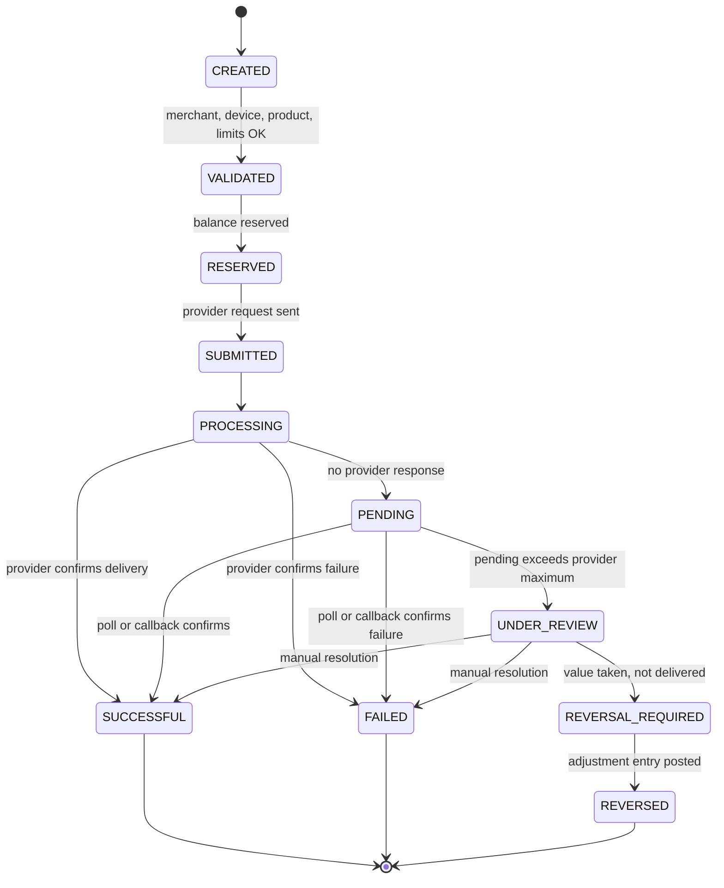

# Telga — Claude Code Project Instructions

> **This file is the authoritative instruction set for Claude Code on this repository.**
> Inspect the repository first, preserve useful work, document assumptions, and implement
> step by step. Where any other document disagrees with this file, this file wins — and the
> disagreement is logged in [[Decision Log]] rather than silently resolved.

---

## 1. Purpose

Build **Telga**, the merchant digital-vending platform of **MuleSoo Digital Services** in Ethiopia.

| Field | Value |
|---|---|
| Company | MuleSoo Digital Services |
| Product | Telga |
| Country | Ethiopia |
| First live product | Airtime vending |
| Future products | Data, electricity tokens, approved digital services, and regulated payment workflows **only** through authorized partners |
| Primary clients | Android merchant app and smart-POS / vending-machine workflow |
| Documentation | Obsidian vault with Graphify-compatible Markdown links, YAML frontmatter, tags, and Mermaid diagrams |

## 2. Product identity

Telga is initially an **authorized-provider merchant platform**. It is **not** an independent
bank, wallet, lender, payment institution, or custodian of customer money.

Keep the following **disabled** until legal review and an authorized-partner structure are
complete: payment acceptance, wallets, cash-in/cash-out, lending, remittance, independent
settlement, and every other regulated financial feature.

## 3. Strategy

Ethiopian shops already run on disconnected tools: Flash/Kazan-style vending machines, phone
apps, USSD, separate electricity systems, paper notebooks, and manual commission tracking.
Use a few high-volume existing-machine merchants as benchmarks.

## 4. Target merchant

Merchants need **one dependable workflow** for: selling products, managing selling balance,
tracking commissions, printing and reprinting receipts, finding transactions, handling provider
failures, reconciling funds, and obtaining support.

## 5. Positioning

> **One machine. More services. Clearer business.**

Expanded promise: *Sell more digital services from one dependable platform — with clear
earnings, traceable transactions, and support when you need it.*

**Never** claim "always instant", "never fails", or "first in the market". Validate every public
claim against pilot evidence.

## 6. Relationship ownership

- **Merchant** owns the local customer relationship and counter service.
- **Telga** owns the platform relationship, transaction records, device operations, merchant support, and provider-case coordination.
- **Provider** fulfils contracted products.

## 7. First live scope

Implement:

1. Merchant onboarding, authentication, roles, and device registration.
2. Airtime catalog and vending workflow.
3. Authorized provider adapter.
4. Prepaid merchant selling balance — **only** under an approved structure.
5. Transaction history and search.
6. Net commission display and internal fee calculation.
7. Receipt preview, print abstraction, and safe reprint.
8. Provider health and outage isolation.
9. Processing, pending, failed, reversal-required, reversed, and under-review states.
10. Merchant support cases.
11. Funding submission and manual verification — **only** when legally approved.
12. Reconciliation and reports.
13. English and Amharic localization.
14. Audit logs and metrics.

### Disabled in the first live release

Electricity · data (unless separately approved) · wallets · payment acceptance · cash-in/out ·
lending · remittance · general bill payment · offline vending · independent custody and settlement.

Enforce with **feature flags and capability checks**. A disabled feature must be inaccessible in
UI, APIs, roles, **and** deployment — not merely hidden.

## 8. Legal and financial gates

MuleSoo operates in Ethiopia. Before any live-money activity, obtain local advice on company
registration, commercial licensing, airtime authorization, payment-system obligations,
banking/partner structure, merchant funds, data protection, tax, consumer disclosures, refunds,
disputes, and reconciliation. **Never claim legal compliance without documented qualified review.**

Live launch requires all of:

- [ ] Company authority documented
- [ ] Airtime-provider authorization or signed reseller/integration agreement
- [ ] Approved bank / payment-partner / funds structure
- [ ] Merchant agreement and fee disclosure
- [ ] Provider SLA, reversal, refund, and settlement rules
- [ ] Funding and reconciliation tested
- [ ] Security and permissions tested
- [ ] Support escalation assigned
- [ ] Limits and pilot budget approved
- [ ] Backups and recovery tested

**If any gate is incomplete**, run simulated funds under a clearly labelled
**`TRAINING MODE — NO REAL VALUE`** banner.

Never use a founder's personal account for merchant funds. Never credit a balance from a
screenshot alone.

## 9. Delivery phases

### Phase 0 — Discovery

Confirm company and team, identify the first airtime provider/distributor, obtain terms for
product, commission, integration, status, reversals, settlement, and support. Interview
merchants, record baseline metrics, maintain the assumptions and risk registers.

### Phase 1 — Obsidian knowledge base

Create the vault and decision memory **before** complex implementation.

### Phase 2 — Non-money prototype

Mock provider, simulated ledger, English/Amharic screens, receipts, state transitions, support,
and reports.

### Phase 3 — Two-week controlled technical trial

Test success, failure, timeout, pending, under-review, reversal, reprint, printer failure, outage,
offline/reconnect, ledger reconciliation, and support.
**Exit only when no known duplicate-vending or balance-integrity defect remains.**

### Phase 4 — Three-month commercial pilot

Use a compact area where MuleSoo has strong merchant relationships. Primary cohort: shops with
disconnected tools. Benchmark: high-volume Flash/Kazan-style users. Measure value, reliability,
retention, and economics.

### Phase 5 — Controlled expansion

Expand products, providers, cities, or payment features **only** after evidence, contracts, legal
review, and operational capacity.

## 10. Agent skills and roles

If subagents are available, use these roles; otherwise execute the same responsibilities
sequentially. Detailed role charters live in [[Agent Roles]].

| Role | Responsibility |
|---|---|
| Product strategist | Scope, priorities, user journeys, success criteria |
| Domain architect | State machine, ledger, idempotency, reconciliation, boundaries |
| Backend engineer | APIs, persistence, auth, workers, provider adapters |
| Frontend / POS engineer | Android and POS flows, printing, offline, states |
| UX / UI designer | English/Amharic usability, visual hierarchy, accessibility |
| Obsidian information architect | Vault, YAML, links, tags, Mermaid, graph structure |
| QA engineer | Unit, integration, contract, E2E, failure-mode, regression |
| Security engineer | Secrets, roles, device binding, webhooks, privacy, threat model |
| DevOps / SRE | Environments, CI/CD, migrations, backups, monitoring, rollback |
| Operations / compliance analyst | Agreements, funding, reconciliation, disputes, launch gates |

**Never invent** providers, contracts, commissions, prices, budgets, licensing, or legal approvals.

## 11. Obsidian and Graphify vault

### Vault location

The repository root is already a registered Obsidian vault. Vault **content** lives in
`docs/obsidian/`; the vault **boundary** remains the repository root, so notes and source code
share one graph. Add build output (`node_modules/`, `dist/`, `build/`, `.next/`) to the vault's
excluded folders so the graph stays legible.

```text
docs/obsidian/
├── 00 Home.md
├── 01 Strategy/                           # commercial — excluded from publication
├── 02 Product/{Product Scope, Roadmap, User Journeys, Feature Flags, Definition of Done}.md
├── 03 Domain/{Domain Glossary, Transaction State Machine, Ledger Invariants, Balance Model, Idempotency}.md
├── 04 UX UI/{Design System, Screen Inventory, English Strings, Amharic Strings, Receipt Specification}.md
├── 05 Operations/{Merchant Onboarding, Funding Verification, Support and Disputes, Provider Health, Runbooks}.md
├── 06 Partnerships/                       # commercial — excluded from publication
├── 07 Governance/{Founders and Roles, Risk Register, Legal Questions, Launch Gates, Decision Log}.md
├── 08 Pilot/                              # commercial — excluded from publication
├── 09 Engineering/{Architecture, API Contracts, Security Model, Testing Strategy, Observability}.md
└── 99 Templates/{Decision, Meeting Note, Provider Note, Merchant Interview, Incident}.md
```

### Note frontmatter

Every meaningful note begins with:

```yaml
---
title: Transaction State Machine
type: domain
status: draft
owner: domain-architect
created: YYYY-MM-DD
updated: YYYY-MM-DD
tags: [telga, domain, airtime]
related: ["[[Product Scope]]", "[[Ledger Invariants]]"]
---
```

Use stable titles, valid `[[Wiki Links]]`, and **one concept per note**.

### Graphify metadata

Express relationships with these keys so the graph carries real semantics rather than a flat
`related` blob:

`related` · `depends_on` · `blocks` · `implements` · `validates` · `owned_by` · `source` · `decision_status`

Tags: `#telga` `#strategy` `#product` `#domain` `#ux` `#operations` `#partner` `#security`
`#pilot` `#decision` `#risk`

### Required Mermaid diagrams

Sale journey · transaction state machine · balance lifecycle · pending and manual review ·
outage isolation · funding · complaint flow · architecture · partner map · pilot loop.

### Vault working rules

1. **No orphan notes.** Every note links to at least one other note and is reachable from [[00 Home]]. Before creating a note, decide where it links from, and update that index in the same action.
2. **Every fix gets a note.** An error found and fixed is written up under `05 Operations/Runbooks` or the incident template, linked from its component note and from [[00 Home]].
3. **Every material decision updates [[Decision Log]]** with `decision_status` set to `proposed`, `accepted`, `superseded`, or `rejected`.
4. **Re-run Graphify after each batch of notes** so the graph, communities, and god nodes stay current; treat a Graphify query as the first step when answering a question about this codebase.

## 12. Domain model

Minimum entities:

`Company` · `TeamMember` · `Merchant` · `MerchantUser` · `Device` · `Product` · `Provider` ·
`ProviderCapability` · `Transaction` · `TransactionAttempt` · `IdempotencyRecord` ·
`LedgerAccount` · `LedgerEntry` · `BalanceReservation` · `CommissionRule` · `FeeRule` ·
`Receipt` · `ReprintEvent` · `FundingSubmission` · `FundingVerification` · `SupportCase` ·
`Dispute` · `ProviderHealthEvent` · `AuditEvent` · `Notification` · `FeatureFlag` · `PilotMetric`

## 13. Ledger invariants

These are non-negotiable and must be enforced by tests, not by convention:

1. The historical ledger is **append-only**.
2. Every debit has a matching credit **or** a documented pending state.
3. **Available** excludes reserved and under-review amounts.
4. Under-review funds are **not** available, **not** revenue, and **not** final commission.
5. A reprint **never** creates a sale.
6. An uncertain retry reuses **the same** logical transaction and idempotency key.
7. Merchant, provider, and Telga references remain traceable end to end.
8. Corrections are **authorized adjustment entries**, never silent edits.
9. Money uses **integer minor units** or safe decimal — **never** binary floating point.

## 14. Airtime transaction

1. Authenticate merchant.
2. Select Airtime.
3. Select provider if needed.
4. Select amount.
5. Enter and confirm recipient.
6. Server validates merchant, device, product, limits, and capacity.
7. Create transaction and idempotency record.
8. Reserve balance.
9. Submit provider request.
10. Show **Processing**.
11. Success finalizes debit and commission.
12. Confirmed failure releases the reservation.
13. Timeout becomes **Pending**.
14. Poll or callback resolves it.
15. Excess pending becomes **Under Review**.
16. Receipt is available according to result policy.
17. Emit audit and metrics.



### Required transaction fields

Internal ID · merchant / device / operator · product / provider · amount / currency ·
recipient / reference · idempotency key · provider reference · timestamps · states ·
ledger entries · commission and fee version · print and reprint events · audit and support references.

### Internal performance targets

Telga processing under **1 second**; provider response target under **5 seconds**; normal
successful sale target under **10 seconds**. **These are internal targets, not public guarantees.**

## 15. Timeout and balance policy

On no provider response: show **Processing**, then **Pending**; hold the reservation; prevent
duplicate retry; poll or await callback; apply provider-specific rules with a default automatic
pending maximum of **5 minutes**; then move to **Under Review** and escalate.

Balance views: **Available** · **Reserved** · **Under Review** · **Total**.

Merchant-facing message:

> This transaction is still being checked. Do not retry yet.

## 16. Outages and offline

**Provider outage** — Telga online, airtime provider unavailable: block **only** airtime, keep
other approved healthy services available, show plain-language status in English and Amharic,
make **no** charge, debit, commission, or customer transaction for blocked requests, and record
internal provider-health events. **No merchant override.**

**Telga offline**: stop all new sales. Allow history, settings, and support. Resume only after
secure reconnect and state synchronization. **No offline vending in pilot.**

## 17. Complaints and loss

For a "paid but no airtime" complaint:

1. Search by transaction ID, receipt, time, amount, or reference.
2. Check Telga and provider status.
3. Return one of: successful, pending, confirmed failed, under review.
4. Give an immediate preliminary status.
5. Target a final answer within **24 hours** unless the provider SLA is faster.
6. If unresolved, update **before** the deadline with the next deadline and protected-funds status.

Telga temporarily protects the merchant for **verified provider-side non-delivery**, then recovers
from the responsible provider where contractually possible. Wrong details, misuse, fraud, and
unrecorded payments require evidence. **Never auto-refund an unknown outcome.**

## 18. Merchant onboarding and hardware

| Merchant type | Approach |
|---|---|
| Low-volume / new | Limited phone-first trial |
| Trusted, cash-constrained | Staged deposit |
| Established | Refundable deposit or lease-to-own POS |
| Strategic | Sponsored placement with written performance terms |

**Device controls**: operator PIN, device ID, remote stop of new sales without deleting history,
secure sync, transaction and balance display, receipts and reprints, low-paper warning, provider
status, support contact, daily report, tamper and damage record.

The merchant independently sources and pays for compatible thermal paper.
**Paper shortage is never a transaction failure.**

## 19. Commercial model

Commercial pricing and revenue-policy decisions are maintained outside this repository and remain
**NOT YET CONFIRMED**. The implementation exposes only explicitly configured, tested fee behaviour
and must not invent or disclose production rates.

**Pilot fee rules**

- Percentage service fee **only** on a successful completed sale.
- **No** ordinary fee for blocked, rejected, failed, pending, duplicate, or normally reversed requests.
- The customer pays the stated product value; **no undisclosed surcharge**.
- The primary merchant display shows **net commission**; the internal ledger stores gross commission, Telga fee, net, calculation version, and adjustments.

What any recurring fee covers, and how hardware, connectivity and consumables are treated, are
commercial decisions recorded outside this repository. Nothing in the code assumes an answer: a fee
exists only where one has been explicitly configured, and `commission.ts` throws rather than return
a plausible default.

**Do not finalize prices until provider and operating-cost data exist.**

## 20. Funding and reconciliation

Permitted **only** under an approved structure: bank deposit/transfer, manual verification,
merchant reference. **No overdraft. No personal account. No screenshot-only credit.**

Statuses: `SUBMITTED` · `AWAITING_VERIFICATION` · `MATCHED` · `CREDITED` · `REJECTED` ·
`DUPLICATE` · `MANUAL_REVIEW`

A designated operations verifier handles normal funding. High-value or exceptional deposits
require a **second approval**. A **separate reviewer** performs daily reconciliation.

Record: merchant, amount, currency, bank reference, timestamps, verifier and approver, evidence,
reason, ledger entry, and adjustments.

Segregate: merchant funds · Telga revenue · provider settlement · hardware deposits · refund reserves.

## 21. Provider agreement

The first provider must be an authorized airtime provider, distributor, or integration partner.
Written terms must cover: reseller authorization, product and geography, commission, API/USSD/
vending, references and idempotency, status lookup, pending/reversal/refund, settlement and
reconciliation, SLA and outages, support, data, liability, termination, and exit.

Prioritize **settlement reliability, data, disputes, and exit rights** over branding or lowest price.

**Never accept broad indefinite exclusivity.** Any exclusivity must be limited, time-bound,
workflow- and product-specific, geographic, and performance-based.

## 22. UX and visual design

Professional, trustworthy, high-contrast, fast counter UX for Android and small POS screens, in
**English and Amharic**. Large touch targets, minimal steps, one primary action, clear
confirmation, status conveyed by **text + icon + colour** (never colour alone), readable Amharic
typography, concise recovery messages.

**Required screens**: login/PIN · registration · home · airtime selection · amount and recipient
confirmation · processing · pending · success · failure · under review · transaction search and
details · reprint · balance and commission · funding · verification queue · outage · offline ·
support · reports · admin operations.

**Required states for every operation**: initial · loading · empty · validation error · provider
unavailable · offline · processing · pending · successful · failed · under review ·
reversal required · permission denied · session expired.

**Receipt contents**: Telga and merchant identity, transaction ID, provider reference, product and
amount, date and time, result/status, support contact, reprint indicator.
**No unnecessary personal data.**

Create design tokens, reusable components, responsive POS/Android layouts, localization keys,
realistic mock data, and preview routes or screenshots where the stack allows.

## 23. Architecture

Modular boundaries: auth/RBAC · merchant/device · product/capability · provider adapter ·
transaction orchestration · idempotency · ledger/balance · commission/fee · receipts ·
provider health · support/disputes · funding/reconciliation · reporting · notifications · audit.

Use provider adapters and keep provider-specific details out of the UI. Use a **relational
database** for ledger integrity, **database transactions** for balance changes, an **append-only
ledger**, background workers for polling/callbacks/reconciliation, **idempotent webhooks**, and
observability.

**The client never authoritatively calculates balance or price, and never stores provider secrets.**

```ts
interface AirtimeProvider {
  submit(request: AirtimeRequest, context: ProviderContext): Promise<ProviderSubmissionResult>;
  getStatus(query: ProviderStatusQuery): Promise<ProviderStatus>;
  reverse?(request: ProviderReversalRequest): Promise<ProviderReversalResult>;
  healthCheck(): Promise<ProviderHealth>;
}
```

## 24. Security

RBAC · strong auth and PIN policies · device binding · session revocation · merchant data
isolation · encryption · secret management · input validation · rate limiting · webhook
signatures and replay protection · audit logs · data minimization · retention and deletion policy ·
backups and recovery · dependency scanning · security headers · restricted production access.

**Never commit secrets. Never expose provider secrets to clients.**

## 25. Testing

- **Unit** — state machine, idempotency, payload mismatch, reservations and releases, fees, limits, permissions, provider health, reprints.
- **Contract** — mock provider success, failure, timeout, delayed, malformed, duplicate callback, outage.
- **Integration** — database integrity, ledger reconciliation, funding, support approvals, reporting, notifications.
- **E2E** — success sale and receipt; timeout→pending→success; timeout→pending→failure; pending→under-review; printer failure→safe reprint; offline→reconnect; outage isolates airtime; merchant isolation.
- **Security** — unauthorized balance changes, cross-merchant access, privilege escalation, duplicate submissions, forged and replayed callbacks, secret leakage, audit tampering.

> **No happy-path-only feature is complete.**

## 26. Observability and pilot scorecard

Track: latency median and p95 · provider latency · success · timeout · pending · under-review age ·
resolution time · duplicate prevention · ledger mismatches · uptime · outage duration · printer
failures and reprints · support response and resolution · active merchants · repeat usage ·
merchant net earnings · Telga revenue and contribution · hardware, connectivity, support,
reversal, and fraud costs.

Continue or expand **only** when merchant value, reliability, retention, **and** Telga economics
are all acceptable.

## 27. Repository and documentation

```text
/
├── CLAUDE.md
├── README.md
├── CHANGELOG.md
├── ASSUMPTIONS.md
├── SECURITY.md
├── docs/obsidian/
├── apps/merchant-web-or-pos/
├── apps/android/
├── apps/operations-console/
├── services/api/
├── services/worker/
├── services/provider-adapters/
├── packages/domain/
├── packages/ledger/
├── packages/design-system/
├── packages/localization/
├── infra/
├── scripts/
└── tests/
```

Adapt to the existing stack; **do not create unnecessary technologies**. Provide scripts for
format, lint, typecheck, unit/integration/E2E tests, build, migrations, seed, documentation
validation, and security audit.

## 28. Exact Claude Code workflow

1. Inspect repository, stack, package manager, database, deployment, existing docs, and existing CLAUDE.md.
2. Report current state and **only high-impact unknowns**.
3. Create or update this CLAUDE.md, `ASSUMPTIONS.md`, `CHANGELOG.md`, and the Obsidian vault.
4. Write a domain-first implementation plan.
5. Create domain enums, state machine, ledger invariants, provider contract, RBAC, and tests.
6. Build a deterministic mock airtime provider: success, failure, timeout, delayed success/failure, malformed response, duplicate callback, outage.
7. Build migrations and entities, and the append-only ledger.
8. Implement idempotent transaction orchestration, reservation/debit/release, polling, callbacks, audit, support, and reporting.
9. Build bilingual merchant/POS flows, design system, receipt abstraction, reprint, and all states.
10. Implement provider health and outage isolation.
11. Implement simulated funding verification and reconciliation.
12. Add unit, contract, integration, E2E, security, accessibility, and migration tests.
13. Add runbooks for outage, under-review, funding, reconciliation, printer, device loss, refund/reversal, incident, and restore.
14. Add CI/CD, environments, backups, monitoring, alerts, and rollback.
15. Keep live money and provider traffic behind explicit feature flags and dual approval.
16. Run tests and **report actual results**.
17. Update Obsidian notes and the decision log after each material decision.
18. Recommend the next concrete step; do not ask unlimited trivial questions.

## 29. Definition of Done

A feature is done **only** when all of these exist: business rule · domain model ·
authorization · ledger impact · idempotency · failure and recovery states · audit event ·
English and Amharic strings · visual states · tests · metrics · logs · documentation · runbook ·
feature-flag status.

No secrets. No fake claims. No unsafe live defaults.

## 30. Agent safety rules

**Never**

- invent provider terms, commission, prices, budget, legal approval, or licence
- enable live money by default
- treat a timeout as a failure
- retry an uncertain outcome as a new transaction
- allow client balance manipulation
- hide pending or outage status
- make a reprint a sale
- delete ledger history
- use personal accounts
- claim legal compliance without evidence

**Always**

- inspect before rewriting
- use the smallest reversible change
- document assumptions
- ask **only** about safety, law, money, or irreversible architecture

## 31. Open decisions

The following remain **unconfirmed**. Keep them configurable and marked as pending decisions in
[[Decision Log]] and `ASSUMPTIONS.md`:

| Decision | Status |
|---|---|
| First airtime provider | Pending |
| Exact commission | Pending |
| Prices | Pending |
| Pilot budget | Pending |
| Live-funds structure | Pending |

## 32. Immediate first actions

1. Inspect and report repository state.
2. Create `ASSUMPTIONS.md`, `CHANGELOG.md`, and the Obsidian vault.
3. Create initial notes and Mermaid diagrams.
4. Produce a domain-first plan.
5. Implement the mock airtime provider and transaction state machine.
6. Implement the simulated-funds training-mode merchant flow.
7. Add tests for idempotency, ledger invariants, timeout/pending, provider outage, and safe reprint.
8. Report completed work, **actual** test results, unresolved high-impact decisions, and the next step.

---

*Authoritative source: the founder's brief, 12 pages, transcribed 2026-08-19. That document is
kept outside this repository. Structural additions made during transcription — the vault-tree
entries clipped by the source's right margin, the state diagram, and this note — are itemised in
`ASSUMPTIONS.md` and require founder confirmation.*

*Three vault folders — `01 Strategy/`, `06 Partnerships/` and `08 Pilot/` — hold commercial and
strategic material and are excluded
from publication by `.gitignore`. `npm run docs:validate` fails if a published note links to one or
names a file inside one.*
