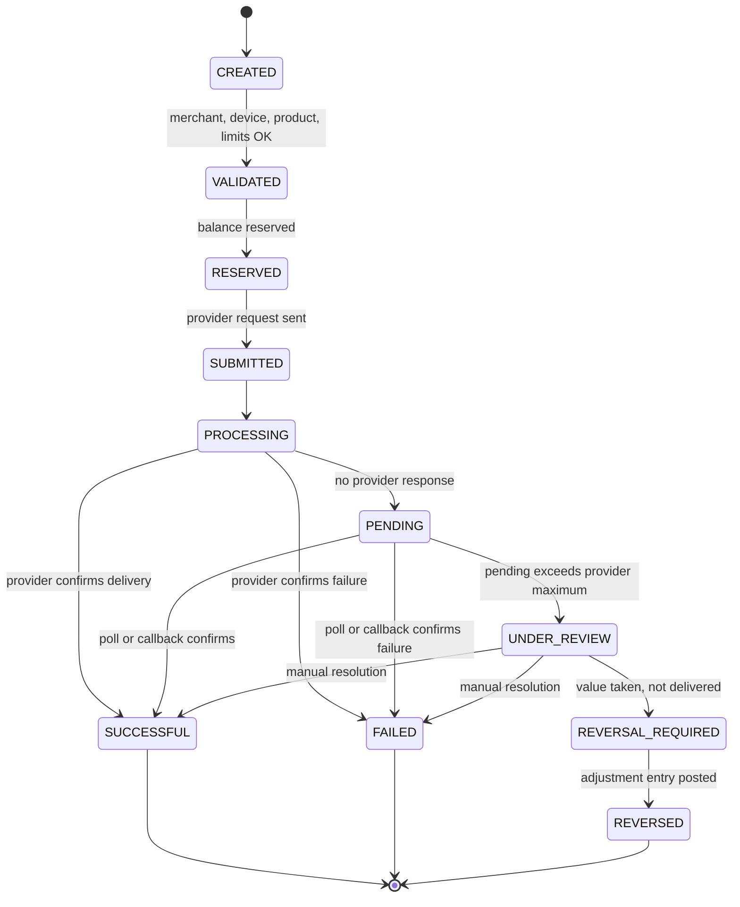

# Telga — Claude Code Project Instructions

> **This file is the authoritative instruction set for Claude Code on this repository.**
> Inspect the repository first, preserve useful work, document assumptions, and implement
> step by step. Where any other document disagrees with this file, this file wins — and the
> disagreement is logged in [[Decision Log]] rather than silently resolved.

---

## 1. Purpose

Build **Telga**, the merchant digital-vending platform of **MuleSoo Digital Services** in Ethiopia.

| Field | Value |
|---|---|
| Company | MuleSoo Digital Services |
| Product | Telga |
| Country | Ethiopia |
| First live product | Airtime vending |
| Future products | Data, electricity tokens, approved digital services, and regulated payment workflows **only** through authorized partners |
| Primary clients | Android merchant app and smart-POS / vending-machine workflow |
| Documentation | Obsidian vault with Graphify-compatible Markdown links, YAML frontmatter, tags, and Mermaid diagrams |

## 2. Product identity

Telga is initially an **authorized-provider merchant platform**. It is **not** an independent
bank, wallet, lender, payment institution, or custodian of customer money.

Keep the following **disabled** until legal review and an authorized-partner structure are
complete: payment acceptance, wallets, cash-in/cash-out, lending, remittance, independent
settlement, and every other regulated financial feature.

## 3. Strategy

Ethiopian shops already run on disconnected tools: Flash/Kazan-style vending machines, phone
apps, USSD, separate electricity systems, paper notebooks, and manual commission tracking.
Use a few high-volume existing-machine merchants as benchmarks.

## 4. Target merchant

Merchants need **one dependable workflow** for: selling products, managing selling balance,
tracking commissions, printing and reprinting receipts, finding transactions, handling provider
failures, reconciling funds, and obtaining support.

## 5. Positioning

> **One machine. More services. Clearer business.**

Expanded promise: *Sell more digital services from one dependable platform — with clear
earnings, traceable transactions, and support when you need it.*

**Never** claim "always instant", "never fails", or "first in the market". Validate every public
claim against pilot evidence.

## 6. Relationship ownership

- **Merchant** owns the local customer relationship and counter service.
- **Telga** owns the platform relationship, transaction records, device operations, merchant support, and provider-case coordination.
- **Provider** fulfils contracted products.

## 7. First live scope

Implement:

1. Merchant onboarding, authentication, roles, and device registration.
2. Airtime catalog and vending workflow.
3. Authorized provider adapter.
4. Prepaid merchant selling balance — **only** under an approved structure.
5. Transaction history and search.
6. Net commission display and internal fee calculation.
7. Receipt preview, print abstraction, and safe reprint.
8. Provider health and outage isolation.
9. Processing, pending, failed, reversal-required, reversed, and under-review states.
10. Merchant support cases.
11. Funding submission and manual verification — **only** when legally approved.
12. Reconciliation and reports.
13. English and Amharic localization.
14. Audit logs and metrics.

### Disabled in the first live release

Electricity · data (unless separately approved) · wallets · payment acceptance · cash-in/out ·
lending · remittance · general bill payment · offline vending · independent custody and settlement.

Enforce with **feature flags and capability checks**. A disabled feature must be inaccessible in
UI, APIs, roles, **and** deployment — not merely hidden.

## 8. Legal and financial gates

MuleSoo operates in Ethiopia. Before any live-money activity, obtain local advice on company
registration, commercial licensing, airtime authorization, payment-system obligations,
banking/partner structure, merchant funds, data protection, tax, consumer disclosures, refunds,
disputes, and reconciliation. **Never claim legal compliance without documented qualified review.**

Live launch requires all of:

- [ ] Company authority documented
- [ ] Airtime-provider authorization or signed reseller/integration agreement
- [ ] Approved bank / payment-partner / funds structure
- [ ] Merchant agreement and fee disclosure
- [ ] Provider SLA, reversal, refund, and settlement rules
- [ ] Funding and reconciliation tested
- [ ] Security and permissions tested
- [ ] Support escalation assigned
- [ ] Limits and pilot budget approved
- [ ] Backups and recovery tested

**If any gate is incomplete**, run simulated funds under a clearly labelled
**`TRAINING MODE — NO REAL VALUE`** banner.

Never use a founder's personal account for merchant funds. Never credit a balance from a
screenshot alone.

## 9. Delivery phases

### Phase 0 — Discovery

Confirm company and team, identify the first airtime provider/distributor, obtain terms for
product, commission, integration, status, reversals, settlement, and support. Interview
merchants, record baseline metrics, maintain the assumptions and risk registers.

### Phase 1 — Obsidian knowledge base

Create the vault and decision memory **before** complex implementation.

### Phase 2 — Non-money prototype

Mock provider, simulated ledger, English/Amharic screens, receipts, state transitions, support,
and reports.

### Phase 3 — Two-week controlled technical trial

Test success, failure, timeout, pending, under-review, reversal, reprint, printer failure, outage,
offline/reconnect, ledger reconciliation, and support.
**Exit only when no known duplicate-vending or balance-integrity defect remains.**

### Phase 4 — Three-month commercial pilot

Use a compact area where MuleSoo has strong merchant relationships. Primary cohort: shops with
disconnected tools. Benchmark: high-volume Flash/Kazan-style users. Measure value, reliability,
retention, and economics.

### Phase 5 — Controlled expansion

Expand products, providers, cities, or payment features **only** after evidence, contracts, legal
review, and operational capacity.

## 10. Agent skills and roles

If subagents are available, use these roles; otherwise execute the same responsibilities
sequentially. Detailed role charters live in [[Agent Roles]].

| Role | Responsibility |
|---|---|
| Product strategist | Scope, priorities, user journeys, success criteria |
| Domain architect | State machine, ledger, idempotency, reconciliation, boundaries |
| Backend engineer | APIs, persistence, auth, workers, provider adapters |
| Frontend / POS engineer | Android and POS flows, printing, offline, states |
| UX / UI designer | English/Amharic usability, visual hierarchy, accessibility |
| Obsidian information architect | Vault, YAML, links, tags, Mermaid, graph structure |
| QA engineer | Unit, integration, contract, E2E, failure-mode, regression |
| Security engineer | Secrets, roles, device binding, webhooks, privacy, threat model |
| DevOps / SRE | Environments, CI/CD, migrations, backups, monitoring, rollback |
| Operations / compliance analyst | Agreements, funding, reconciliation, disputes, launch gates |

**Never invent** providers, contracts, commissions, prices, budgets, licensing, or legal approvals.

## 11. Obsidian and Graphify vault

### Vault location

The repository root is already a registered Obsidian vault. Vault **content** lives in
`docs/obsidian/`; the vault **boundary** remains the repository root, so notes and source code
share one graph. Add build output (`node_modules/`, `dist/`, `build/`, `.next/`) to the vault's
excluded folders so the graph stays legible.

```text
docs/obsidian/
├── 00 Home.md
├── 01 Strategy/                           # commercial — excluded from publication
├── 02 Product/{Product Scope, Roadmap, User Journeys, Feature Flags, Definition of Done}.md
├── 03 Domain/{Domain Glossary, Transaction State Machine, Ledger Invariants, Balance Model, Idempotency}.md
├── 04 UX UI/{Design System, Screen Inventory, English Strings, Amharic Strings, Receipt Specification}.md
├── 05 Operations/{Merchant Onboarding, Funding Verification, Support and Disputes, Provider Health, Runbooks}.md
├── 06 Partnerships/                       # commercial — excluded from publication
├── 07 Governance/{Founders and Roles, Risk Register, Legal Questions, Launch Gates, Decision Log}.md
├── 08 Pilot/                              # commercial — excluded from publication
├── 09 Engineering/{Architecture, API Contracts, Security Model, Testing Strategy, Observability}.md
└── 99 Templates/{Decision, Meeting Note, Provider Note, Merchant Interview, Incident}.md
```

### Note frontmatter

Every meaningful note begins with:

```yaml
---
title: Transaction State Machine
type: domain
status: draft
owner: domain-architect
created: YYYY-MM-DD
updated: YYYY-MM-DD
tags: [telga, domain, airtime]
related: ["[[Product Scope]]", "[[Ledger Invariants]]"]
---
```

Use stable titles, valid `[[Wiki Links]]`, and **one concept per note**.

### Graphify metadata

Express relationships with these keys so the graph carries real semantics rather than a flat
`related` blob:

`related` · `depends_on` · `blocks` · `implements` · `validates` · `owned_by` · `source` · `decision_status`

Tags: `#telga` `#strategy` `#product` `#domain` `#ux` `#operations` `#partner` `#security`
`#pilot` `#decision` `#risk`

### Required Mermaid diagrams

Sale journey · transaction state machine · balance lifecycle · pending and manual review ·
outage isolation · funding · complaint flow · architecture · partner map · pilot loop.

### Vault working rules

1. **No orphan notes.** Every note links to at least one other note and is reachable from [[00 Home]]. Before creating a note, decide where it links from, and update that index in the same action.
2. **Every fix gets a note.** An error found and fixed is written up under `05 Operations/Runbooks` or the incident template, linked from its component note and from [[00 Home]].
3. **Every material decision updates [[Decision Log]]** with `decision_status` set to `proposed`, `accepted`, `superseded`, or `rejected`.
4. **Re-run Graphify after each batch of notes** so the graph, communities, and god nodes stay current; treat a Graphify query as the first step when answering a question about this codebase.

## 12. Domain model

Minimum entities:

`Company` · `TeamMember` · `Merchant` · `MerchantUser` · `Device` · `Product` · `Provider` ·
`ProviderCapability` · `Transaction` · `TransactionAttempt` · `IdempotencyRecord` ·
`LedgerAccount` · `LedgerEntry` · `BalanceReservation` · `CommissionRule` · `FeeRule` ·
`Receipt` · `ReprintEvent` · `FundingSubmission` · `FundingVerification` · `SupportCase` ·
`Dispute` · `ProviderHealthEvent` · `AuditEvent` · `Notification` · `FeatureFlag` · `PilotMetric`

## 13. Ledger invariants

These are non-negotiable and must be enforced by tests, not by convention:

1. The historical ledger is **append-only**.
2. Every debit has a matching credit **or** a documented pending state.
3. **Available** excludes reserved and under-review amounts.
4. Under-review funds are **not** available, **not** revenue, and **not** final commission.
5. A reprint **never** creates a sale.
6. An uncertain retry reuses **the same** logical transaction and idempotency key.
7. Merchant, provider, and Telga references remain traceable end to end.
8. Corrections are **authorized adjustment entries**, never silent edits.
9. Money uses **integer minor units** or safe decimal — **never** binary floating point.

## 14. Airtime transaction

1. Authenticate merchant.
2. Select Airtime.
3. Select provider if needed.
4. Select amount.
5. Enter and confirm recipient.
6. Server validates merchant, device, product, limits, and capacity.
7. Create transaction and idempotency record.
8. Reserve balance.
9. Submit provider request.
10. Show **Processing**.
11. Success finalizes debit and commission.
12. Confirmed failure releases the reservation.
13. Timeout becomes **Pending**.
14. Poll or callback resolves it.
15. Excess pending becomes **Under Review**.
16. Receipt is available according to result policy.
17. Emit audit and metrics.



### 14.1 Reversing a delivered-but-unredeemed sale

`SUCCESSFUL` is otherwise terminal. **One** transition out of it exists, added 2026-09-09:

```
SUCCESSFUL --> REVERSAL_REQUIRED: token proven UNREDEEMED, within the reversal window
```

**Only when the token is proven unredeemed.** The founder's case is a customer who is handed an
airtime or data token, cannot use it, and hands it back — the sale succeeded from Telga's side
because a token was issued, and no value has reached anybody. Reversing it returns the shop's money.

**Redemption is read, never assumed.** If the token has been redeemed, the customer has the value
and the reversal is refused — a merchant must not be able to reclaim money for something a customer
already spent. If redemption cannot be determined, the request goes to `UNDER_REVIEW`; it does not
default to either answer.

`FAILED` stays terminal and has no reversal path: nothing was taken, so there is nothing to return.

### Required transaction fields

Internal ID · merchant / device / operator · product / provider · amount / currency ·
recipient / reference · idempotency key · provider reference · timestamps · states ·
ledger entries · commission and fee version · print and reprint events · audit and support references.

### Internal performance targets

Telga processing under **1 second**; provider response target under **5 seconds**; normal
successful sale target under **10 seconds**. **These are internal targets, not public guarantees.**

## 15. Timeout and balance policy

On no provider response: show **Processing**, then **Pending**; hold the reservation; prevent
duplicate retry; poll or await callback; apply provider-specific rules with a default automatic
pending maximum of **5 minutes**; then move to **Under Review** and escalate.

Balance views: **Available** · **Reserved** · **Under Review** · **Total**.

Merchant-facing message:

> This transaction is still being checked. Do not retry yet.

## 16. Outages and offline

**Provider outage** — Telga online, airtime provider unavailable: block **only** airtime, keep
other approved healthy services available, show plain-language status in English and Amharic,
make **no** charge, debit, commission, or customer transaction for blocked requests, and record
internal provider-health events. **No merchant override.**

**Telga offline**: stop all new sales. Allow history, settings, and support. Resume only after
secure reconnect and state synchronization. **No offline vending in pilot.**

## 17. Complaints and loss

> **Unimplemented, and deliberately so.** Founder decision **D144** limits Telga staff to
> **aggregates** — the operations console shows per-shop counts and states, never an individual
> transaction. Step 1 below ("search by transaction ID…") therefore **cannot be performed from the
> console**, and no replacement mechanism exists yet. The obligation in this section still stands;
> the means does not. Tracked as **R44**, and it must be resolved before a pilot.

For a "paid but no airtime" complaint:

1. Search by transaction ID, receipt, time, amount, or reference.
2. Check Telga and provider status.
3. Return one of: successful, pending, confirmed failed, under review.
4. Give an immediate preliminary status.
5. Target a final answer within **24 hours** unless the provider SLA is faster.
6. If unresolved, update **before** the deadline with the next deadline and protected-funds status.

Telga temporarily protects the merchant for **verified provider-side non-delivery**, then recovers
from the responsible provider where contractually possible. Wrong details, misuse, fraud, and
unrecorded payments require evidence. **Never auto-refund an unknown outcome.**

### 17.1 Merchant-initiated reversal

A merchant may **request** a reversal from the app. Telga **approves** it. The two are separate
acts and must stay separate.

| Step | Who | What |
|---|---|---|
| 1 | Merchant | Presses **Reverse** on a transaction, states a reason, authorises with their PIN |
| 2 | Telga | Checks state, reversal window, and token redemption |
| 3 | Telga | Moves the transaction to `REVERSAL_REQUIRED` and opens a support case |
| 4 | Supervisor | `OPS_APPROVER` or `ADMIN` completes it — the money moves here, not at step 1 |
| 5 | Both | A reversal receipt is available, marked `REVERSED`, carrying both transaction ids |

**Why a merchant cannot complete their own reversal.** §13 invariant 8: *"Corrections are authorized
adjustment entries, never silent edits."* A reversal moves money back on the strength of a human
judgement about whether value was delivered. A merchant judging that alone is a merchant who can
return their own money for a sale a customer received.

**The reversal fee is configurable and defaults to ZERO.** §19 states plainly: *"No ordinary fee for
blocked, rejected, failed, pending, duplicate, or normally reversed requests."* The mechanism exists
so a fee can be set if the commercial model later requires one; setting it above zero **contradicts
§19 and requires a founder decision recorded in [[Decision Log]]**. Nothing may invent a rate.

**Reversal window and approval threshold are configuration, not constants in code.** Both default to
values marked `NOT YET CONFIRMED` and neither may be presented as a commercial term.

**Refusals a merchant will actually meet**, each with its own message: already reversed · not in a
reversible state · token already redeemed · outside the reversal window · above the threshold and
awaiting Telga approval.

### 17.2 Complaint verification

A merchant reports a problem; Telga decides whether it is real. This extends `support_cases` — it
does not introduce a second case system.

| Verdict | Evidence | Action |
|---|---|---|
| **Legitimate** | Provider did not deliver · token unredeemed · state `FAILED` or `PENDING` | Reverse, credit the merchant, recover from the provider where contractually possible |
| **Scam** | Provider confirmed delivery · token redeemed · state `SUCCESSFUL` | Refuse, and flag for review |
| **Uncertain** | Provider unclear · redemption unknown | Escalate. Protect the merchant temporarily per §17, and say so |

**No photograph upload from the app.** D138 refused an unauthenticated upload path for registration
for the same reason: it is a way to put arbitrary bytes on Telga's volume. The merchant describes
the problem and names the transaction; an admin attaches evidence at review, where the originals are.

**A complaint is the one place staff may see an individual transaction.** D144 limits Telga staff to
aggregates. The exception is inside an **open case, scoped to that one shop** — which is how §17
becomes answerable again without reopening general browsing. Every such view is audited with the
case reference.

**Never auto-refund an unknown outcome** (§17). Uncertain is a state, not a decision.

### 19.1 Shop-to-shop transfer — TRAINING ONLY

A shop may send selling balance to another shop.

> **This is a regulated activity and is switched off.** Moving value between two legal entities is
> money transfer. §2 and §7 list `remittance`, `cash.in_out` and `payments.acceptance` as disabled
> until legal review and an authorized-partner structure exist. The flag
> `transfer.shop_to_shop` is **off**, and turning it on is a founder decision that needs legal
> advice first — not a configuration change.

Built now as a **training-mode simulation**, on the same precedent as the Telga Pay card simulator
(D87/D124) and training deposits (D70): a training ledger, no counterparty, no bank, no network.

**Rules that hold whatever the flag says:**

- The recipient is named by **device id**, never device key. A device key is a credential; asking a
  shop to read one aloud to another shop teaches exactly the wrong habit (§18.2).
- Both shops must be `ACTIVE`. A suspended shop neither sends nor receives.
- One balanced ledger pair, both sides inside one transaction. A transfer that debited without
  crediting is money destroyed.
- **PIN authorised**, per-transfer and daily limits, both configurable and both `NOT YET CONFIRMED`.
- Above the approval threshold, Telga must approve before it settles.
- **Irreversible** once settled, unless both shops agree and an admin approves — recorded as an
  adjustment (§13 invariant 8), never an edit.
- Any transfer fee is configurable and defaults to **zero**. No rate may be invented.
- Suspicious patterns — rapid repeats, circular routes — raise an alert rather than blocking
  silently.

## 18. Merchant onboarding and hardware

| Merchant type | Approach |
|---|---|
| Low-volume / new | Limited phone-first trial |
| Trusted, cash-constrained | Staged deposit |
| Established | Refundable deposit or lease-to-own POS |
| Strategic | Sponsored placement with written performance terms |

**Device controls**: operator PIN, device ID, remote stop of new sales without deleting history,
secure sync, transaction and balance display, receipts and reprints, low-paper warning, provider
status, support contact, daily report, tamper and damage record.

The merchant independently sources and pays for compatible thermal paper.
**Paper shortage is never a transaction failure.**

### 18.5 Printing

The slip screens carry a **Print receipt** button. What it does is hand the slip
to the **device's own print stack** (`window.print()`), which reaches whatever
that phone or POS is already paired with — a Bluetooth or wi-fi roll printer, or
a PDF. The print stylesheet is what makes the output a receipt rather than a
screenshot: everything but the slip is hidden, the slip is sized to the 58 mm or
80 mm roll the shop chose, and the mark is forced to solid black because a
thermal head is one bit per dot.

**Telga speaks no printer protocol of its own.** There is no ESC/POS encoder and
no vendor SDK, because the POS model is not chosen yet (`ASSUMPTIONS` A101). This
route works on every device that can print at all, needs no permission, and
cannot silently print the wrong thing — a human sees the print dialogue. When
the hardware is decided, a native path can sit behind the same button.

**Every printed slip carries `TRAINING — NO REAL VALUE`.** It is drawn inside
`slipCard` itself, not passed in by a caller, so no screen can print a slip
without it — a vending sale, a top-up, a data bundle, a reprint and a Telga Pay
deposit all draw the same card.

**Printing is never a transaction.** It moves no money, writes no row, and needs
no CSRF token. A failed print is not a failed sale, and the Print button is
deliberately a plain button while Reprint — which does append an audit line — is
a form. The two must not look alike.

### 18.0 One app, one backend, one console

Three facts that are repeatedly misread, stated once so they cannot be:

1. **There is one Telga Android app, not two.** `et.mulesoo.telga` — a Capacitor shell in
   `apps/mobile/` hosting the server's own screens. A smart-POS terminal runs Android and a
   merchant's phone runs Android, so **the same app is installed on both**. There is no separate
   "POS app". `apps/merchant-pos/` is the **server** that renders those screens, not a second
   client; its name is historical. Decision Log **D68** — *"Telga is one application"* — and
   **D106**. A native reimplementation of the vending flow was rejected and stays rejected:
   a second implementation is a second place a duplicate sale can originate, and §13 makes
   duplicate prevention an invariant, not a preference.
2. **One backend serves every shop.** Not one deployment per merchant, not one site per shop.
   Each shop is a tenant record inside it, and the same backend serves both the app (every phone
   and every POS, across every shop) and the operations console.
3. **One operations console for the whole platform.** Telga staff only. It is a separate
   *application* from the merchant app — different users, different auth, different threat
   model — but not a separate *system*: same backend, same database.

**Each installed instance belongs to exactly one shop.** Its device identity is issued by the
backend and is separate from the console's own login; a shop may run several devices, and each
carries its own device key while drawing on **one** shop balance (§18.3).

> **Scale target: 1000+ shops**, each with its own owner, devices and credentials, all managed
> from the one console, with no cross-tenant leakage. See §18.4 for what is and is not yet true
> of that target.

### 18.1 Vendor registration and approval

The app opens on **two** options: **Login** and **Register as Telga member**. Registration is
**never** automatic approval — a submission enters a queue that a Telga admin reads.

A third route, **Activate this device**, is linked from the sign-in screen for a machine that has
a code but no key yet (§18.2). It is on that screen because a device with no key cannot sign in,
so the sign-in screen is the only one it can reach.

**Sign-in lockout: four wrong attempts, then a five-minute hold.** The number is a trade between
a stolen device being guessed at and a shopkeeper being locked out of their own till with
customers waiting; five minutes is short enough that a genuine slip never becomes a support call.

**Path A — the shop registers itself** (Decision Log **D138**, feature flag
`registration.self_service`):

| Step | Who acts | What happens |
|---|---|---|
| 1 | Shop owner | Opens the Telga app — on a phone or on POS hardware, the same app — and taps **Register as Telga member** |
| 2 | Shop owner | Submits shop and owner details and document *numbers*. **No photographs**: an unauthenticated upload endpoint is a way to put arbitrary bytes on Telga's volume, and the originals must be seen by a person anyway |
| 3 | The backend | Records one row in `merchant_applications` as `SUBMITTED` / `submitted_via = 'SELF_SERVICE'` and returns a **reference number**. **No account, no merchant, no device, no credential and no session are created** — [[Admin Operations Console]] Decision 3 |
| 4 | Telga admin | Sees it in the console's review queue, flagged **Unverified — from app**, and checks the details |
| 5 | Telga admin | **Approves or rejects.** Approval provisions the shop in the same request |
| 6 | Telga admin | Issues the shop's sign-in parameters — a separate act, because it is the only moment a secret is displayed (§18.2) |
| 7 | The shop | Signs in with those parameters. Not before |

**Path B — a Telga admin registers the shop directly.** An admin holding the originals at the
counter ticks *"Approve immediately — I have seen these documents"* on the console's
**Register Telga User** form. **Admin creation is the approval**: there is no pending state and
no second review, because the reviewer and the recorder are the same person and the same
documents. It still requires `ADMIN_APPROVE_MERCHANT`, which carries step-up re-authentication —
a shortcut through a *screen*, never through a *permission* — and the audit trail records
`path: 'DIRECT'` so an approval with no second pair of eyes is distinguishable forever after.

**Approval is per shop.** One shop's approval, rejection or suspension changes nothing for any
other. Credentials issued to one shop never authenticate another.

#### Rules that hold on both paths

- A submission **creates no account**. There is no locked account for an unvetted applicant to
  attack, which is better than an approval check on every route where one missed guard is a way in.
- **Sign-in is blocked until that shop is `ACTIVE`** — enforced twice: nothing exists to sign in
  with before approval, *and* `signIn` refuses when `merchants.status` is not `ACTIVE`. A shop
  suspended mid-session has its sessions revoked on the next request, not at the next voluntary
  sign-out.
- The self-service route is **throttled per source** and its refusals count, so probing the
  validator is not free. The caller's address is **salted and hashed, never stored**.
- Registration refusals **name the wrong field**, unlike sign-in refusals, because there is no
  account to probe for — except a document already registered to another shop, which is softened
  so the route cannot be used to test licence numbers against Telga's merchant list.

### 18.2 Device registration and activation

Registering a **business** and provisioning a **machine** are different acts with different
secrets. §18.1 is the first; this is the second.

A device **never creates its own identity**. Registration is admin-initiated and device-completed,
in two secrets that are deliberately not the same secret.

| Step | Who acts | What happens |
|---|---|---|
| 1 | Shop owner | Submits a merchant application — §18.1, Path A or B. **No account, no merchant, and no device exist yet** |
| 2 | Telga admin | Reviews and approves the application in the operations console |
| 3 | Telga admin | Creates the device record, bound to that merchant. Its state is `PENDING` |
| 4 | Telga admin | Issues a **one-time activation code**. Displayed once, never again |
| 5 | A person | Carries the code to the shop — read down a phone line, or handed over with the hardware |
| 6 | The device | On first open, asks for its device ID and the activation code, and **exchanges** them for a long-term device key |

**Where step 6 happens:** `GET`/`POST /activate` on the merchant server, reachable with no
session — necessarily, because a device with no key cannot sign in. Do **not** confuse it with
`/enrol`, which re-keys a machine whose operator is *already signed in*; the two look similar and
are opposites. The key is rendered, never redirected to, so it cannot reach a URL, a history
entry or a log.

**The activation code** (`services/api/src/admin/enrollment.ts`): cryptographically random,
100 bits, base32 without `I`, `O`, `0` or `1` because those are the characters people mishear,
grouped in fives so a reader does not lose their place. It expires in **one hour**, is stored only
as a hash, and is **single use**.

**The device key** (`services/api/src/admin/redeemEnrollment.ts`): 256 bits, generated at
redemption, shown once to the device and never recoverable afterwards. It — not the activation
code — authenticates every later request. The two are separate because the thing a person reads
aloud must never be the thing that signs traffic for the life of the device.

**Single use is structural, not a flag.** `device_enrollments` holds one secret hash per device;
issuing writes the *code's* hash, redeeming replaces it with the *key's* hash. After redemption
the code no longer verifies against anything, because what it was compared to is gone.

**Refusals disclose nothing.** An unknown device and a wrong code get the **identical** answer, so
activation cannot be used to discover which device IDs exist. Expiry is told apart, because an
operator whose code has aged out needs to know to ask for another.

#### Forbidden until explicitly decided otherwise

- **Device-initiated automatic registration** — a device that provisions itself, with no admin
  action and no human-carried code. Deferred by [[Decision Log]] **D113(b)**; no self-service
  device provisioning is exposed in any UI, API, or CLI.

  > **This is not contradicted by §18.1.** D138 opened self-service registration of a
  > **business** — an application a human reads. It did not open self-service provisioning of a
  > **device**, and the distinction is the whole safety of both: an application grants nothing
  > until an admin approves it, whereas a device key authenticates every later request. A device
  > that could provision itself would have to carry a secret to be trusted on, that secret would
  > ship in the APK, and an APK is a public file.
- **A permanent secret shipped in the APK.** An APK is a public file.
- **Reusing an activation code** for a second device, or reissuing a device key to a device that
  already holds one. Replacing a lost device is a **new** device record and a **new** code, so the
  old key can be revoked independently.
- **Logging either secret in plaintext**, at any level, anywhere.

### 18.3 What belongs to a shop, and what belongs to a device

| Boundary | Owned by | Consequence |
|---|---|---|
| Money | **The shop** | `balanceFor(merchantId)`. Every till in a shop draws on **one** float. A deposit at one till is immediately spendable at another, and **no device has a balance of its own** |
| Authentication and audit | **The device** | Each device holds its own key and appears in the ledger on every sale it made. Stopping one device leaves the shop trading on the others |
| Credentials | **The shop** | Operator ids, device ids and keys are issued per shop. Shop A's credentials never authenticate Shop B |

Any specification that assumes per-device balances is describing a different product.

### 18.4 Multi-tenancy at 1000+ shops — what is true, and what is not

**True today**: one backend, one console, one database; every query scoped by a
session-derived merchant id; 11 isolation cases plus URL, body and encoded-id tampering tested
against a live server; the console lists merchants, devices, tenants and applications across all
of them.

**Not yet true, and must not be claimed**: per-shop database files. [[Decision Log]] **D103**
chose one database file per shop and called it *"the irreversible choice — splitting later is a
data migration and merging later is worse"*. **D113(a)** then deferred it for the training
deployment and named the condition that ends the deferral:

> *"It stops being defensible the moment a second real shop exists."*

`admin/tenantRouting.ts` is written, checks four things on every open, and **has no callers** —
deliberately, under D120's shared-database model. Wiring it would silently reinstate D103.

> **Before a second real shop is onboarded**, the shared-versus-per-tenant storage question needs
> a founder decision. It is the one architectural choice on this list that is expensive to
> reverse, and self-service registration makes reaching that second shop faster.

## 19. Commercial model

Commercial pricing and revenue-policy decisions are maintained outside this repository and remain
**NOT YET CONFIRMED**. The implementation exposes only explicitly configured, tested fee behaviour
and must not invent or disclose production rates.

**Pilot fee rules**

- Percentage service fee **only** on a successful completed sale.
- **No** ordinary fee for blocked, rejected, failed, pending, duplicate, or normally reversed requests.
- The customer pays the stated product value; **no undisclosed surcharge**.
- The primary merchant display shows **net commission**; the internal ledger stores gross commission, Telga fee, net, calculation version, and adjustments.

What any recurring fee covers, and how hardware, connectivity and consumables are treated, are
commercial decisions recorded outside this repository. Nothing in the code assumes an answer: a fee
exists only where one has been explicitly configured, and `commission.ts` throws rather than return
a plausible default.

**Do not finalize prices until provider and operating-cost data exist.**

## 20. Funding and reconciliation

Permitted **only** under an approved structure: bank deposit/transfer, manual verification,
merchant reference. **No overdraft. No personal account. No screenshot-only credit.**

Statuses: `SUBMITTED` · `AWAITING_VERIFICATION` · `MATCHED` · `CREDITED` · `REJECTED` ·
`DUPLICATE` · `MANUAL_REVIEW`

A designated operations verifier handles normal funding. High-value or exceptional deposits
require a **second approval**. A **separate reviewer** performs daily reconciliation.

Record: merchant, amount, currency, bank reference, timestamps, verifier and approver, evidence,
reason, ledger entry, and adjustments.

Segregate: merchant funds · Telga revenue · provider settlement · hardware deposits · refund reserves.

## 21. Provider agreement

The first provider must be an authorized airtime provider, distributor, or integration partner.
Written terms must cover: reseller authorization, product and geography, commission, API/USSD/
vending, references and idempotency, status lookup, pending/reversal/refund, settlement and
reconciliation, SLA and outages, support, data, liability, termination, and exit.

Prioritize **settlement reliability, data, disputes, and exit rights** over branding or lowest price.

**Never accept broad indefinite exclusivity.** Any exclusivity must be limited, time-bound,
workflow- and product-specific, geographic, and performance-based.

## 22. UX and visual design

Professional, trustworthy, high-contrast, fast counter UX for Android and small POS screens, in
**English and Amharic**. Large touch targets, minimal steps, one primary action, clear
confirmation, status conveyed by **text + icon + colour** (never colour alone), readable Amharic
typography, concise recovery messages.

**Required screens**: login/PIN · registration · home · airtime selection · amount and recipient
confirmation · processing · pending · success · failure · under review · transaction search and
details · reprint · balance and commission · funding · verification queue · outage · offline ·
support · reports · admin operations.

**Required states for every operation**: initial · loading · empty · validation error · provider
unavailable · offline · processing · pending · successful · failed · under review ·
reversal required · permission denied · session expired.

**Receipt contents**: Telga and merchant identity, transaction ID, provider reference, product and
amount, date and time, result/status, support contact, reprint indicator.
**No unnecessary personal data.**

Create design tokens, reusable components, responsive POS/Android layouts, localization keys,
realistic mock data, and preview routes or screenshots where the stack allows.

## 23. Architecture

Modular boundaries: auth/RBAC · merchant/device · product/capability · provider adapter ·
transaction orchestration · idempotency · ledger/balance · commission/fee · receipts ·
provider health · support/disputes · funding/reconciliation · reporting · notifications · audit.

Use provider adapters and keep provider-specific details out of the UI. Use a **relational
database** for ledger integrity, **database transactions** for balance changes, an **append-only
ledger**, background workers for polling/callbacks/reconciliation, **idempotent webhooks**, and
observability.

**The client never authoritatively calculates balance or price, and never stores provider secrets.**

```ts
interface AirtimeProvider {
  submit(request: AirtimeRequest, context: ProviderContext): Promise<ProviderSubmissionResult>;
  getStatus(query: ProviderStatusQuery): Promise<ProviderStatus>;
  reverse?(request: ProviderReversalRequest): Promise<ProviderReversalResult>;
  healthCheck(): Promise<ProviderHealth>;
}
```

### 23.1 Console identity policy

The operations console enforces two identity checks: a **second factor** on the
session, and **step-up re-authentication** within a five-minute window before
high-risk actions (approving a merchant, registering a device, issuing an
enrolment token, approving funding, managing administrators).

Both may be switched off together — `--single-factor true` /
`TELGA_CONSOLE_SINGLE_FACTOR=true` — for a training deployment where an
administrator would otherwise retype a code on every button ([[Decision Log]]
D143). **Off by default**, announced at start-up, and shown as a banner on
every page.

**The relaxation is of identity proof only.** Permissions are unchanged, a
suspended administrator is still refused, and every action is still audited
under its actor. Widening authority is a different decision and must never ride
along with this flag.

**It must be off before live money.** §8's "security and permissions tested"
gate cannot close while it is on.

### 23.2 What Telga staff may see of a shop

**Aggregates, not individual transactions** — founder decision **D144**.

| Telga staff may see | Telga staff may **not** see |
|---|---|
| Per-shop sales count, volume, and counts by state | Any individual transaction |
| Pending and under-review counts | Any recipient, masked or otherwise |
| Balances, devices, operators, applications, deposits | Any single sale's amount |
| Audit of their own colleagues' actions | — |

**No slip printing.** A slip is the shop's document for its customer. The console produces no
receipt, no reprint and no admin copy, and a test asserts that none appears.

**Removed, not hidden.** `/transactions` and `/transactions/:id` answer 404. Hiding a control while
its endpoint still answers is a defect, not a control.

**Why pending and under-review counts survive the boundary:** that a shop *has* an unresolved sale
is a platform fact an operations desk cannot work without. Whose money it was is the shop's
business. That is where the line sits.

## 24. Security

RBAC · strong auth and PIN policies · device binding · session revocation · merchant data
isolation · encryption · secret management · input validation · rate limiting · webhook
signatures and replay protection · audit logs · data minimization · retention and deletion policy ·
backups and recovery · dependency scanning · security headers · restricted production access.

**Never commit secrets. Never expose provider secrets to clients.**

## 25. Testing

- **Unit** — state machine, idempotency, payload mismatch, reservations and releases, fees, limits, permissions, provider health, reprints.
- **Contract** — mock provider success, failure, timeout, delayed, malformed, duplicate callback, outage.
- **Integration** — database integrity, ledger reconciliation, funding, support approvals, reporting, notifications.
- **E2E** — success sale and receipt; timeout→pending→success; timeout→pending→failure; pending→under-review; printer failure→safe reprint; offline→reconnect; outage isolates airtime; merchant isolation.
- **Security** — unauthorized balance changes, cross-merchant access, privilege escalation, duplicate submissions, forged and replayed callbacks, secret leakage, audit tampering.

> **No happy-path-only feature is complete.**

## 26. Observability and pilot scorecard

Track: latency median and p95 · provider latency · success · timeout · pending · under-review age ·
resolution time · duplicate prevention · ledger mismatches · uptime · outage duration · printer
failures and reprints · support response and resolution · active merchants · repeat usage ·
merchant net earnings · Telga revenue and contribution · hardware, connectivity, support,
reversal, and fraud costs.

Continue or expand **only** when merchant value, reliability, retention, **and** Telga economics
are all acceptable.

## 27. Repository and documentation

```text
/
├── CLAUDE.md
├── README.md
├── CHANGELOG.md
├── ASSUMPTIONS.md
├── SECURITY.md
├── docs/obsidian/
├── apps/merchant-pos/          # the server that renders the merchant screens
├── apps/mobile/                # the ONE Telga Android app (Capacitor shell) — §18.0
├── apps/operations-console/    # Telga staff console, same backend
├── services/api/
├── services/worker/
├── services/provider-adapters/
├── packages/domain/
├── packages/ledger/
├── packages/design-system/
├── packages/localization/
├── infra/
├── scripts/
└── tests/
```

The three `apps/` entries above are the **actual** directory names. An earlier draft of this
tree listed `apps/merchant-web-or-pos/` and `apps/android/`, neither of which was ever built
under those names — and the pairing invited exactly the misreading §18.0 corrects, that a phone
app and a POS app are different things. Capacitor generates its native project into a child
`android/`, so the shell lives at `apps/mobile/` rather than `apps/android/android/` (D106).

Adapt to the existing stack; **do not create unnecessary technologies**. Provide scripts for
format, lint, typecheck, unit/integration/E2E tests, build, migrations, seed, documentation
validation, and security audit.

## 28. Exact Claude Code workflow

1. Inspect repository, stack, package manager, database, deployment, existing docs, and existing CLAUDE.md.
2. Report current state and **only high-impact unknowns**.
3. Create or update this CLAUDE.md, `ASSUMPTIONS.md`, `CHANGELOG.md`, and the Obsidian vault.
4. Write a domain-first implementation plan.
5. Create domain enums, state machine, ledger invariants, provider contract, RBAC, and tests.
6. Build a deterministic mock airtime provider: success, failure, timeout, delayed success/failure, malformed response, duplicate callback, outage.
7. Build migrations and entities, and the append-only ledger.
8. Implement idempotent transaction orchestration, reservation/debit/release, polling, callbacks, audit, support, and reporting.
9. Build bilingual merchant/POS flows, design system, receipt abstraction, reprint, and all states.
10. Implement provider health and outage isolation.
11. Implement simulated funding verification and reconciliation.
12. Add unit, contract, integration, E2E, security, accessibility, and migration tests.
13. Add runbooks for outage, under-review, funding, reconciliation, printer, device loss, refund/reversal, incident, and restore.
14. Add CI/CD, environments, backups, monitoring, alerts, and rollback.
15. Keep live money and provider traffic behind explicit feature flags and dual approval.
16. Run tests and **report actual results**.
17. Update Obsidian notes and the decision log after each material decision.
18. Recommend the next concrete step; do not ask unlimited trivial questions.

## 29. Definition of Done

A feature is done **only** when all of these exist: business rule · domain model ·
authorization · ledger impact · idempotency · failure and recovery states · audit event ·
English and Amharic strings · visual states · tests · metrics · logs · documentation · runbook ·
feature-flag status.

No secrets. No fake claims. No unsafe live defaults.

## 30. Agent safety rules

**Never**

- invent provider terms, commission, prices, budget, legal approval, or licence
- enable live money by default
- treat a timeout as a failure
- retry an uncertain outcome as a new transaction
- allow client balance manipulation
- hide pending or outage status
- make a reprint a sale
- delete ledger history
- use personal accounts
- claim legal compliance without evidence

**Always**

- inspect before rewriting
- use the smallest reversible change
- document assumptions
- ask **only** about safety, law, money, or irreversible architecture

## 31. Open decisions

The following remain **unconfirmed**. Keep them configurable and marked as pending decisions in
[[Decision Log]] and `ASSUMPTIONS.md`:

| Decision | Status |
|---|---|
| First airtime provider | Pending |
| Exact commission | Pending |
| Prices | Pending |
| Pilot budget | Pending |
| Live-funds structure | Pending |

## 32. Immediate first actions

1. Inspect and report repository state.
2. Create `ASSUMPTIONS.md`, `CHANGELOG.md`, and the Obsidian vault.
3. Create initial notes and Mermaid diagrams.
4. Produce a domain-first plan.
5. Implement the mock airtime provider and transaction state machine.
6. Implement the simulated-funds training-mode merchant flow.
7. Add tests for idempotency, ledger invariants, timeout/pending, provider outage, and safe reprint.
8. Report completed work, **actual** test results, unresolved high-impact decisions, and the next step.

---

*Authoritative source: the founder's brief, 12 pages, transcribed 2026-08-19. That document is
kept outside this repository. Structural additions made during transcription — the vault-tree
entries clipped by the source's right margin, the state diagram, and this note — are itemised in
`ASSUMPTIONS.md` and require founder confirmation.*

*Three vault folders — `01 Strategy/`, `06 Partnerships/` and `08 Pilot/` — hold commercial and
strategic material and are excluded
from publication by `.gitignore`. `npm run docs:validate` fails if a published note links to one or
names a file inside one.*
