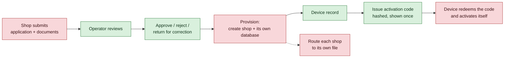

# Multi-Shop Onboarding

> [!question] The founder's requirement, in their words
> An admin panel on a computer that watches every shop's device activity; accounts
> created for different devices with **auto-generated sign-in parameters** issued
> *after* sufficient documents and information are supplied; **each device having
> its own data**; and every shop visible in one place.
>
> This is [[Decision Log]] **D103** plus **D113(b)**. It is already designed. Most
> of it is already written. **Four links are missing**, and one of them is the
> reason none of it has ever been tested.

## The state of the chain

### What is built and works

| Capability | Where |
|---|---|
| Console with its own sign-in, **MFA and step-up re-authentication** | `/login`, `/mfa`, `/step-up` |
| Application review — list, pick up, approve, reject, return | `/applications` |
| Merchants, devices, tenants, admins, audit trail | `/merchants` `/devices` `/tenants` `/admins` `/audit` |
| **Auto-generated device activation code**, hashed at rest, shown once | `POST /devices/:id/enrollment-token` |
| Full merchant lifecycle state machine | `admin/applications.ts` |
| Per-shop provisioning, five steps, crash-safe | `admin/provisioning.ts` |
| Per-shop database routing with four checks per open | `admin/tenantRouting.ts` |
| `tenant_registry` and `merchant_applications` tables | migration 014 |

The lifecycle is already the one the founder described:
`SUBMITTED → UNDER_REVIEW → APPROVED → PROVISIONING → DEVICE_PENDING →
READY_FOR_TRAINING → ACTIVE_TRAINING → LIVE_ELIGIBLE`, with `SUSPENDED` and
`CLOSED` reachable from almost anywhere.

### The four missing links

> [!danger] Two of the files are not even exported
> `services/api/src/index.ts` exports `admin/tenants`, `admin/applications` and
> `admin/enrollment` — and **not** `admin/provisioning`, **not**
> `admin/tenantRouting`. The two modules that create a shop and route it to its
> own data cannot be imported by the console that would call them. This is why
> the panel has never been tested for this purpose: the wiring was never there
> to test.

1. ~~**No application can be submitted.**~~ **CLOSED 2026-09-08 — D121, and the
   route built in D126.** `GET /applications/new` renders the founder's form and
   `POST /applications` records it — application and documents in one
   transaction, creating no merchant, operator, device or credential.
   Migration 015 adds `merchant_application_documents`, and
   `admin/applicationIntake.ts` encodes the register from
   [[Multi-Tenant Architecture Proposal]] §5 — six documents for a sole trader,
   eight for a company, an expired trade licence refused outright.

   > [!note] The "no public route" caveat here is superseded — D138, 2026-09-09
   > This entry used to end *"No public route: a Telga operator records what a
   > shop brought in, so D113(b)'s deferral of self-service still stands."* That
   > was true when written and is no longer. **D138** reverses the registration
   > half of D113(b): `POST /register` on the merchant server now accepts a
   > shop's own submission, flagged `submitted_via = 'SELF_SERVICE'` so a
   > reviewer can tell it from a folder an admin held. See
   > [[Vendor Registration]].
   >
   > D113(b)'s **device** half is untouched: a device still may not provision
   > itself.
2. ~~**Approval stops at a status change.**~~ **CLOSED 2026-09-08 — D120.**
   `/applications/:id/decide` now calls `provisionMerchant()` on approval, in the
   same request, and creates the merchant row, the registry row and the link back
   to the application. Nine HTTP-level tests in
   `tests/admin/provision-on-approve.test.ts`. Storage is one shared database
   with logical isolation, contained in a single port so the D103 question stays
   open — see D120.
3. ~~**An activation code can be issued but never redeemed.**~~
   **CLOSED 2026-09-08 — D121.** `admin/redeemEnrollment.ts` exchanges the
   one-time code for a 256-bit device key, reusing `enrolDevice`. Single use is
   structural: redemption replaces the code's hash with the key's, so a replayed
   code has nothing left to verify against. Wiring it exposed that the console
   hashed the code in its **displayed** form, making the hyphens part of the
   secret — fixed, and it had never shown because nothing redeemed.
4. **Nothing routes to a tenant database.** `tenantRouting.ts` is complete and
   has no callers. **This is not a defect and is not being fixed:** under D120's
   shared-database model it is *meant* to be unused, and wiring it would silently
   reinstate D103. It waits on that reversal being decided, and the port design
   keeps the swap to one function.

> [!warning] Built, but not reachable — partly resolved
> Gaps 1, 2 and 4 were closed **as logic with tests**, with no route serving
> intake, redemption or the forced PIN change.
>
> **Intake now has a route** (D138): `GET /register` and `POST /register` on the
> merchant server, which is what the Android app reaches. See
> [[Vendor Registration]].
>
> **Redemption now has one too.** `GET`/`POST /activate` calls
> `redeemEnrollmentToken`, so a shop read a code down the phone finally has
> somewhere to type it. The older `/enrol` route survives for re-keying a
> machine whose operator is already signed in — a different act, deliberately
> kept separate.

> [!note] One balance per shop, not per device
> `balanceFor(merchantId)` — the float belongs to the **merchant**, and every
> device in that shop draws on the same one. A deposit made at one till is
> immediately spendable at another, and no device has a balance of its own.
> Devices are an *authentication and audit* boundary, not a money boundary; the
> ledger records which device made each sale. Any specification that assumes
> per-device balances is describing a different product.

## The decision that must come first

> [!important] Per-shop SQLite files, or one shared Postgres?
> D103 chose **one database file per shop** and the vault calls it
> *"the irreversible choice — splitting later is a data migration and merging
> later is worse."* D113 then deferred it for the single-shop training
> deployment, and stated the condition that ends the deferral:
>
> > *"It stops being defensible the moment a second real shop exists."*
>
> The founder is now proposing a second shop. **The condition has arrived.**

| | Per-shop SQLite (D103) | Shared Postgres / Supabase (D108) |
|---|---|---|
| Isolation | *"The other shop's rows are not in the file"* | Every query must remember `WHERE merchant_id = ?` |
| Code today | **`provisioning.ts` and `tenantRouting.ts` already implement it** | Does not exist |
| Cost to adopt | Export two modules, wire two call sites | Async refactor: ~80 files, 21 `transaction()` call sites, re-prove the claim lease (A37/R16) |
| Cross-shop reporting | A fan-out, not a query | One query |
| Backup / restore | N operations | One |
| Blast radius | One corrupt file affects one shop | One database holds every shop |

**Recommendation: keep D103.** Adopting Supabase here would not *add* to the
existing work — it would **delete** it and reopen a decision the founder already
took after a full comparison. The per-shop model also gives *stronger* isolation
than the shared instance Supabase would provide, which is the opposite of what
the proposal assumes. Postgres becomes the right answer when cross-shop
reporting or N-backups actually hurt; that is a later, evidence-driven decision.

## Why the console should be deployed, not rebuilt

The founder's instinct that the panel is unusable is **correct** — but the cause
is not its technology. `apps/operations-console/src/cli.ts` refuses anything but
loopback over HTTP, deliberately:

> *"A POS session sells airtime for one shop; a console session can suspend
> merchants, approve funding and create administrators."*

So it runs only on the founder's own machine and cannot watch a shop anywhere
else. **The fix is TLS and a reachable address, not a new front end.**

Rebuilding it on Vercel would mean rewriting login, MFA, step-up, CSRF, RBAC and
the audit trail — all of which exist and are covered by the fourteen HTTP-level
tests in `tests/auth/console-authorization.test.ts` — for **zero new
capability**. And it would still be unable to reach a SQLite file on a Railway
volume. See [[Vercel Deployment Limits]].

> [!warning] Exposing this console is a security decision in its own right
> It can suspend merchants and create administrators. It needs TLS, and a
> deliberate answer on whether it faces the public internet at all. Its MFA and
> step-up screens exist precisely because that answer may be "yes", but the
> decision must be made rather than inherited from a deployment convenience.

## What must not be claimed

- That multi-shop onboarding works. **No shop can submit an application today.**
- That per-shop data isolation is active. It is written and unwired (D113a).
- That approving an application creates a shop. It changes a status.
- That any of this is production-ready, or that a real merchant may be onboarded.
  Real shops mean real money, which needs all ten [[Launch Gates]].

## Related

- [[Merchant Onboarding]] — the commercial side: hardware, deposits, terms
- [[Security Model]] — device binding, session revocation, merchant isolation
- [[Balance Top-Up and Funding]] — where a shop's balance comes from once it exists
- [[Vercel Deployment Limits]] — why the console cannot move to Vercel
- [[Launch Gates]] — what standing between this and a real shop
- [[Decision Log]] — D103, D108, D113, D118
