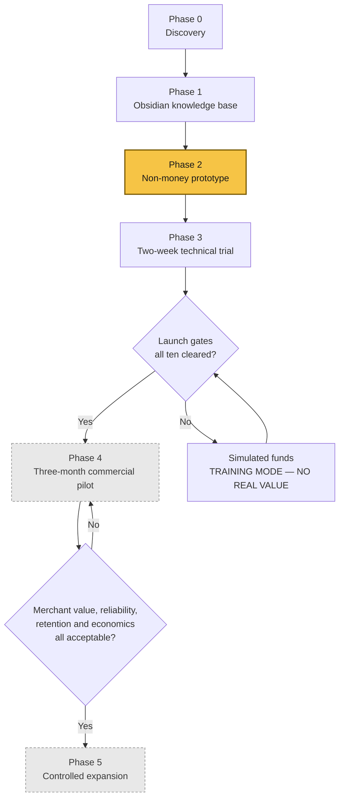

# Roadmap

Six phases. **No phase begins before its predecessor's exit condition is met.** Telga is currently
in **Phase 2**.

## Phase detail

### Phase 0 — Discovery
Confirm company and team, identify the first airtime provider or distributor, obtain terms for
product, commission, integration, status, reversals, settlement, and support. Interview merchants,
record baseline metrics, maintain the assumptions and risk registers.
**Owner: MuleSoo. Status: NOT STARTED.** Registers: the provider assessment (commercial material, kept outside this repository),
the provider engagement record (commercial material, kept outside this repository) , the pilot baseline metrics (commercial material, kept outside this repository), the pilot assumptions register (commercial material, kept outside this repository) ,
[[Risk Register]].

### Phase 1 — Obsidian knowledge base
Create the vault and decision memory **before** complex implementation. This vault is that work.
**Status: SUBSTANTIALLY COMPLETE** — 115 notes, maintained alongside the code.

### Phase 2 — Non-money prototype
Mock provider, simulated ledger, English and Amharic screens, receipts, state transitions,
support, and reports. No live provider, no live money.
See [[Architecture]] and [[Testing Strategy]].
**Status: IN PROGRESS** (Decision Log D113).

Built: the mock provider, the append-only ledger, the transaction state machine, the
English and Amharic screens, receipts, support cases and reports.

**Not** built, and why this phase is not complete: no remote deployment yet
([[Railway Deployment Checklist]]), no Android phone or POS testing on real hardware
(`A92`), **no printer integration of any kind** (`A101`), no merchant registration or
automatic tenant provisioning (`A85`, `A86`), incomplete admin operational views, and
the Phase 3 controlled technical trial has not started. **All ten launch gates remain
open.**

### Phase 3 — Two-week controlled technical trial
Test success, failure, timeout, pending, under-review, reversal, reprint, printer failure, outage,
offline and reconnect, ledger reconciliation, and support.
**Exit condition: no known duplicate-vending or balance-integrity defect remains.**
See the technical trial plan (commercial material, kept outside this repository).

### Phase 4 — Three-month commercial pilot
A compact area where MuleSoo has strong merchant relationships. Primary cohort: shops with
disconnected tools. Benchmark: high-volume Flash/Kazang-style users. Measure value, reliability,
retention, and economics. See the commercial pilot plan (commercial material, kept outside this repository)  and the pilot measurement record (commercial material, kept outside this repository).

### Phase 5 — Controlled expansion
Expand products, providers, cities, or payment features **only** after evidence, contracts, legal
review, and operational capacity.

## Dates

**No dates are set.** Phase 4 cannot be scheduled until [[Launch Gates]] clears, and that depends
on a provider agreement that does not yet exist.

## Related

- [[Product Scope]]

---
Back to [[00 Home]]
