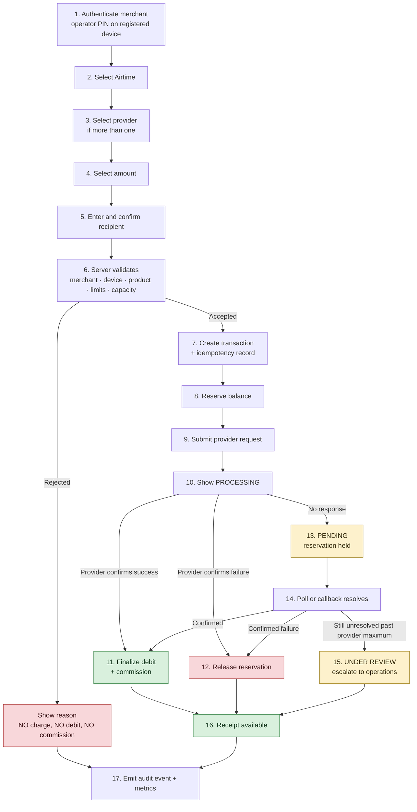

# User Journeys

## Merchant airtime sale journey

The counter-level flow. Seventeen steps from authentication to audit, as specified in `CLAUDE.md`.

> [!important] The merchant never sees a guess
> Between step 10 and step 14 the honest answer is "still being checked". The UI says exactly
> that, and blocks retry. See [[Idempotency]] and [[Amharic Strings]].

## Journey variants

| Journey | Entry | Notes |
|---|---|---|
| Reprint a receipt | Transaction details screen | Emits `ReprintEvent`, never a sale — [[Receipt Specification]] |
| Find a transaction | Transaction search | By ID, receipt, time, amount, or reference |
| Raise a support case | Transaction details or support screen | [[Support and Disputes]] |
| Submit funding | Funding screen | Simulated only — [[Funding Verification]] |
| Sale blocked by outage | Airtime selection | Airtime blocked, other approved services stay available — [[Provider Health]] |
| Device offline | Any screen | New sales stop; history, settings and support remain — [[Provider Health]] |

## Operations journeys

- **Verify a funding submission** — operations verifier, second approval for high-value; see [[Funding Verification]]
- **Resolve an under-review transaction** — operations reviewer; see [[Runbooks]]
- **Daily reconciliation** — a *separate* reviewer from the verifier; see [[Funding Verification]]

## Related

- [[Transaction State Machine]]
- [[Screen Inventory]]
- [[Support and Disputes]]
- [[Provider Health]]

---
Back to [[00 Home]]
