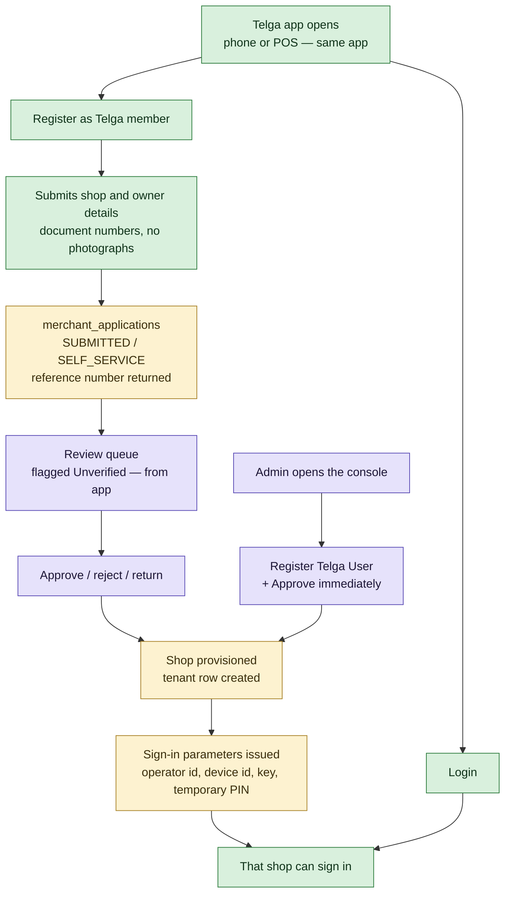

# Vendor Registration

How a shop that has never spoken to Telga gets a Telga account. [[Device Registration]] covers
how a *machine* is trusted afterwards; this note covers how the *business* is admitted.

> [!important] Registration is not approval, and approval is not access
> Three things happen in sequence and are routinely collapsed into one:
> a shop **applies**, an admin **approves**, and credentials are **issued**. Each is a separate
> act with its own permission and its own audit event. A shop that has applied has nothing to
> sign in with, because nothing was created.

## The gap this note closes

The vault held two accepted positions that cancelled each other, and neither was written in
`CLAUDE.md`:

| Where | What it said |
|---|---|
| [[Admin Operations Console]] Decision 3 | *"An applicant downloads the app, submits shop details, and receives a reference number."* **Accepted** |
| [[Decision Log]] D113(b) | *"no self-service registration is exposed in the Android app, the POS, the console or the API."* **Accepted** |
| `admin/applicationIntake.ts` | *"There is no public registration route… D113(b) defers self-service registration"* — matching D113(b), so the **build followed the deferral** |
| `CLAUDE.md` | Named "device registration" as scope and described **no registration flow at all** |

**D138** resolves it in favour of Decision 3 and writes the flow into `CLAUDE.md` §18.1, which is
the authoritative file. The founder's requirement was explicit: the app opens on **Login** and
**Register as Telga member**.

## The two paths

### Path A — the shop registers itself

Feature flag `registration.self_service`, route `POST /register` on the merchant server.

1. Shop owner opens the app — **on a phone or on POS hardware, the same app** ([[Platform Shape]]).
2. Taps **Register as Telga member**, fills in shop, owner and document *numbers*.
3. The backend writes **one row** to `merchant_applications` and returns a reference number.
4. An admin sees it in the queue, marked **Unverified — from app**.
5. Approve or reject. Approval provisions the shop in the same request.
6. Credentials are issued as a separate act.
7. The shop signs in.

### Path B — an admin registers the shop directly

An admin at the counter with the originals ticks *"Approve immediately — I have seen these
documents"*. **Admin creation is the approval**: no pending state, no second review, because the
recorder and the reviewer are the same person looking at the same papers.

It reuses the review path's own two steps — record the decision, then provision — rather than a
second creation path, so a shop created here and a shop approved from the queue are the same
shop with the same tenant row. The audit trail records `path: 'DIRECT'`, so an approval that had
no second pair of eyes stays distinguishable forever after.

## Design decisions, and what each one is defending

### No account exists until approval

Decision 3's argument, unchanged: the alternative is creating a locked account immediately, which
means real credentials for unvetted people plus an approval check on every route where a single
missed guard is a way in. **Nothing to attack is better than a guard that must never be
forgotten.** Pinned by a test that counts merchants, operators, devices, enrolments and sessions
before and after a submission.

### Two secrets, never one

A registration produces a **reference number** — public, the applicant's only handle on their own
application. A device produces a **device key** — 256 bits, shown once, never recoverable. The
reference identifies; the key authenticates. See [[Device Registration]].

### Document numbers, never photographs, on the public route

The console's version of this form takes scans, because an admin is holding the originals and can
see the scan matches them. The public route takes **references only**: an unauthenticated upload
endpoint is a way to put arbitrary bytes on Telga's volume, and the originals must still be seen
by a person before approval — so a scan here adds a risk without removing a step.

### `submitted_via` is about evidence, not provenance

Migration 018. Until D138 every application was typed by an admin from a folder a shop carried in,
so a reviewer could assume somebody had seen the documents. That assumption stops being true the
moment the internet can write to the table, **and a reviewer who cannot tell the two apart will
keep making it.** The console shows it as **Unverified — from app**, because what a reviewer needs
to know is not where a row came from but what it is worth.

The column defaults to `ADMIN`, not `SELF_SERVICE`. Defaulting the other way sounds safer and is
worse: it would retroactively relabel verified applications as unverified, making the flag
meaningless on exactly the rows where it is most trustworthy.

### Refusals say more here than at sign-in, except in one case

A sign-in refusal is vague because precision there is a probe for somebody holding a stolen
device. A registration refusal **names the wrong field**, because there is no account to probe for
and a message that will not say what is wrong just loses a real merchant.

The exception is a document number already registered to another shop. Saying so would turn the
route into a way to test licence numbers against Telga's merchant list, so it says
*"contact Telga"*. The honest cases — a re-application, a typo — need a person anyway.

### The one anonymous write surface is bounded

Six submissions per source per hour, refusals included — a refusal that did not count would let a
caller probe the validator for free. The caller's address is **salted and hashed**; a throttle
needs to know two requests came from the same place, not where, and an address in a database is
personal data with nothing to justify it.

Behind a proxy the first `x-forwarded-for` entry is used, **only when the peer is a trusted
proxy**. Otherwise a caller mints a fresh bucket per request by inventing the header.

> [!warning] Two honest limits
> **The salt is per-process.** `recipientSalt` is a fresh UUID at start-up, so a restart empties
> every bucket. It fails in the safe direction — a restart forgets who was throttled rather than
> throttling somebody who was not — but a durable salt is a deployment decision still open.
>
> **With no `--trust-proxy` configured**, the forwarding header is ignored and every request
> behind the same edge shares one bucket. The throttle is then coarse rather than absent. See
> [[Railway Deployment Checklist]].

## Sign-in is gated on the shop, not only the operator

`signIn` refuses when `merchants.status` is not `ACTIVE`, and `authenticate` revokes a live
session the moment the shop stops being active.

> [!bug] This was a real hole, found while writing this note
> Suspending a merchant in the console wrote `merchants.status` and **nothing read it at
> sign-in**. `createSale` refused, so a suspended shop could not sell — but its operators could
> still sign in, browse and hold live sessions until they chose to sign out. The console's own
> device-stop route was careful about exactly this (*"a stopped device that kept a live session
> would still be usable, which is the opposite of stopped"*); merchant suspension was not.
> Fixed with D138 and pinned by a test.

## What is deliberately still forbidden

**Device-initiated provisioning.** D113(b)'s device half is untouched. Opening self-service
registration of a *business* did not open self-service provisioning of a *machine*: an
application grants nothing until a human approves it, whereas a device key authenticates every
later request. A device that provisioned itself would carry a secret shipped in the APK, and an
APK is a public file.

## Related

- [[Platform Shape]] — one app, one backend, one console, 1000+ tenants
- [[Device Registration]] — the activation code and the device key
- [[Multi-Shop Onboarding]] — the chain this completes
- [[Admin Operations Console]] — Decision 3, and the review queue
- [[Merchant Onboarding]] — the operational side
- [[Feature Flags]] — `registration.self_service`
- [[Decision Log]] — D138

---
Back to [[00 Home]]
