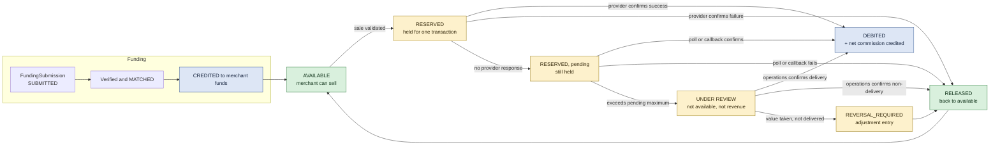
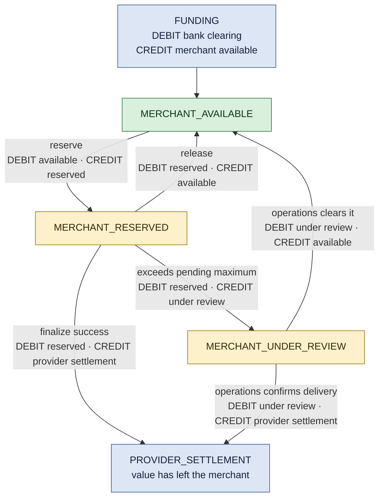

# Balance Model

## The four views

A merchant sees four numbers. They are **derived from the ledger**, never stored as a mutable
field, so they cannot drift.

| View | Meaning | Can the merchant spend it? |
|---|---|---|
| **Available** | Free to sell against | Yes |
| **Reserved** | Held against an in-flight sale | No |
| **Under review** | Held against an unresolved outcome | No |
| **Total** | Available + reserved + under review | — |

```text
Total = Available + Reserved + UnderReview
Available = Credited − Debited − Reserved − UnderReview
```

## Value lifecycle



> [!important] Nothing disappears between boxes
> At every instant every santim sits in exactly one bucket. A transition that removes value from
> one bucket without placing it in another is a balance-integrity defect, and Phase 3 cannot exit
> while one is known. See the technical trial plan (commercial material, kept outside this repository).

## Reservation, release and finalization as postings

In the persisted model the four views are not derived from reservation rows — each bucket is a
**real ledger account**, and every movement between buckets is a balanced posting. That makes each
step auditable rather than inferred ([[Decision Log]] D12, [[SQLite Persistence Layer]]).



Three properties hold at every arrow, and each has a test:

| Property | Test |
|---|---|
| The original entries are never edited — a release is a **new** balancing posting | `never edits the original entries — it posts new balancing ones` |
| A repeated release cannot double-credit | `a repeated release cannot double-credit` |
| A repeated finalization cannot double-debit | `a repeated finalization cannot double-debit` |

The guard is the reservation status update: `WHERE status = 'HELD'` changes one row or none, so a
second attempt finds nothing to move and is refused before any posting is written.

## Which service moves value between buckets

| Movement | Service |
|---|---|
| available → reserved | `createSale` |
| reserved → available | `createSale` on confirmed failure, `resolvePending` on a failure lookup |
| reserved → provider settlement | `createSale` on success, `resolvePending` on a success lookup |
| reserved → under review | `resolvePending`, past the pending maximum |
| under review → available | `completeReversal` |

Each runs inside one unit of work with its reservation row and audit event, so the bucket totals
and the reservation status can never disagree. See [[Transaction Orchestration]].

## When nobody is watching

[[Recovery Sweep]] moves value between buckets without a human present. The same rule governs it:
**only a determinate provider answer may move a merchant's money.** An unreachable provider, a
malformed body or a misconfigured credential all leave the value exactly where it is.

The one exception is a `RESERVED` transaction with no provider reference — proof the provider was
never called, because `createSale` reaches `PROCESSING` before it submits. That value is released.

## Simulated funds and training mode

While `training.mode` is on (see [[Feature Flags]]):

- the merchant operates a **simulated ledger**, structurally separate from any live ledger
- every screen carries **TRAINING MODE — NO REAL VALUE**
- a boundary check prevents a training transaction from reaching a provider adapter or a settlement path
- training entries are excluded from every revenue and reconciliation report

This is the only mode Telga runs in today.

## Funding into the balance

Only under an approved structure: bank deposit or transfer, manual verification, merchant
reference. **No overdraft. No personal account. No screenshot-only credit.**
Full flow in [[Funding Verification]].

## Related

- [[Ledger Invariants]]
- [[Transaction State Machine]]
- [[Funding Verification]]
- [[Screen Inventory]]

---
Back to [[00 Home]]
