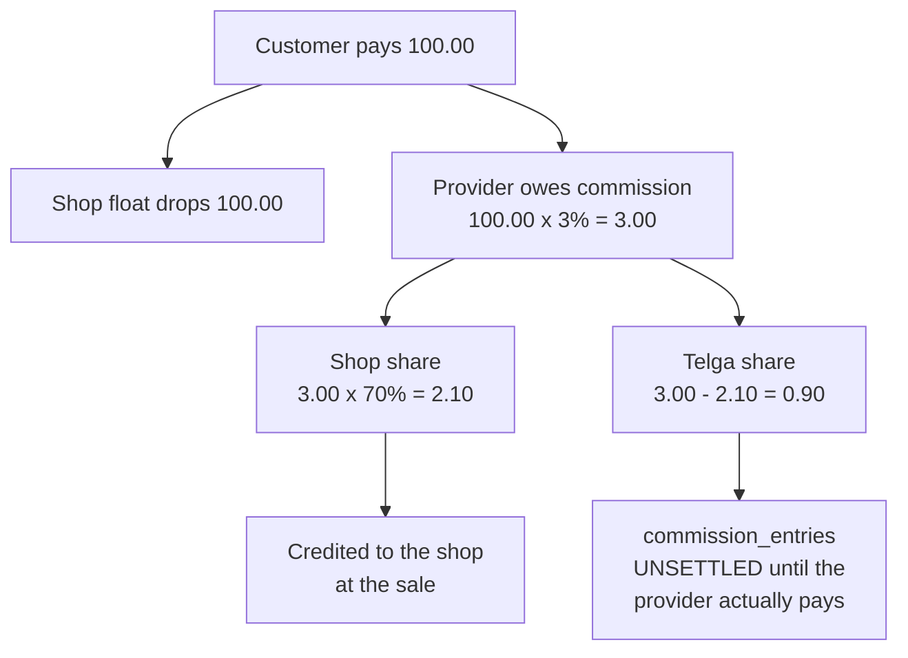
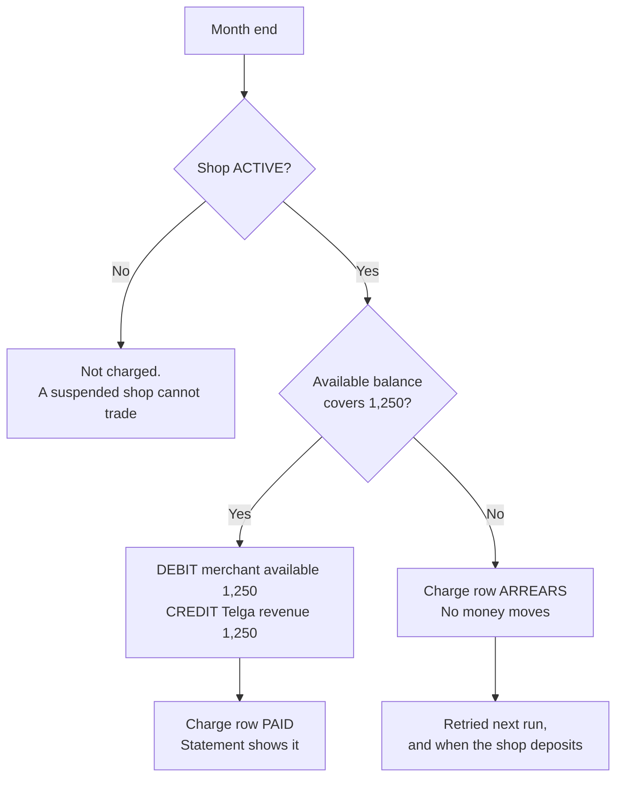

# Commission and Fees

How money is divided between a shop, Telga and a provider — and the one fee that
runs the other way.

> **The rates here are configuration, not commercial terms.** The split (70/30)
> and the software fee (ETB 1,250) are founder decisions. **No provider's
> commission rate is known**, and `CLAUDE.md` §30 forbids inventing one.

## The split — D165

A provider pays Telga a commission on a sale. That commission is divided; the
shop keeps most of it.

**Two steps, not one.** The policy is explicit: *"do not calculate shop profit
from the full transaction amount unless a provider contract explicitly defines
that behavior."*

### What this replaced, and what it costs a shop

`trainingProfitMinor` (D69) took **4% of the face value**. On the same 100 birr
sale a shop earned **4.00** there and earns **2.10** here. The founder was told
that plainly and chose this model.

The old function still exists and is still tested — it explains what past
training sales paid, and the ledger is append-only.

### Telga's share is subtracted, never calculated

Rounding both shares independently loses or invents a santim on **2,000 of the
first 19,999 amounts** — one in ten. Deriving the second share as the remainder
makes `shop + telga === commission` an identity.

`commission_entries` carries a `CHECK` that refuses a split which does not sum,
so a future caller that computes the shares some other way is refused by the
database rather than by a code review.

When a half-santim has to fall somewhere, it falls to the **shop**.

## Who decides the rate

**The admin panel, and one figure for every shop.** Founder instruction:

> *"Only admin pannel can decide he persent of commition the shop earn… shops
> cant decide."*
> *"Notice all telga shops owner the some amount of commission from each sales
> that decide by admin pannel."*

`platform_fee_settings` has **no merchant column**. That absence is the
enforcement: a per-shop rate is not hidden, it is unrepresentable. The screen is
`/fees` in the console, reserved to `PLATFORM_OWNER` with a step-up.

| Question | Where the answer lives | Who may change it |
|---|---|---|
| What share does a shop keep? | `platform_fee_settings.shop_share_bps` | `PLATFORM_OWNER` |
| What does a provider pay? | `provider_commission_rates` | `PLATFORM_OWNER`, with a `source` |
| What if a provider has no row? | `platform_fee_settings.default_commission_bps` | `PLATFORM_OWNER` |
| What did *this* sale pay? | `commission_entries` | Nobody — history |

`PROFIT_PERCENT_BPS` in the per-merchant `settings` table is **no longer read by
the sale path**. Existing rows stay, as history.

### A provider's rate is never defaulted silently

`splitCommission` takes the rate as a required argument. A caller that does not
know it cannot get a plausible number out of the function. The 3% default is a
starting point for the configuration screen, shown to an administrator before it
is ever used.

`provider_commission_rates` starts **empty** and every row requires a `source`
naming the contract it came from.

## What the admin panel does not show

**Any shop's profit.** Founder instruction: *"profit on admin pannel no, no need
shop profit on admin pannel thats private."*

`/fees` shows the rate that applies to everybody, and **Telga's own** revenue as
a platform aggregate. No shop is named and no individual sale appears — which is
the same line [[Decision Log]] D144 draws for §23.2.

Balance and profit stay on Telga Vending, where the shop reads them.

## The monthly software fee — D166

**ETB 1,250, every active shop, at each month end.** Founder instruction:

> *"1250 fee must every month end regardless of telga weather baught by shop
> owner or telga provided must be minused from existing shop balance without any
> notice but it must shaw transaction statment of telga vending."*

### "Regardless" is the whole rule

No hardware condition, no volume threshold, no trial exemption. A condition
added here would be a commercial term nobody agreed (§30).

A **suspended** shop is not charged — not an exemption, but because it cannot
trade, so the charge would drain a balance it can neither spend nor replenish.

### "Without any notice" has exactly one limit

**§20: "No overdraft."** A shop below the fee is not debited. A negative selling
balance is Telga lending money, which §2 keeps switched off.

The charge is still **recorded** as `ARREARS` — a debt Telga can see and collect
— rather than a month that silently went uncharged.

**Partial collection is refused.** Taking 400 of 1,250 leaves a shop unable to
trade and still owing 850: the worst answer for both sides.

### It cannot charge twice

The ledger posting and the charge row are written in **one transaction**, and
`(merchant_id, period)` is unique. A restarted worker, a cron firing on two
instances, and an administrator repeating it by hand all find the row and move
nothing.

### Where a shop sees it

The **Telga Vending statement**, in its own column, on the day it was taken. A
month still owed shows as *Due* on the last day of that month, because that is
the day a shopkeeper will look for it.

## The defect this uncovered

Worth recording on its own, because the same shape will recur.

The fee credits `TELGA_REVENUE` **attributed to the shop it was charged to**, so
reconciliation can say whose fee it was. `profitForDay` and
`profitAvailableMinor` sum exactly that account for exactly that merchant.

Without an exclusion, charging a shop 1,250 birr would have **raised the profit
its dashboard showed by 1,250** — and `profitAvailableMinor` is what a profit
transfer draws on, so the owner could then have moved that 1,250 into their
selling balance. **A fee taken would have become money invented.**

Both queries now exclude `FEE_DEBIT`, **by entry type** rather than by declining
to attribute the merchant, so any fee added later is covered by the same rule
instead of by whoever writes it remembering.

## What is NOT settled

| Question | Status |
|---|---|
| Any provider's actual commission rate | `NOT YET CONFIRMED` — P2, P3 |
| Whether the software fee may lawfully be charged | §8 requires a merchant agreement and fee disclosure; neither is written |
| The card fee | Defaults to **zero**. No acquirer term exists (§30) |
| When provider commission is actually settled | `commission_entries.settlement_status` exists; no settlement process does |

## Related

- [[Ledger Invariants]] — invariants 1, 7, 8 and 9 all bear on this
- [[Balance Model]] — what "available" excludes
- [[Admin Operations Console]] — where `/fees` lives
- [[Decision Log]] — D69, D165, D166

---
Back to [[00 Home]]
