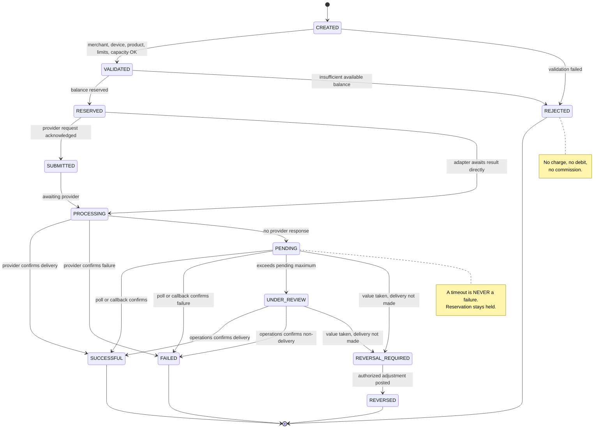

# Transaction State Machine

The single source of truth for what a Telga transaction can do. The transition table is **data,
not control flow** — every legal move is a row, and anything absent throws. That is what makes the
machine exhaustively testable.

**Implemented in** `packages/domain/src/states.ts`, with the aggregate in
`packages/domain/src/transaction.ts`. **Tested in** `tests/domain/states.test.ts`.

## The twelve states

| State | Meaning | Value bucket | Terminal? |
|---|---|---|---|
| `CREATED` | The transaction record and idempotency record exist. Nothing has been validated or held. | None | No |
| `VALIDATED` | Merchant, device, product, limits and capacity all pass. Still nothing held. | None | No |
| `RESERVED` | Merchant value is held against this sale, excluded from available balance. | Reserved | No |
| `SUBMITTED` | The provider request has been sent and acknowledged. | Reserved | No |
| `PROCESSING` | Awaiting a provider outcome. What the merchant sees during a normal sale. | Reserved | No |
| `PENDING` | The provider has not answered. **Outcome unknown — not a failure.** Reservation still held. | Reserved | No |
| `UNDER_REVIEW` | Pending exceeded the provider maximum. Escalated to operations; funds protected. | Under review | No |
| `REVERSAL_REQUIRED` | Determined that value was taken and delivery did not happen. Awaiting an adjustment entry. | Under review | No |
| `SUCCESSFUL` | Delivery confirmed. Debit finalized, commission credited. | Debited | **Yes** |
| `FAILED` | Failure confirmed. Reservation released, no charge. | Released | **Yes** |
| `REVERSED` | An authorized adjustment entry has been posted. | Released | **Yes** |
| `REJECTED` | Refused before anything was held. **No charge, no debit, no commission.** | Released | **Yes** |

`CREATED`, `VALIDATED`, `RESERVED` and `REVERSAL_REQUIRED` are named here deliberately: earlier
drafts left them implicit, and the knowledge graph flagged them as isolated nodes. Each now has a
row above, a transition row below, and a named test.

## Valid transitions

Every legal move, with the ledger effect and the test that proves it.

| # | From | To | Trigger | Ledger effect | Test |
|---|---|---|---|---|---|
| 1 | `CREATED` | `VALIDATED` | Server validation passes | None | `CREATED -> VALIDATED` |
| 2 | `CREATED` | `REJECTED` | Validation fails | **None** | `rejects every pair absent from the transition map` (positive path via map) |
| 3 | `VALIDATED` | `RESERVED` | Reservation succeeds | `BalanceReservation` created | `VALIDATED -> RESERVED` |
| 4 | `VALIDATED` | `REJECTED` | Insufficient available balance | None | `refuses a reservation larger than available` (balance suite) |
| 5 | `RESERVED` | `SUBMITTED` | Provider request sent and acknowledged | None | `RESERVED -> SUBMITTED` |
| 6 | `RESERVED` | `PROCESSING` | Adapter with no separate acknowledgement | None | `RESERVED -> PROCESSING` |
| 7 | `SUBMITTED` | `PROCESSING` | Awaiting outcome | None | `accepts every pair present in the transition map` |
| 8 | `PROCESSING` | `SUCCESSFUL` | Provider confirms delivery | Reservation → debit; commission credited | `PROCESSING -> SUCCESSFUL` |
| 9 | `PROCESSING` | `FAILED` | Provider confirms failure | Reservation released | `PROCESSING -> FAILED` |
| 10 | `PROCESSING` | `PENDING` | No provider response | Reservation **held** | `PROCESSING -> PENDING (a timeout is never a failure)` |
| 11 | `PENDING` | `SUCCESSFUL` | Poll or callback confirms | Reservation → debit | `PENDING -> SUCCESSFUL` |
| 12 | `PENDING` | `FAILED` | Poll or callback confirms failure | Reservation released | `PENDING -> FAILED` |
| 13 | `PENDING` | `UNDER_REVIEW` | Pending exceeds provider maximum (default 5 min) | Reservation → under-review bucket | `PENDING -> UNDER_REVIEW` |
| 14 | `PENDING` | `REVERSAL_REQUIRED` | Callback states value taken, delivery not made | Held pending adjustment | `PENDING -> REVERSAL_REQUIRED` |
| 15 | `UNDER_REVIEW` | `SUCCESSFUL` | Operations confirms delivery | Under review → debit | `accepts every pair present in the transition map` |
| 16 | `UNDER_REVIEW` | `FAILED` | Operations confirms non-delivery | Under review released | `accepts every pair present in the transition map` |
| 17 | `UNDER_REVIEW` | `REVERSAL_REQUIRED` | Value taken, delivery not made | Held pending adjustment | `UNDER_REVIEW -> REVERSAL_REQUIRED -> REVERSED` |
| 18 | `REVERSAL_REQUIRED` | `REVERSED` | Authorized adjustment entry posted | Adjustment appended | `REVERSAL_REQUIRED -> REVERSED` |

> [!note] Two clarifications recorded during implementation
> **Row 6** — `RESERVED → PROCESSING` is legal without passing through `SUBMITTED`, for adapters
> that do not acknowledge separately ([[Decision Log]] D10).
> **Row 14** — `PENDING → REVERSAL_REQUIRED` is legal without passing through `UNDER_REVIEW`: a
> provider callback can state plainly that value was taken and delivery did not happen, which
> needs no human determination first ([[Decision Log]] D9).

## Invalid transitions

Every ordered pair not listed above is illegal. With 12 states there are 144 ordered pairs, 18 of
which are legal, so **126 are refused** — asserted exhaustively rather than sampled.

| Attempt | Why it is refused | Error |
|---|---|---|
| `CREATED → RESERVED` | Value may never be held before validation | `IllegalTransitionError` |
| `CREATED → SUCCESSFUL` | A sale cannot complete without being submitted | `IllegalTransitionError` |
| `RESERVED → FAILED` | A failure must be *confirmed* by a provider outcome, not assumed at reservation | `IllegalTransitionError` |
| `PROCESSING → UNDER_REVIEW` | Under review is reached only after a pending period elapses | `IllegalTransitionError` |
| `PENDING → REVERSED` | A reversal requires the `REVERSAL_REQUIRED` determination first | `IllegalTransitionError` |
| Anything out of `SUCCESSFUL`, `FAILED`, `REVERSED`, `REJECTED` | Terminal | `TerminalStateError` |

A refused transition leaves the transaction **completely untouched** — same state, same history.
Tested by `the aggregate refuses an illegal move and leaves the transaction untouched`.

## Terminal states

`SUCCESSFUL` · `FAILED` · `REVERSED` · `REJECTED`

No transition out of any of them is legal, from any state, ever. Tested by
`has exactly four, and none of them can move`.

Everything else is in flight and **holds merchant value**.

## Diagram

## Who drives these transitions

Every transition is made by a named service in [[Transaction Orchestration]], never by a client:

| Transition | Driven by |
|---|---|
| `CREATED → VALIDATED → RESERVED → PROCESSING` | `createSale` |
| `PROCESSING → SUCCESSFUL / FAILED / PENDING` | `createSale`, from the provider outcome |
| `PENDING → SUCCESSFUL / FAILED` | `resolvePending`, from a status lookup |
| `PENDING → UNDER_REVIEW` | `resolvePending`, past the pending maximum |
| `PENDING / UNDER_REVIEW → REVERSAL_REQUIRED` | `requireReversal`, after a determination |
| `REVERSAL_REQUIRED → REVERSED` | `completeReversal` |

| `PROCESSING → SUCCESSFUL / FAILED / PENDING` (recovered) | `recoverInFlight`, from a status lookup |
| `RESERVED → PROCESSING → FAILED` (never submitted) | `recoverInFlight`, on proof the provider was never called |
| `RESERVED → PROCESSING → PENDING` (uncertain) | `recoverInFlight`, when submission cannot be ruled out |
| `PENDING → UNDER_REVIEW` (unattended) | `recoverInFlight`, past the deadline or out of attempts |

**The client never decides the final state.** It sends an intent and receives a typed result.

> [!note] Why recovery uses two hops out of `RESERVED`
> There is no legal `RESERVED → FAILED` edge, and recovery does not add one. It takes the legal
> path `RESERVED → PROCESSING → FAILED` instead. The transition map stays the single authority
> even for a machine acting unattended — see [[Recovery Sweep]].

## Non-negotiable rules

1. **A timeout is never a failure.** `PROCESSING → PENDING` is the only legal response to silence.
2. **An uncertain outcome is never retried as a new transaction.** Same logical transaction, same idempotency key — see [[Idempotency]].
3. **No state leaves merchant value unaccounted for.** Every state maps to exactly one bucket in the `VALUE_DISPOSITION` table; asserted by `assigns every state exactly one bucket`.
4. **No fee on a non-successful outcome.** See [[Ledger Invariants]].
5. **A reprint changes no state.** It emits a `ReprintEvent` and nothing else.

## Required transaction fields

Internal ID · merchant / device / operator · product / provider · amount / currency ·
recipient / reference · idempotency key · provider reference · timestamps · states ·
ledger entries · commission and fee version · print and reprint events · audit and support references.

## Timing

| Parameter | Value | Source |
|---|---|---|
| Telga processing target | under 1 s | Internal target, not a public guarantee |
| Provider response target | under 5 s | Internal target |
| Successful sale target | under 10 s | Internal target |
| Automatic pending maximum | **5 minutes default** | Assumed default A7 — provider-specific rules override once contracted |

## What the merchant sees

While `PENDING`:

> This transaction is still being checked. Do not retry yet.

Retry is blocked in the UI, and blocked again at the API by the idempotency key.

## Related

- [[Ledger Invariants]]
- [[Balance Model]]
- [[Idempotency]]
- [[Provider Health]]
- [[Testing Strategy]]
- [[Domain Implementation Plan]]

---
Back to [[00 Home]]
