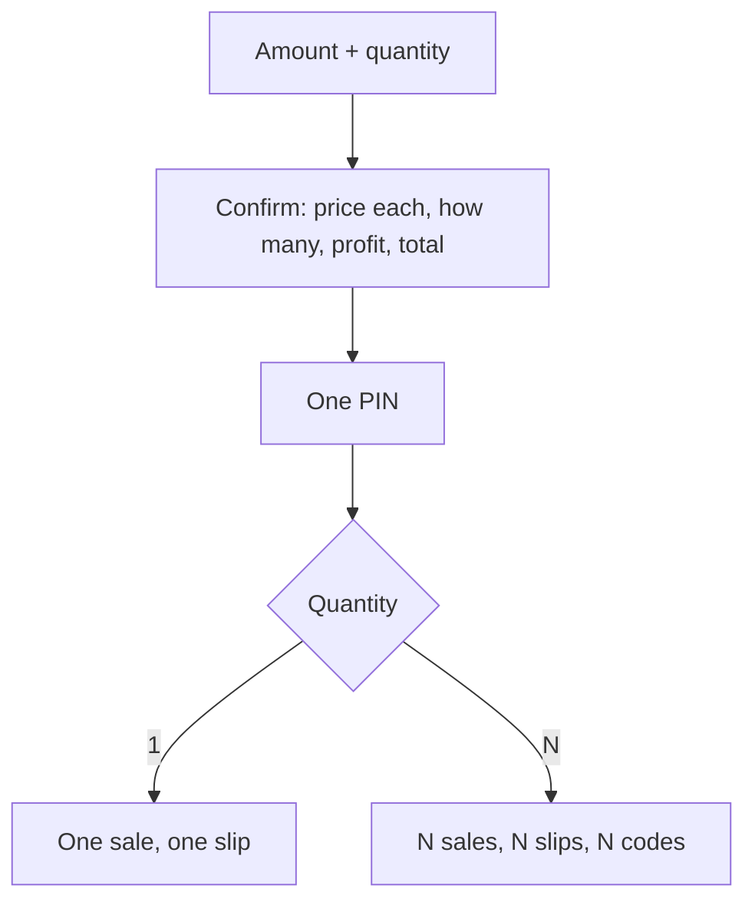

# Bulk Printing and Sign Out

The consolidated retest produced fifteen findings. Most were navigation and slip corrections,
recorded in [[Data Vouchers and Slip Codes]]. Three carried real money or security consequences
and are recorded here.

Everything is **training only**. No provider is contacted and no real money moves.

## 1. The recipient chain was broken end to end

The single defect behind four separate retest findings.

`authorizeOrder` passed the literal string `VOUCHER-SALE-NO-RECIPIENT` as the recipient of
**every** voucher sale — including top-ups and data bundles that had a real phone number
attached. Masking that placeholder produced `VOUC*******************ENT`, so:

| Reported as | Actually caused by |
|---|---|
| "PIN is masked with stars" | the placeholder recipient line, read as the PIN |
| "top-up slip shows no phone number" | the real number never reached the transaction |
| "airtime slip shows a phone field it shouldn't" | the placeholder printed on every voucher |
| "slip looks ugly / lacks detail" | that line, plus a truncated Network and a raw product id |

Three fixes:

- **The order's mask is passed through, not re-masked.** `pending_orders.recipient` already holds
  the mask — masked at creation, the full number never kept — so re-masking it would print
  nonsense. `SaleRequest` gained an optional `recipientMasked` for exactly this case.
- **A product with no recipient carries an empty mask**, and the slip omits the line entirely. A
  counter voucher is handed over, not sent anywhere; a blank or starred line there is worse than
  no line at all.
- **`transactions.product_type` records what was sold.** It used to be the hard-coded literal
  `AIRTIME` for every sale, which is why the slip's Network line — derived from the product id in
  that column — could never render.

`parseProductId` replaces `split('_')[0]`, which truncated `NETWORK_A` to `NETWORK` because the
network id contains an underscore of its own. It anchors on the product kind instead, so the
network is everything before it.

## 2. Bulk printing

[[Decision Log]] **D75**, migration 010. A shop selling ten 25-birr vouchers pressed PIN ten
times; now it presses once.

**Batching the authorization, never the money.** Ten vouchers is ten things a customer can hold,
and one row cannot carry ten different PINs — so a batch of ten is ten transactions, each with
its own idempotency key, reservation, ledger postings and simulated redemption code. They are
created sequentially, because letting ten reservations race against the same float would make
the balance check guarding the last one depend on scheduling.

**Nothing stores the list.** Each voucher's client request id is derived from the order's
(`batchRequestId`), and an idempotency key is derived from merchant, device and that id — so the
whole batch is found again from the order row alone. A stored list could disagree with what was
actually created; a derived one cannot.

**Bounded at 1–20**, in the service *and* in the CHECK, so a typo cannot become two hundred
ledger postings. The ceiling is a guess at a safe bound, not a measured one — see `ASSUMPTIONS.md`
A71.

The affordability check now judges the **total**: four 25-birr vouchers needs 100 birr on hand,
not 25. The old check compared one voucher against the balance and would have let an unaffordable
batch through to fail mid-way.

## 3. What sign-out means

[[Decision Log]] **D74**. Three different events, three different costs:

| Event | Forgets | Operator re-enters |
|---|---|---|
| Idle timeout (60s) | the session | **PIN only** |
| App closed or restarted | session + operator | operator + PIN |
| **Sign out** (Settings) | everything | device, device key, operator, PIN |

The mechanism is three cookies with deliberately different lifetimes, not three branches of
logic: the device and device-key cookies persist, and the operator cookie carries **no
`Max-Age`**, so it dies with the browser. That single difference is what separates "idle" from
"restarted".

> ⚠️ **This reverses a security property.** The device key was previously never stored on the
> client. Remembering it is what makes an idle timeout cost a PIN alone, and the cost is that
> possession of the browser profile becomes possession of the device key — the key stops being a
> second factor beside the session.
>
> Mitigations: `httpOnly` (page script cannot read it), `SameSite=Strict`, `Secure` when the
> transport is, never written to `localStorage`. The **PIN is still never stored anywhere in any
> form**, and server-side device revocation overrides every cookie.
>
> Recorded as `ASSUMPTIONS.md` **A69**, open for review before any shared device and before live
> money. See [[Authentication and Sessions]].

Sign-out lives in Settings rather than on the counter screens on purpose: the one action that
costs everything should take a decision to reach. It asks before it acts.

## What is still open

- The 20-voucher ceiling is unmeasured against a real provider adapter and a real printer (A71).
- Remembering the device key has not been assessed against a shared or public-counter device,
  which is the case where it matters most (A69).
- Amharic for the new strings is draft and **requires native review before production**.

---
Back to [[00 Home]]
