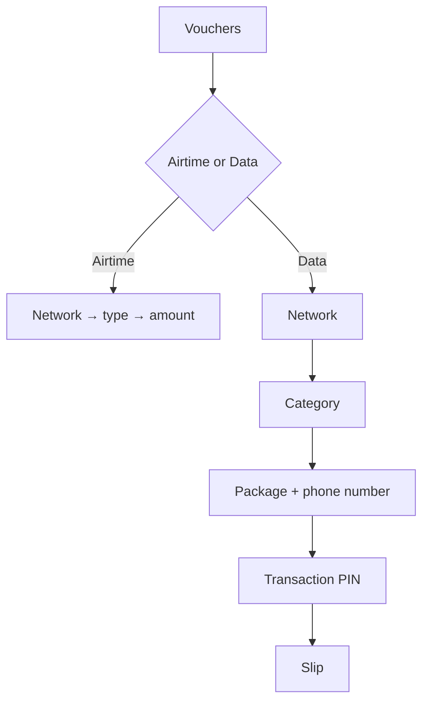

# Data Vouchers and Slip Codes

Three changes from the founder's Stage 1–2 retest: a data bundle flow, a redemption code on
the slip, and navigation that can always get back to the main screen.

Everything here is **training only**. No provider is contacted and no code will load anything.

## 1. Data bundles

Approved as a training-only flow ([[Decision Log]] **D72**), which changes what CLAUDE.md §7
previously listed as disabled. Data remains disabled for any live release.

Nine categories: Monthly · Weekly · Daily · Hourly · Weekend · All-Access · LTE · Social ·
Voice. Each bundle carries a volume, a validity and a price, all three visible before the
operator commits.

A phone number is **required**, for the same reason a top-up requires one: the bundle is
delivered to a handset, so there is nowhere else for it to go. It is masked at the boundary
before it reaches the database, exactly as a top-up recipient is.

### Two names deliberately not used

The founder's list named **FreeMe**, which is a Vodacom trademark, and asked for real carrier
names such as **Ethio Telecom** and **MTN** on the slip. Neither is used:

- Telga has no agreement with any of those operators. CLAUDE.md §10 forbids inventing a
  provider, and [[Decision Log]] D66 already settled that the simulated networks stay
  `Network A–D (simulated)`.
- A trademark on a training slip is a claim of association that does not exist.

`All-Access` carries the same meaning without borrowing a brand. A test asserts that none of
those names appears anywhere in the flow.

> Volumes, validities and prices are **training values**, not researched market rates — see
> `ASSUMPTIONS.md` A66. They must not be quoted to a merchant or a provider.

## 2. What the slip prints

A voucher slip without a redemption code is not a voucher. So the slip now carries:

| Line | Example | Notes |
|---|---|---|
| Network | `NETWORK_A` | the simulated network, never a carrier |
| Voucher PIN | `TRAIN-12345678` | `TRAIN-` prefix, always |
| Token reference | `TKN-TRAIN-ABC123` | what support would quote |
| To load, dial | `*000*TRAIN-12345678#` | `*000*` belongs to no operator |

Beneath them, in a box: **`SIMULATED CODE — will not load airtime`**. The general
`TRAINING — NO REAL VALUE` banner is printed as well — they are two separate notices, because
a customer reading a PIN needs the warning next to the PIN.

The founder asked for the `*805*PIN#` **format**. `*805*` is Ethio Telecom's real recharge
string, so the *shape* is kept and the digits are a placeholder. See [[Decision Log]] **D73**.

### Derived, never stored

`simulatedVoucherCode()` is a pure function of the transaction id. That is what makes a
**reprint print the identical code** — a voucher whose PIN changed between prints would be
worthless to whoever holds the first slip — and it means:

- a sale resolved later by the recovery worker gets a code without that worker knowing slips exist;
- `lookupReceipt` stays what it promises: a read that writes nothing, not even an audit event;
- there is no table, no append-only trigger, and no extra write on the sale path.

**A top-up prints no code.** It lands on the customer's phone directly, so there is nothing to
hand over, and printing a code would invite somebody to try to redeem it.

## 3. Navigation

Three fixes from the retest:

1. **Home went to the old sell page.** The shared navigation bar's "Home" pointed at `/`, the
   legacy POS home whose primary action opens the old single-screen `/sell` form. It now points
   at `/dashboard`. The legacy "Sell airtime" nav entry is removed.
2. **A Main button, everywhere.** Present on every screen of the sale flow — including the slip,
   which is the screen an operator reported being stranded on — and deliberately absent from
   `/dashboard` itself.
3. **Leaving mid-sale cleans up.** Where an order is already open, Main is a CSRF-carrying form
   that cancels the order on the way out rather than stranding it `OPEN` until its ten-minute
   clock expires. It asks first; with scripting off it still cancels, which is the safe outcome
   either way. No voucher is issued in either case.

## Idle timeout — superseded

Confirmed at **60 seconds**, and at the time of this note nothing else changed: the device
stayed enrolled through both idle expiry and logout, and the device key was never remembered.

**The second half of that is no longer true.** A later instruction ([[Decision Log]] **D74**)
made an idle timeout cost the operator their PIN alone, which required remembering the device
key. Sign-out also became the action that forgets everything rather than one that preserved the
device. See [[Bulk Printing and Sign Out]] for the current model and for what remembering the
key costs.

## What is still open

- Data prices and volumes are unconfirmed training values (A66).
- Who receives a simulated slip, and what they are told, is a training-operations rule that
  does not yet exist (A67).
- Amharic for the new strings is draft and **requires native review before production**.

---
Back to [[00 Home]]
