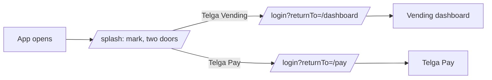

# Launcher, Menu and Shop Settings

The mark, the way into each app, the three-bar menu, and everything behind Settings.

Everything here is **training only**.

## 1. The mark

**It is the founder's artwork, served as a file.** Two earlier attempts redrew it as SVG paths
and both were rejected — the first stood the T upright with the figure beside it, the second
tipped the letter but still did not look like the render. So the real file is used
([[Decision Log]] **D81**).

- Served from `/assets/telga-logo.png`, same-origin, because the page CSP is `img-src 'self'`
  — a `data:` URI is refused, and inlining 1.6 MB of base64 into every page would be worse.
- The **fall → catch → stand** sequence is a CSS rotation that **rests upright**. The supplied
  render is the *middle* of that sequence, which is why a still copy reads as "still falling".
- It plays on the splash and the launcher, never on a slip, and stops for
  `prefers-reduced-motion` and for printing.

> **Known limitation.** Rotating the composition rotates the road and the figure with it. A flat
> PNG cannot have the letter separated from them without editing the image — which would mean
> redrawing the thing that must not change. A true three-layer animation needs the artwork
> supplied as separate layers.

## 2. The way in

Choosing an app carries the choice through sign-in, so an operator lands where they picked
rather than on a shared home they then navigate out of.

## 3. The three-bar menu

Top right of **every** authenticated screen — drawn by `page()`, not by each screen, so an
entry cannot exist on the dashboard and be missing from history ([[Decision Log]] **D82**).

| Entry | Goes to |
|---|---|
| Telga mark + operator id | — (who the machine thinks you are) |
| Statements | `/transactions` |
| End shift | `/shift/end` |
| Customer list | `/customers` |
| Learning | `/learning` |
| Settings | `/settings` |
| Help | `/help` |
| Log out | `POST /logout`, asks first |

It is a `
` element, so opening and closing is the browser's job and the menu works with
scripting off. **Nothing about what it can reach is decided in the browser**: every entry is a
plain link or a CSRF-carrying form, and the server re-checks permission on arrival.

## 4. Balance, and the "+"

The dashboard balance carries a **+** beside it, opening `/topup` — the mark, "Top up your
balance", and three stacked choices: **Bank deposit**, **Telga Pay balance**, **Profit**. None
of them moves money themselves; each routes to the flow that does, with its own server-side
permission check.

## 5. Settings

| Section | Contains |
|---|---|
| Shop | slip width, advertisement, training profit rate |
| Business details | name, address, phone, TIN, licence, slip footer |
| In-app | sound, hide balance, low-balance alert |
| Admin only | statements admin-only, print barcode, print lookup slip, require PIN to unlock |
| Security | lock after N seconds (15–3600), change PIN |
| About and policies | About, Terms, Privacy, Cookie |
| | Sign out completely |

Each toggle is a plain checkbox with a hidden `off` companion, so an unchecked box still
submits — otherwise turning something off would send nothing and read as "leave unchanged".

The admin group is grouped by **label**, not enforced by the screen: `POS_MANAGE_SETTINGS`
already refuses an operator server-side, which is what actually keeps an assistant out.

## 6. Shifts and customers

A **shift** is a labelled span of time, opened and closed. It carries no money — the ledger is
still the only place value moves — so ending one records a time and nothing else. Closing is
single-winner: a second press changes nothing, and the row is never deleted.

A **saved customer** is a name beside a **masked** number ([[Decision Log]] **D83**). Sending to
them still means typing the number. That is deliberate: a list of full numbers on a counter
machine would be the largest pool of personal data in the product, in a build with no
data-protection review. The screen says so.

## What is still open

- **The support contact is a placeholder** and must be replaced before any merchant-facing use
  (`ASSUMPTIONS.md` A74).
- **The policy texts are placeholders** with no legal review (D84).
- **Whether saved customers should hold full numbers** is a decision for the data-protection
  review, not a code change (A75).
- **"Change password" was not built**: there is no password in Telga — sign-in is operator id +
  PIN + device key. Change PIN exists and works (A76).
- Amharic for the new strings is draft and **requires native review before production**.

---
Back to [[00 Home]]
