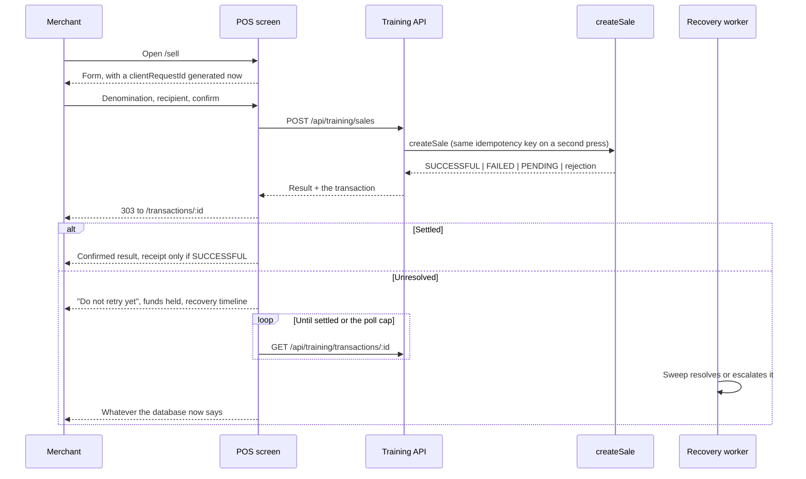

# Merchant POS Screens

The training-mode merchant POS: `apps/merchant-pos/`. Five screens, server-rendered, no live
money and no live provider.

> [!danger] TRAINING MODE — NO REAL VALUE
> Every screen carries the banner, and it cannot be turned off: `page()` emits it unconditionally
> and **throws** rather than render a screen whose mode is not `TRAINING`. See
> [[POS API Surface]] for the other three refusals beneath it.

## The five screens

| Screen | Path | What it is for |
|---|---|---|
| Home | `/` | The four balances, a count of anything unresolved, recent sales, and the way in to a sale |
| New sale | `/sell` | Denomination, recipient, and the training outcome to practise |
| Transaction detail | `/transactions/:id` | Status, funds, references, recovery timeline, support, permitted actions |
| Transaction history | `/transactions` | Every transaction for this merchant, newest first |
| Queue | `/queue` | Pending, under review and reversal required, grouped, with guidance |

This is the **smallest coherent flow**, not the full [[Screen Inventory]]. Login, funding,
reports, receipt printing, the operations console and the reprint flow are not built — see
[Known limitations](#known-limitations).

## The counter journey

## The double press

The sale form carries a `clientRequestId` **generated when the form is built**, not when it is
submitted. Both presses of the same button therefore carry the same value, `createSale` derives
the same idempotency key, and the second press returns `DUPLICATE_REQUEST` pointing at the first
transaction. A form that generated the id on submit would defeat the whole mechanism.

The form then uses post/redirect/get, so a browser refresh cannot resubmit the sale either.

Opening the form **again** is a new intent and gets a new id — which is correct: that is a second
sale, and the merchant meant it.

## Screen conditions, which are not transaction states

A merchant reading "we cannot reach Telga" has learnt nothing about whether their customer got
airtime. The two are kept strictly apart:

| Condition | What the screen shows |
|---|---|
| `LOADING` (first) | "Loading …", `aria-busy` |
| `LOADING` (refresh) | The previous answer, marked busy — a poll never blanks the screen |
| `READY` | The data |
| `EMPTY` | A sentence saying so. An empty list is not an error |
| `STALE` | **The previous answer, plus a notice** that Telga could not be reached and when the answer is from |
| `ERROR` | The failure, its safe reason code, the correlation id, and a line saying the message is about the screen and not about the sale |

`STALE` is the important one. Two designs would be wrong: replacing the last known state with an
error loses the transaction id and the support reference at the moment they are needed; showing
the last state silently lets the merchant believe it is current. `STALE` carries both facts.

## Recovery status

The detail screen renders a plain-language timeline from the pending-resolution row and the
current claim:

| Phase | Sentence |
|---|---|
| `NOT_APPLICABLE` | No recovery needed for this transaction. |
| `AWAITING_RECOVERY` | Waiting for Telga to check this with the provider. |
| `BEING_CHECKED_NOW` | Telga is checking this with the provider now. |
| `ESCALATED` | This has been passed to the Telga team to resolve. |
| `RESOLVED` | Telga finished checking this transaction. |

Plus attempts ("2 of 5"), last check, next check due, escalation deadline and the last **safe
outcome category**. What is deliberately absent: the worker id, the lease, the scan id and the
claim internals. Those identify Telga's machinery, not the merchant's transaction, and a test
asserts none of them reaches the page. See [[Recovery Sweep]].

## Polling

The client script is **progressive enhancement only** — every screen is complete without it. It
re-requests a transaction that is still in flight and reloads when the state changes.

The interval is `statusCheckIntervalMs` from the server envelope, which is the recovery policy's
own number: the POS asks at roughly the rate the worker works at, rather than faster. It is
bounded by `maxPolls`, so a screen left open on a counter overnight stops asking. A settled
transaction carries **no polling attributes at all**, so the script does nothing.

## Bilingual

English and Amharic. `translate()` reports when it fell back to English rather than hiding it, and
a screen marks untranslated text as such.

**Fourteen keys have no Amharic**: the thirteen screen titles and `support.response.notice`. They
are absent rather than machine-translated — an unreviewed guess that looks finished is worse than
a visible gap. An Amharic screen also renders `REQUIRES NATIVE AMHARIC REVIEW BEFORE PRODUCTION`.
See [[Amharic Strings]].

## Accessibility

Per [[Design System]], and each of these is asserted on every screen:

- Exactly one `h1`.
- Every focusable control has an accessible name; nothing unusable is in the focus order.
- Every visible field has a `<label for>`, and every `aria-describedby` points at an element that exists.
- Status is text + icon + tone, never tone alone. The decorative icon is `aria-hidden`.
- The current navigation destination carries `aria-current="page"`.
- Touch targets are at least 3rem; focus is visible; reduced motion is honoured.

## No framework, and why

The screens are pure functions returning a small element tree, serialised to HTML on the server.
No React, no bundler, no DOM emulator — the same reasoning that made the build emit CommonJS from
plain `tsc` rather than adopt a bundler ([[Build Pipeline]], D30).

What the UI tests need to assert — the banner is present, an uncertain state renders no success
affordance, the retry instruction exists as text, controls have names and reachable focus — are
properties of the tree, not of a layout engine. Recorded as D36.

**The honest limitation**: this is a component-level test, not a browser test. It does not
exercise CSS, real focus behaviour, or a real screen reader. If a browser test is wanted later
these render functions feed one unchanged — `mount()` builds real DOM from the same tree.

## Known limitations

| Gap | Consequence |
|---|---|
| No authentication or session | The POS trusts a `merchantId` in the URL. Fine for training on a controlled machine; **not** a security boundary — [[Security Model]] |
| No login, PIN or device binding screen | Screens 1 and the device controls in [[Screen Inventory]] are not built |
| No receipt printing | The button exists for a `SUCCESSFUL` sale; there is no print abstraction behind it yet, and no reprint event is recorded |
| No funding, reports or operations console | Out of this scope |
| No reversal control | Deliberate: `completeReversal` requires a supervisor approval, and exposing it without an authenticated supervisor session would be a way *around* that approval rather than an implementation of it |
| No offline behaviour | The pilot has no offline vending; a lost connection shows `STALE` and refuses nothing else |
| Component-level tests only | No browser, no CSS, no real screen reader |
| Amharic incomplete and unreviewed | 14 keys missing; the rest is an unreviewed draft |

## No live-money behaviour

The POS changes no transaction state, posts no ledger entry, completes no reversal, releases no
reservation, calls no provider and computes no balance. Its only write is a sale through the
existing `createSale` service against a scripted mock. See [[POS API Surface]].

## Authentication screens — 2026-08-21

Four new screens, and an identity indicator on every authenticated one.

| Screen | Path | Purpose |
|---|---|---|
| Sign in | `/login` | Operator, PIN, device, device key |
| Session ended | rendered on a refused write | Says nothing was lost, offers sign-in |
| Not allowed | rendered on a 403 | Says signing in again will **not** help |
| Enrol a device | `/enrol` | Needs `DEVICE_ENROL`; shows the key once |
| Something went wrong | rendered on an unexpected failure | Safe, generic, carries a support code |

The authentication screens use their own shell rather than `page()`, because
`page()` takes a merchant id and none of them has an authenticated merchant to
name. They carry the same unconditional training banner plus an explicit
**"Internal training only. Not for merchant or customer use."**

### What a refused sign-in says

Not which field was wrong. An unknown operator and a wrong PIN produce the
identical message, so operator ids cannot be enumerated from the screen. A
lockout and a revoked device do get their own messages, because those change
what the operator should do next — wait, or call Telga.

Neither secret is ever echoed back into the form. The screen has no parameter
for a PIN or a device key, so a refused attempt cannot repopulate them.

### The identity indicator

Every authenticated screen shows **operator · merchant · device**, and a sign-out
control. Sign-out is a **form, not a link**: it changes server state, and a link
would be followed by anything that prefetches. It carries the session's CSRF
token like every other write, and is omitted entirely when there is no token to
carry — better to show nothing than a control that would be refused.

The POS renders the authenticated merchant identity, but **never treats it as
authority**: no navigation link, no form field and no href carries a merchant id
any more. The session decides scope on the server, every time.

### The device enrolment screen

States the limitation on the screen itself: *"Training-grade binding: this
identifier is supplied by the device, not proved by hardware."* The issued key is
rendered directly into the page and **never redirected to**, so it reaches no
URL, no browser history and no access log.

## The page under a nonce policy — 2026-08-21

The document carries one inline script and one inline stylesheet, and both now
declare a **per-response nonce**. The policy allows that nonce and nothing else
inline; `unsafe-inline` is gone.

For the screens this changes nothing visible: the same markup, the same
progressive enhancement, and the page still works with scripting off. What
changes is that injected markup cannot execute — it has no nonce, and cannot
learn one, because a fresh value is generated per response.

Every POS response also carries `Cache-Control: no-store`. A shared counter
machine whose back button re-renders the previous operator's balance from cache
is a real leak, not a theoretical one.

## Related

- [[State To UI Mapping]]
- [[POS API Surface]]
- [[Screen Inventory]]
- [[Design System]]
- [[Amharic Strings]]
- [[Recovery Sweep]]

---
Back to [[00 Home]]
