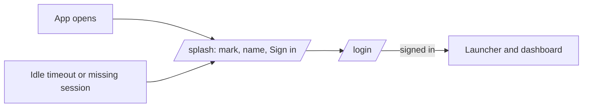

# Splash, Profit and Corporate Settings

Four additions from the founder's second retest: a cover screen, a way to move earned profit
into the selling balance, an owner-changeable PIN, and the shop's own identity on every slip.

Everything here is **training only**. No money leaves Telga and no detail below is verified.

## 1. The cover screen

`/splash` is **public** — drawn with the pre-session chrome, so it renders with no session at
all. Every unauthenticated redirect lands there rather than on the login form
([[Decision Log]] **D77**).

It carries **no merchant name, device id, operator name or balance**. None of that is known
before sign-in, and a cover screen that leaked any of it would be showing shop data to whoever
picked the machine up. The training banner still prints.

## 2. Moving profit into the selling balance

Pressing the dashboard **Profit** pill opens a screen with one box. Type an amount, press OK.

| | |
|---|---|
| Ledger | DEBIT `TELGA_REVENUE`, CREDIT `MERCHANT_AVAILABLE` — a balanced pair |
| Entry reason | `ADJUSTMENT` |
| Bound | all-time profit **not yet moved** |
| Too much | refused, and **nothing moves** |
| Who | owner only |
| Audit | `PROFIT_TRANSFERRED_TO_BALANCE` |

**Why the bound is not today's profit.** The dashboard pill shows what today earned. The
transfer is bounded by earned-minus-already-moved across all time, because a shop that earned on
Monday can still move it on Tuesday — and bounding by today's figure would offer an owner a
number they cannot actually take.

Because a move is posted as a DEBIT against the same account, the remaining net **is** the
untaken balance. There is no second tally to drift out of agreement with the ledger.

The check and the posting run inside **one database transaction**, so two simultaneous transfers
cannot both pass a check against the same balance and then both post.

It is a **move, not a payout**. No money leaves Telga, no bank is involved, nothing settles —
see `ASSUMPTIONS.md` A73 for why the wording matters. [[Decision Log]] **D78**.

## 3. Changing the transaction PIN

In Settings, owner only, and **the current PIN is required**.

An open owner session is deliberately not enough: a session left unlocked on a counter is
exactly the case this guards against. Six digits; `111111`, `123456`, `987654` and an unchanged
PIN are refused.

A wrong current PIN is recorded as a `PIN_AUTH` failure — the same scope a wrong voucher PIN
uses — so guessing is bounded by the existing lockout and **can never contribute to a login
lockout**.

> The PIN reaches no log, response, audit metadata, cookie, or redirect URL. Only the derived
> key, its salt and its parameters are stored. The two confirmation boxes are compared in the
> POS *before* the request, so a mistyped confirmation never puts a PIN on the wire.

[[Decision Log]] **D79**.

## 4. Corporate settings

Six fields, stored per merchant (migration 011) and printed under the Telga mark on every slip:

| Setting | On the slip |
|---|---|
| `BUSINESS_NAME` | the trading name, in place of the merchant id |
| `BUSINESS_ADDRESS` | where the shop is |
| `BUSINESS_PHONE` | how a customer reaches the shop, not Telga |
| `BUSINESS_TIN` | tax identification number |
| `BUSINESS_LICENCE` | trade licence number |
| `SLIP_FOOTER` | a closing line, separate from the advertisement |

They ride on `SlipStyle`, which is already read once per render and handed to every slip caller
— so a new slip type cannot forget to print the shop's name. Empty fields simply do not print.

> **Telga verifies none of these.** An owner types their own licence number and the slip prints
> what it was given. Nothing here asserts that a business is registered, licensed or
> tax-compliant — CLAUDE.md §8 forbids claiming compliance without documented review. Whether
> printing a TIN on a training slip carries an obligation of its own is a question for that
> review; see `ASSUMPTIONS.md` A72.

[[Decision Log]] **D80**.

## What is still open

- Whether a printed TIN or licence number carries obligations of its own (A72).
- The wording of the profit move must stay "move to selling balance" — never "withdraw",
  "pay out" or "settle" (A73).
- Amharic for the new strings is draft and **requires native review before production**.

---
Back to [[00 Home]]
