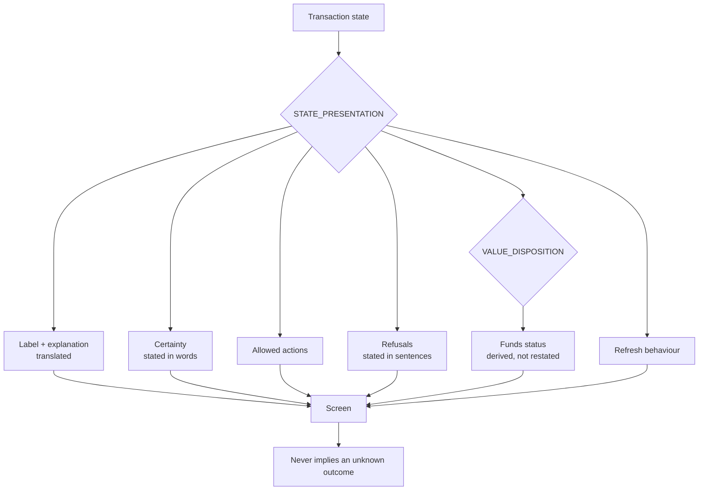

# State To UI Mapping

What a merchant may **see** and **do** for each transaction state. One table,
`STATE_PRESENTATION` in `packages/pos-view-model/src/presentation.ts`, and this note is its
prose form. The code is the authority; `tests/ui/presentation.test.ts` fails if they disagree.

> [!important] The rule the table exists to enforce
> **A screen may never imply an outcome that is not known.** Only `SUCCESSFUL` is presented as
> a confirmed sale, and only `SUCCESSFUL` may offer a receipt. Everything else says, in words,
> that the result is not yet known.

## Why it is a table and not a set of conditions

The same reason [[Transaction State Machine]] keeps its transitions as data: a table is
exhaustively testable. A new domain state cannot be added without the presentation tests failing
until it has been given an entry, so an unmapped state can never reach a counter screen as a
blank status.

Domain state names are used **verbatim**. Nothing renames a state; the human label is a separate,
translated field beside it. There is therefore no mapping to memorise between what an engineer
sees in the database and what a merchant sees on the screen.

## The mapping

| State | Label | Funds | Certainty | Allowed | Refresh | Escalation |
|---|---|---|---|---|---|---|
| `CREATED` | Processing | Not yet committed | In progress | View, refresh | Poll | — |
| `VALIDATED` | Processing | Not yet committed | In progress | View, refresh | Poll | — |
| `RESERVED` | Processing | **Held** | In progress | View, refresh | Poll | — |
| `SUBMITTED` | Processing | **Held** | In progress | View, refresh | Poll | — |
| `PROCESSING` | Processing | **Held** | In progress | View, refresh | Poll | — |
| `PENDING` | Transaction pending | **Held** | Not known | View, refresh, support | Poll | On request |
| `UNDER_REVIEW` | Under review | **Held, under review** | Awaiting determination | View, refresh, support, copy reference | Poll | Case opened automatically |
| `REVERSAL_REQUIRED` | Under review | **Held, under review** | Awaiting determination | View, refresh, support, copy reference | Poll | Case required |
| `SUCCESSFUL` | Transaction successful | Debited | **Confirmed** | View, print, reprint, new sale | None | On request |
| `FAILED` | Transaction failed | Released | Confirmed: no sale | View, new sale | None | On request |
| `REVERSED` | Transaction failed | Released | Confirmed: no sale | View, copy reference, new sale | None | On request |
| `REJECTED` | Transaction failed | Released | Confirmed: no sale | View, new sale | None | On request |

## Funds status is derived, never restated

`fundsStatusFor(state)` reads `VALUE_DISPOSITION` from the domain and maps it to a merchant
phrase. It does **not** keep its own copy:

| Domain disposition | Shown to the merchant |
|---|---|
| `NONE` | No money committed yet |
| `RESERVED` | Your money is held for this sale |
| `UNDER_REVIEW` | Your money is held while this is checked |
| `DEBITED` | Your balance was reduced for this sale |
| `RELEASED` | Your money was returned to your available balance |

A second hand-maintained copy would eventually disagree with the ledger, and the merchant would
be told the wrong thing about their own money. Deriving it means [[Ledger Invariants]] 3 and 4
hold on the screen as well as in the database.

Note the words. "Held" is not "charged". "Returned" is not "refunded" — a refund implies money
left and came back, which is not what releasing a reservation is.

## The four states that need particular care

| Situation | What the screen must do |
|---|---|
| `RESERVED` with **no provider reference** | Say the result is not known and show "Not issued" for the reference. The money is already held, so nothing may say "no charge was made" |
| `PROCESSING` with an indeterminate provider result | Identical presentation to `RESERVED`. The merchant's question is not which state it is in but whether the customer got their airtime, and the honest answer is the same |
| `PENDING` after the sweep has run | Show attempts, last check, next check and the escalation deadline. "Nothing is happening" and "something is happening slowly" look identical without them |
| `UNDER_REVIEW` after the deadline or attempt exhaustion | Say the Telga team has it, show the support reference, and keep saying the money is held |

## Safe to retry, and not

`doNotRetryYet` is true for exactly the states where the outcome is unknown, and it is rendered
with `role="alert"` **above** the status detail — it is the one line that must not be scrolled
past on a busy counter.

`RETRY_SAME_SALE` is forbidden in **every** state, settled or not. Selling the same thing again
is always a new sale with a new intent, never a repeat of an existing transaction; the POS has no
control that resubmits an existing one. And refusals are **stated**, not merely absent:

| Refusal | Sentence shown |
|---|---|
| `RETRY_SAME_SALE` | Do not sell this again — it would charge the customer twice. |
| `TREAT_AS_SUCCESSFUL` | Do not tell the customer the airtime has arrived yet. |
| `RELEASE_FUNDS` | Your held balance stays held until this is resolved. |

A missing button explains nothing to an operator who is about to key the sale in again.

## Status is never colour alone

Every entry carries three signals, per [[Design System]]: a text label, a short text icon, and a
`tone` attribute that is only a colour hook. `PENDING` and `UNDER_REVIEW` deliberately share a
tone, and a test asserts their **labels differ** — so the two are distinguishable without seeing
colour at all.

## Authentication states — 2026-08-21

Distinct from transaction states, and never to be confused with them. A merchant
reading *"your session ended"* has learnt nothing about whether their customer
got airtime, and none of these screens suggests otherwise.

| Condition | Screen | HTTP | Sign in again? | What it says about the sale |
|---|---|---|---|---|
| No session | redirect to `/login` | 303 / 401 | yes | nothing |
| Idle timeout | Session ended | 401 | yes | **nothing was lost** |
| Absolute lifetime reached | Session ended | 401 | yes | nothing was lost |
| Logged out | redirect to `/login` | 303 | yes | nothing was lost |
| Device revoked / unenrolled / expired | Not allowed | 403 | **no** | nothing |
| Wrong merchant scope | Not allowed | 403 | no | nothing |
| Permission denied | Not allowed | 403 | no | nothing |
| CSRF refused | Not allowed | 403 | no | **no sale was created** |
| Rate limited | Sign in, with a wait | 429 | wait | nothing |
| Body too large | Something went wrong | 413 | no | nothing |

The 401/403 split is the whole design: **401 means signing in again will fix
this; 403 means it will not.** Sending an operator with a revoked device round a
login they cannot pass teaches them to keep retrying something that cannot work.

Every one of these screens says, in words, that the message is about the screen
and not about a sale — and points at the transaction list, which is where the
answer actually is.

## Related

- [[Merchant POS Screens]]
- [[Transaction State Machine]]
- [[Balance Model]]
- [[Design System]]
- [[Screen Inventory]]

---
Back to [[00 Home]]
