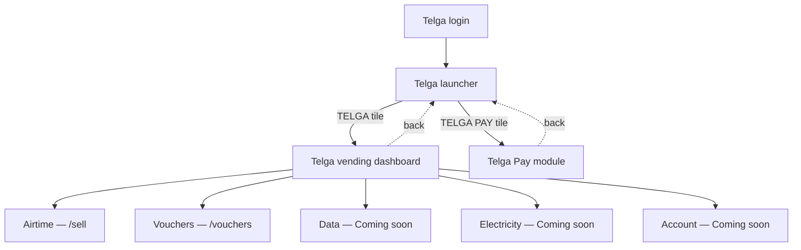

# Telga Launcher and Dashboard

**Telga is one application, with one repository, one login, and one authenticated session.**
After signing in, the operator lands on a single new screen — the launcher — showing two
module tiles. They are visually app-like, but they are not two installed applications, two
operating-system icons, or two separate login systems. Both tiles are plain links inside the
same session `page()` already requires everywhere else in this app. Do not describe them as
"apps," "installed," or "separate" in code, tests, or documentation — use *module*, *section*,
or *tile*.

## Sequence

## Routes

| Route | Function | File |
|---|---|---|
| `GET /launcher` | `launcherScreen` | `apps/merchant-pos/src/ui/launcher.ts` |
| `GET /dashboard` | `dashboardScreen` | `apps/merchant-pos/src/ui/dashboard.ts` |
| `GET /dashboard/data`, `/electricity`, `/account` | `comingSoonScreen` | same |

`safeReturnTo()` in `apps/merchant-pos/src/server.ts` now defaults to `/launcher` — a successful
login with no explicit `returnTo` lands there, not on `/`. `/` (`homeScreen`) still exists,
unchanged, reachable from the dashboard's bottom-nav "Account" link.

## The no-native-app framing

This is a server-rendered HTML page, not a packaged desktop or mobile build. Confirmed by direct
repository inspection: no Electron, Tauri, nw.js, or any desktop-packaging dependency exists in
any `package.json` in this repository. The launcher is an honest in-browser screen with two large
tiles — it never claims OS-level installation, a native icon, or a separate executable.

## Service classification

Verified against the actual repository, not assumed because a service is common in Ethiopia —
see `apps/merchant-pos/src/ui/dashboard.ts`'s `DASHBOARD_SERVICES` array, which is the single
place a service tile is declared.

| Service | Status | Why |
|---|---|---|
| Airtime | IMPLEMENTED | Real route (`/sell`), real backend, unchanged |
| Vouchers | IMPLEMENTED | Real route (`/vouchers`/`/orders`), full Stage 2 backend, unchanged |
| Data | COMING_SOON | Named conditionally in `CLAUDE.md` §7; no backend exists |
| Electricity | COMING_SOON | Named explicitly as disabled in `CLAUDE.md` §7 and the vault's `product.electricity` flag; no backend exists |
| Account | COMING_SOON | No dedicated flow invented; the dashboard's bottom-nav "Account" link points at the existing, real balance screen (`/`) instead |
| Water, DStv, Telecom bill, Traffic payment, Lottery, Tickets, Fuel | **HIDDEN — not rendered at all** | None of these is named anywhere in `CLAUDE.md` or the vault. Showing even a Coming Soon tile for a product line the founder's brief never approved would itself be an invented product claim (`CLAUDE.md` §10, §30) |

A Coming Soon screen (`comingSoonScreen`) creates no transaction, calls no provider, changes no
database state, and offers working BACK (to `/dashboard`) and HOME (to `/launcher`) links —
verified by `tests/ui/launcher-dashboard-pay.test.ts`.

## No invented Profit — yet

The reference terminal shows Balance and Profit as two separate running fields, and that model is
confirmed in [[Decision Log]] D69: a sale moves the merchant float by **−face value** and credits a
configurable percentage of that face value to `TELGA_REVENUE` as a **separate** ledger entry. The
customer always pays face value — profit is a shop-side credit, never a surcharge. The training
rate is 4%, which is training configuration only and not a commercial rate.

**None of that is implemented yet.** No profit is calculated or posted anywhere, and
`commission.net` remains a reserved localization key no screen calls. The dashboard renders both
pill slots for visual parity with the reference, but the Profit pill's *value* is always the
literal, translated "Not yet available" text (`dashboard.profit.unavailable`) — never a number.
Showing the pill slot is a layout decision; showing a figure before one is actually posted would
be an invented one, and this screen does not do that. The Balance pill alone carries a real value,
from the existing `GET /api/training/balance` read, unchanged.

## Related

- [[Voucher Purchase Flow]]
- [[Telga Pay Card Simulator]]
- [[Decision Log]]

---
Back to [[00 Home]]
