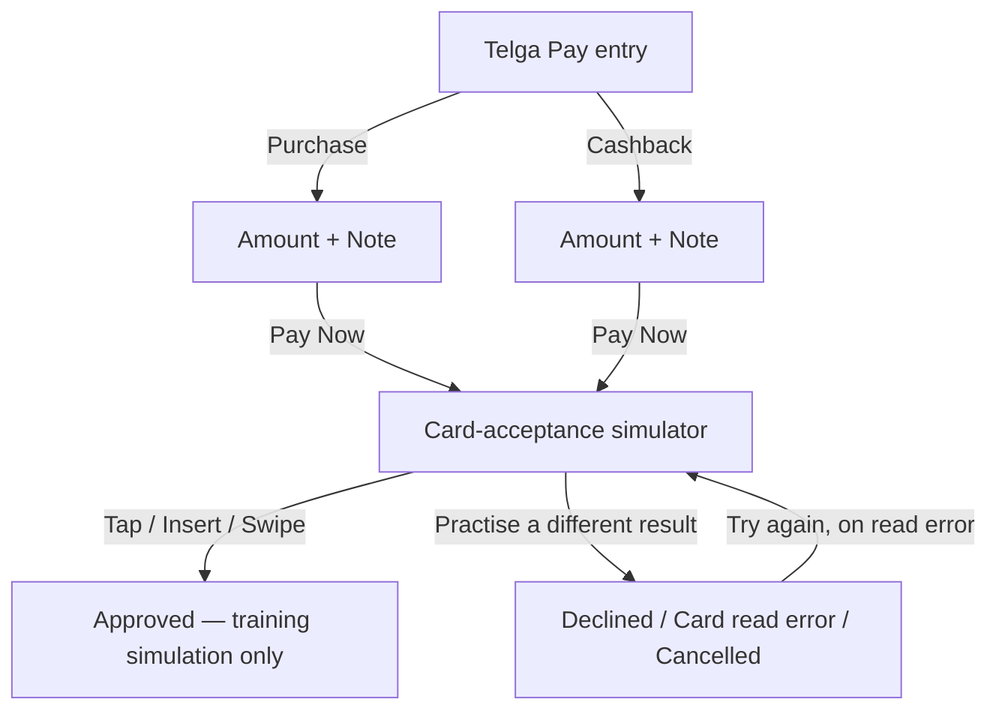

# Telga Pay Card Simulator

**Telga Pay is a module inside Telga — not a separate application, not a separate login.**
Reached from the launcher's TELGA PAY tile, `GET /pay`, using the exact same authenticated
session every other screen in this app uses. There is no second sign-in screen inside this
module.

## What this version is

**Purchase and Cashback are UI-only.** No new database table, no persistence of any kind.
Their amounts, notes, and card-simulation outcomes exist only in the URL's query string
between one GET screen and the next — nothing is written anywhere. Confirmed by direct test
(`tests/ui/launcher-dashboard-pay.test.ts`): every outcome, including "approved," creates zero
database rows.

**Add balance is the one exception, and it is deliberate.** A third tile posts a real,
balanced ledger credit to the merchant's *simulated* training float, so that a deposit
practised at this card screen becomes value a sale can then reserve against. This reverses the
original "UI-only everywhere" position for this one path, in TRAINING mode only — recorded and
argued in [[Decision Log]] **D70**, and described in [[Top Up Slips and Settings]].

It is still **not payment acceptance**: no card is read, no PAN exists, no processor or partner
is contacted, and nothing leaves the machine. The driver and the schema both refuse any mode
other than TRAINING. The deposit is owner-only, bounded, idempotent, and audited.

## Why it says so, everywhere

Every Telga Pay screen carries the training banner:

> Training card-payment simulator — no real processor connected.

No code in this repository is capable of contacting a real card network, processor, or bank —
confirmed by direct search: no Visa/Mastercard/EMV/card-reader integration exists anywhere. The
"approved" outcome states explicitly, in the result screen, that it is a training simulation
only.

## Sequence

## Income and transaction count

No invented numbers. `GET /pay` reuses Telga's own, already-existing transaction read
(`/api/training/transactions`) to compute **"Today's Telga sales"** and a transaction count —
real data, honestly labelled as Telga's sales, never as Telga Pay income (Telga Pay has recorded
nothing, since it has no backend). If no successful sale exists today, the entry screen instead
shows:

> No Telga Pay transactions recorded in training.

## Visual reference

A second uploaded reference showed a real card-payment app ("AddPay") with its **own** login
screen (user code + password), reached from a **separate** Android home-screen icon alongside the
vending app's icon. That two-icon-on-the-home-screen pattern is exactly what this repository's
one-application, two-module-tile launcher already represents — see [[Telga Launcher and Dashboard]]
and [[Decision Log]] D68. **The reference's separate login screen was deliberately not
replicated**: Telga Pay still uses the one session Telga already authenticated, per the
explicit, repeated founder instruction that there is one login and one authentication system.
Only the reference's *visual* style was adopted — a teal accent colour, circular icon-badge
buttons for Purchase and Cashback, a large amount display, and a bottom card-badge row (`VISA`,
`Mastercard`, text only, no real logo asset) on the card-acceptance screen.

## Card states

| State | Behaviour |
|---|---|
| Approved | "Training simulation only — no real payment was processed." Creates nothing. |
| Declined | Clear decline message, red tone. Creates nothing. |
| Card read error | Clear red error, offers "Try again" back to the card screen. Creates nothing. |
| Cancelled | Returns to `/pay` with no stale amount/note carried forward. Creates nothing. |

Tap/Insert/Swipe are visual, clearly-simulated choices; Visa and Mastercard appear only as
training examples with an explicit "no real card network is connected" notice. Five specific
read-error causes from the original spec (card removed early, chip misread, stripe misread,
dirty/unreadable card, bad insert) are consolidated into one generic "card read error" state in
this UI-only version — a deliberate simplification, not an oversight, since none of them can be
distinguished without a real reader.

## A flagged, not silently resolved, scope question

`CLAUDE.md` §2 lists "payment acceptance," "cash-in/cash-out," and "wallets" among features that
must stay disabled until legal review and an authorized-partner structure exist. A card-payment
simulator — even fully UI-only, even fully training-labelled — is structurally the same feature
category. Building this UI-only version is not itself the disabled thing (this repository already
builds training-only versions of otherwise-gated concepts, e.g. simulated funding), but the
decision to build it at all is recorded explicitly rather than silently assumed — see
[[Decision Log]] D68.

## Related

- [[Telga Launcher and Dashboard]]
- [[English Strings]]
- [[Decision Log]]

---
Back to [[00 Home]]
