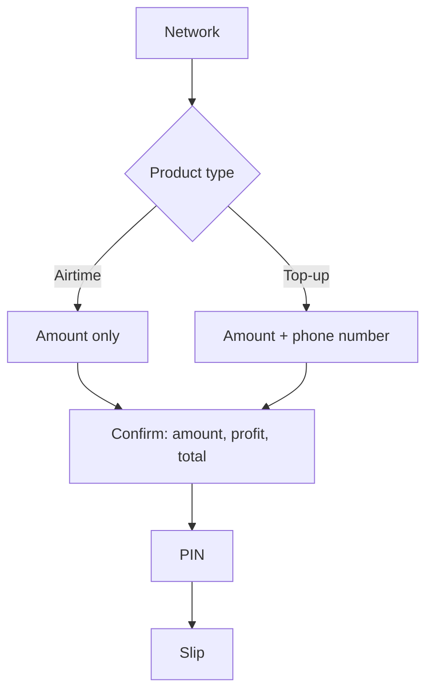

# Top Up Slips and Settings

Priority 3, Stages 3–5. Three additions that share one theme: the merchant should be able to
see what a sale earns them, send airtime to a customer's phone rather than only across the
counter, and print all of it on one consistent piece of paper they control the shape of.

Everything here is **training only**. No provider is contacted, no card is read, no processor
exists, and no real money moves.

## 1. Profit, shown before the PIN

A sale of face value **F** moves the merchant float by **−F** and credits a configurable
percentage of F to `TELGA_REVENUE` as a separate ledger entry. The customer pays exactly F.
This is [[Decision Log]] **D69**, confirmed against the original POS screenshots, which show
Balance and Profit as two separate running fields.

The amount and the profit are both on screen before the operator touches the PIN pad, as two
separate rows of the order summary — never one blended figure, because blending them would
misstate both.

| Row | Where it comes from |
|---|---|
| Amount | the stored order row, not the catalog |
| Your profit | `trainingProfitMinor(amount, rate)` |
| Total | the stored order row — equals Amount, never Amount + profit |

**Why not the catalog.** A custom-amount product carries `amountMinor: 0` in the catalog as a
placeholder; the real amount lives on the order. A summary built from the catalog would show
the operator one number and charge them another. Every figure on the confirmation and PIN
screens is read back from `GET /api/training/orders/:id`.

**The rate is training configuration only.** It is not a negotiated commission and not a
production rate; `packages/domain/src/commission.ts` still throws rather than returning one.
See CLAUDE.md §19.

### The rate can never restate the past

Each profit entry records the rate in force when it was written, as
`rule_version: training-profit-<bps>bps`. A day's profit is **summed from the entries**, never
recomputed from the current setting — so an owner who raises the rate on Tuesday has not
retroactively earned more on Monday. Pinned by
`tests/application/settings-and-profit.test.ts`.

## 2. Direct top-up

A second product type beside airtime, reached from the same network screen.

The phone field exists **only** on the top-up screen. It is absent from the airtime screen
rather than hidden, so there is nothing for a tampered form to submit, and the server refuses
a `TOPUP` that arrives without one regardless.

The number is masked at the boundary before it reaches the database — `pending_orders.recipient`
never holds a full number, exactly as `transactions.recipient_masked` never has. This reverses
the earlier "do not ask for the customer's cellphone number" instruction, which was written
when the only flow was a counter voucher that genuinely needed none.

## 3. One slip for everything

Sale, top-up, reprint and Telga Pay deposit all render through a single `slipCard` function
([[Decision Log]] **D71**). The `TRAINING — NO REAL VALUE` line is **drawn by that function
rather than passed to it**, so no caller can print a receipt without it.

Before this, the voucher result screen showed an order summary while history showed a slip —
a sale and a reprint of that same sale produced two different-looking pieces of paper.

A reprint is still marked as a reprint, carries its sequence number, and moves no money.
See [[Receipt Specification]].

## 4. Settings

Per-merchant rows in the `settings` table (migration 008), owner-only to change
(`POS_MANAGE_SETTINGS`). An operator may **read** them, because a slip has to print whoever is
at the counter.

| Key | What it does | Default |
|---|---|---|
| `SLIP_SIZE` | roll width, `58` or `80` mm | `80` |
| `SLIP_ADVERT` | one shop line at the foot of every slip | empty |
| `PROFIT_PERCENT_BPS` | training profit rate, in basis points | `400` (4%) |

They live server-side because a slip's format is the merchant's, not the browser's, and must
survive a device being replaced. Settings is in the bottom navigation rather than the service
grid — the twelve-tile arrangement is the accepted visual design, and it is not a service a
merchant sells.

## 5. Telga Pay training deposits

The one path in Telga Pay that is not UI-only. See [[Telga Pay Card Simulator]] for the module
and [[Decision Log]] **D70** for why a simulated cash-in is not payment acceptance.

- Owner-only (`POS_DEPOSIT_TRAINING_FUNDS`), CSRF-protected, rate-limited as a sale is.
- Bounded: 10 – 50,000 birr per deposit, whole birr only.
- Posts a balanced `fundMerchant` credit against `BANK_CLEARING` in TRAINING mode.
- Idempotent through the posting id, so a double press credits once.
- Audited as `TRAINING_DEPOSIT_CREDITED`, recording the amount and the gesture — never a card,
  a PAN, or a processor reference, because none of those exist.
- Prints the same slip everything else prints.

Purchase and Cashback remain UI-only and still write nothing.

## What is still open

- The training profit rate defaults to 4%. That figure is **not confirmed commercially** and
  must not be quoted as one — see `ASSUMPTIONS.md` and CLAUDE.md §19.
- Amharic for the new strings is draft and **requires native review before production**, like
  the rest of the table.

---
Back to [[00 Home]]
