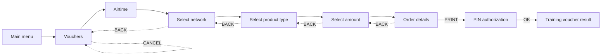

# Voucher Purchase Flow

A second, wizard-style sale sequence, built alongside the existing single-screen `/sell` flow
rather than in place of it. `/sell` is unchanged and still works exactly as before. This note
describes the new flow's screens, its real (Stage 2) backend, and what still remains open.

## Why this exists

An uploaded South African voucher-vending reference showed a clear, multi-step sequence — network,
then product type, then amount, then an order review, then a PIN, then a result — and that
**structure** was adopted as a UX pattern. See [[Decision Log]] for the scoping decision: Telga
does **not** expand to South Africa, does **not** add ZAR, and does **not** integrate any real
telecom network. Every network name in this flow is a clearly-labelled placeholder —
`Network A (simulated)` through `Network D (simulated)` — and every amount stays in the existing
ETB training denominations already used by `/sell`.

## Sequence

## Screens and routes

HTML screens (session-authenticated, `apps/merchant-pos/src/ui/screens.ts`, wired in
`apps/merchant-pos/src/server.ts`):

| Screen | Route | Function |
|---|---|---|
| Main menu | `GET /menu` | `mainMenuScreen` |
| Vouchers | `GET /vouchers` | `vouchersScreen` |
| Network | `GET /vouchers/airtime` | `networkScreen` |
| Product type | `GET /vouchers/airtime/:network` | `productTypeScreen` |
| Amount | `GET /vouchers/airtime/:network/:type` | `amountScreen` |
| Order details | `GET /orders/:id` | `orderDetailsScreen` |
| PIN authorization | `GET /orders/:id/authorize`, `POST /orders/:id/authorize` | `pinAuthScreen` |
| Result | `GET /orders/:id/result` | `voucherResultScreen` |

The amount form (`POST /orders`) and the cancel form (`POST /orders/:id/cancel`) are the only two
other writes; both forward to the JSON API below through `handle()`, exactly as `/sell` already
forwards to `/api/training/sales` — no route in `server.ts` hand-rolls its own CSRF check.

JSON API (`services/api/src/http/router.ts`, permission `POS_CREATE_SALE`, guarded by the same
session/CSRF chain as every other write):

| Method | Path | Handler |
|---|---|---|
| POST | `/api/training/orders` | `postOrder` |
| GET | `/api/training/orders/:id` | `getOrder` |
| POST | `/api/training/orders/:id/cancel` | `postCancelOrder` |
| POST | `/api/training/orders/:id/authorize` | `postAuthorizeOrder` |

## Backend design

`pending_orders` (migration `007_pending_orders`, `packages/persistence/src/migrations/`): one row
per order, written once at creation with `merchant_id`/`device_id`/`operator_id`/`session_id` taken
only from the authenticated `AuthContext` — never from a request body. Every later read
(`getOrderForContext`, `services/api/src/application/voucherOrders.ts`) re-checks the row belongs to
the caller's session, device and merchant, and the PIN-submit body carries only `{orderId, pin}` —
there is no field left for a client to change network, product or amount after PRINT.

**Idempotency**: `client_request_id` is generated once, at order creation, and reused for the
`createSale` call inside `authorizeOrder` — the same mechanism `/sell` already relies on
(`deriveIdempotencyKey`/`findIdempotencyRecord`). A duplicate PIN submission for an already
`AUTHORIZED` order is refused before `createSale` is even reached; a genuine race falls through to
that same idempotency check. Proven under real concurrent HTTP requests in
`tests/application/voucher-orders.test.ts`.

**Expiry**: `pending_orders.expires_at = created_at + 10 minutes`, checked lazily on read
(`expirePendingOrderIfDue`) — no background job, no worker involvement.

**PIN verification**: reuses `verifySecret` against `merchant_users.pin_hash` — the same primitive
login uses, no new secret storage format.

**`PIN_AUTH` lockout — deliberately separate from login lockout** (see [[Decision Log]] D67). A
wrong voucher PIN is recorded only as an `auth_attempts` row with `scope = 'PIN_AUTH'`; it never
calls `recordFailedLogin` and never touches `merchant_users.failed_attempts` or `locked_until`.
Locked while 5+ `PIN_AUTH` failures for the operator fall within the trailing 5 minutes
(`VOUCHER_PIN_LOCKOUT_POLICY`, `packages/domain/src/auth.ts`) — a plain time-windowed count with no
stored "locked until" to clear. Proven directly: a test fails PIN_AUTH five times, then asserts
`merchant_users.failed_attempts` and `locked_until` are untouched and a fresh login with the
correct PIN still succeeds.

**Result**: reuses `Receipt`/`createReceipt` (`packages/domain/src/receipt.ts`) via the existing
`transactionDetailScreen` building blocks (`statusBlock`, `fundsBlock`) — `voucherResultScreen`
does not invent a second way to describe a transaction's state. The recipient field required by
`SaleRequest`/`createSale` is filled with a fixed, clearly non-phone sentinel
(`VOUCHER-SALE-NO-RECIPIENT`, since this flow has no customer number) and is never rendered on any
voucher screen — an open item, see below.

## Catalog

`apps/merchant-pos/src/cli.ts` exports `TRAINING_VOUCHER_NETWORKS` (four simulated networks) and
`TRAINING_VOUCHER_CATALOG` (one `AIRTIME` product per network per existing training denomination —
10, 25, 50, 100 Birr). Every voucher product id is merged into the **same** `catalog` `createSale`
validates against (`ApiDeps.catalog`), in addition to `voucherCatalog` (which governs order
*creation*, the earlier and separate check) — both must recognise a product id for a voucher sale
to complete. `/sell` still uses `TRAINING_CATALOG` unmodified. No network, product type, or amount
outside this catalog can reach any screen.

## Failure handling — why a correct PIN is never re-requested

An operator reported the PIN screen re-appearing after entering the correct PIN. The cause was
real and is fixed: `POST /orders/:id/authorize` redirected **every** failure back to the PIN
screen, including business-rule refusals. With the training merchant holding no float, a correct
PIN produced `INSUFFICIENT_AVAILABLE_BALANCE`, which bounced straight back to the PIN prompt —
and because the screen mapped only `PIN_INVALID` and `PIN_LOCKED`, it rendered **no message at
all**. The operator saw the PIN screen reload silently.

Failures are now split by kind:

| Outcome | Destination | Why |
|---|---|---|
| Success | `/orders/:id/result` | the voucher |
| `PIN_INVALID`, `PIN_LOCKED` | `/orders/:id/authorize?error=…` | the PIN *was* the problem — ask again |
| Everything else | `/orders/:id/result?error=…` | the PIN was accepted; re-asking would be wrong and unexplainable |

`isPinFailure()` in `apps/merchant-pos/src/ui/screens.ts` is the single place that decides,
and `failureMessage()` maps each reason code to a translated sentence with a
`voucher.error.generic` fallback — so an unmapped code still produces a sentence saying no
voucher was issued, never a blank area and never a raw machine code. The code is kept as a
`data-reason-code` attribute for support and tests, never as visible text.

## Airtime entry point

The dashboard's **Airtime** tile opens `/vouchers/airtime` — the approved sequence. It previously
opened `/sell`, the legacy single-screen form, which is why operators met a field labelled
"Confirm number" and an amount that appeared pre-selected. `/sell` remains reachable and
behaviourally unchanged, but it is a *direct airtime-to-cellphone* flow: its recipient field is
now labelled **Customer cellphone number**, and its amount control now carries a disabled
placeholder so no denomination is submitted without a deliberate choice.

## Amount selection

Fixed denominations render as a horizontal row of tap targets, followed by a **Custom amount**
entry whose value the operator types. Nothing is pre-selected: every radio carries `required` and
none is `checked`, so the browser refuses to submit until one is chosen — enforced natively, with
the server re-validating regardless.

### The custom entry is a real catalog product

`TRAINING_VOUCHER_CATALOG` carries one `*_AIRTIME_CUSTOM` entry per network, with
`amountMinor: 0` as a placeholder no order may use and `isCustom: true`. The catalog therefore
remains the thing the server validates against — a typed amount does not bypass the product model,
it selects a product whose amount is supplied per order.

`customAmountRejection` (`packages/domain/src/auth.ts`) bounds the typed value against
`TRAINING_CUSTOM_AMOUNT_LIMITS` — minimum 5 birr, maximum 1 000 birr, whole birr only. It returns
*which* rule was broken rather than a boolean, so the operator is told "below the minimum" instead
of a vague refusal. **These are training values, not a commercial limit**; real per-transaction
limits depend on a provider agreement and a float policy that are NOT YET CONFIRMED.

A supplied amount on a **fixed** denomination is ignored outright, so a tampered form field cannot
change what a denomination costs — asserted directly by test.

### Insufficient balance is refused before the PIN

The available balance is checked when the order is created, not only at authorization, so an
operator who cannot afford an amount is told while still on the amount screen and never reaches a
PIN prompt they could not have completed. The refusal carries the figure the server actually saw
(`INSUFFICIENT_AVAILABLE_BALANCE:<minor>`), which the screen renders as:

> Insufficient simulated balance. Available balance: 50.00 ETB.

No order, no transaction, no ledger entry, no receipt. `createSale` still performs its own atomic
check at authorization — this earlier one is the friendly refusal, not the authoritative one.

### Navigation

BACK from network selection, CANCEL at any stage, and Home on the result and failure cards all
return to the **Telga dashboard** (`/dashboard`), so finishing or abandoning a sale returns the
operator to where sales start rather than leaving them inside the selling flow.

## Open items

- The `VOUCHER-SALE-NO-RECIPIENT` sentinel is a pragmatic reuse of `createSale`'s
  phone-number-shaped domain model for a flow that has none — flagged, not silently decided.
- `pending_orders` has no cleanup job for rows that expire and are never revisited; they simply sit
  `EXPIRED` indefinitely, the same way `idempotency_records` already accumulate without a sweep.
- `wrong-PIN`/`locked` messages (`voucher.pin.wrong`, `voucher.pin.locked`) are wired into the PIN
  screen; the result screen's honest no-printer notice (`voucher.result.no_printer`) always shows,
  since Telga's "print" affordance is a browser print trigger, not a managed physical integration.

## Related

- [[Merchant POS Screens]]
- [[English Strings]]
- [[Decision Log]]

---
Back to [[00 Home]]
