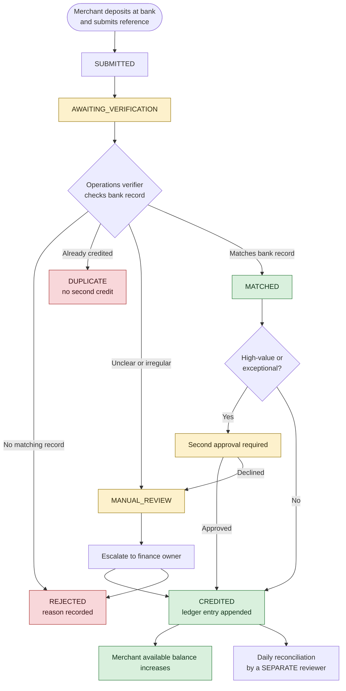

# Funding Verification

> [!danger] Not enabled
> Funding is permitted **only under an approved structure**, and that structure is
> **NOT YET CONFIRMED**. The `funding.submission` flag is off. Everything below describes the
> simulated flow built for training and the design that live funding must follow once
> [[Launch Gates]] clears.

## Absolute rules

- **No overdraft.** A merchant can never sell against value they do not have.
- **No personal account.** A founder's personal account is never used for merchant funds.
- **No screenshot-only credit.** A photograph of a transfer is not verification.
- **Segregated accounts.** Merchant funds, Telga revenue, provider settlement, hardware deposits, and refund reserves never mix. See [[Ledger Invariants]].

## Status flow

## Statuses

| Status | Meaning |
|---|---|
| `SUBMITTED` | Merchant has claimed a deposit |
| `AWAITING_VERIFICATION` | Queued for an operations verifier |
| `MATCHED` | Confirmed against the bank record |
| `CREDITED` | Ledger entry appended; balance increased |
| `REJECTED` | No matching record; reason recorded |
| `DUPLICATE` | Already credited; no second credit |
| `MANUAL_REVIEW` | Unclear or irregular; escalated |

## Separation of duties

| Duty | Who |
|---|---|
| Normal verification | Designated operations verifier |
| High-value / exceptional approval | **Second** approver |
| Daily reconciliation | A **separate** reviewer — never the verifier |

All three owners are **NOT YET ASSIGNED** — see [[Founders and Roles]]. Until they are, live
funding cannot operate, which is one reason `money.live` stays off.

## Record for every submission

Merchant · amount · currency · bank reference · timestamps · verifier · approver · evidence ·
reason · ledger entry · adjustments.

## Simulated funding in training mode

The prototype's funding screen writes to the **simulated ledger** only, is labelled
**TRAINING MODE — NO REAL VALUE**, and shows `funding.simulated.notice`. It exercises the full
status flow so operations staff can be trained before any real deposit exists.

## Related

- [[Balance Model]]
- [[Ledger Invariants]]
- [[Legal Questions]]
- [[Launch Gates]]

---
Back to [[00 Home]]
