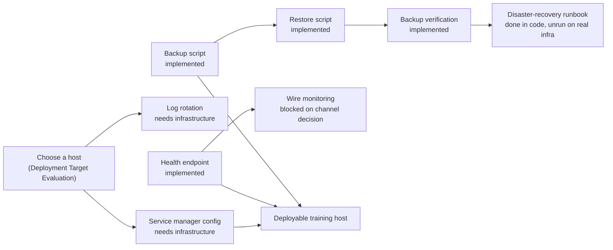

# Persistent Host Runbook

Owner: DevOps / SRE — **NOT YET ASSIGNED** ([[Founders and Roles]]).

What actually exists in this repository toward running
[[Training Deployment Architecture]] on a real host, and what does not — read
from the code, not assumed.

## Prerequisite audit

| Prerequisite | Status | Where |
|---|---|---|
| Service manager configuration (systemd unit, or equivalent) | **Needs infrastructure** | Not in this repository — host-specific, written when a host is chosen |
| Environment-variable template without secrets | **Needs code** | No `.env.example` or equivalent exists. Every flag has an env-var alias (see README), but nothing lists them together for an operator |
| Secret-management procedure | **Documentation only** | The recipient-hash salt and TLS key are the only deployment secrets — see [[Security Model]] — but no written procedure for storing or rotating them exists |
| Persistent data directory | **Already implemented** | `--db <path>` is required by both CLIs; the driver refuses to guess |
| File permissions | **Documentation only** | Certificate/key permission checks exist in code (`tests/transport/tls.test.ts` — "reports a world-readable key on POSIX"); no written guidance for the database file's own permissions |
| Backup script | **Implemented** | `services/backup` (`@telga/backup`) — `npm run backup`. See the backup/restore implementation note (implemented separately) |
| Restore script | **Implemented** | `npm run restore`. Isolated-target only; no live-replace mode |
| Backup verification | **Implemented** | Checksum, schema, integrity, append-only triggers, residual, row counts — all verified before a restore is trusted |
| TLS certificate procedure | **Already implemented** | [[Local Certificate Handling]] — certificates are supplied by path, never generated; the CLI validates match, expiry and permissions at startup |
| Health endpoint | **Implemented** | `GET /api/health/live`, `GET /api/health/ready` — see the health endpoints note (implemented separately) |
| Log rotation | **Needs infrastructure** | Both processes log to stdout/stderr only; no file-logging path exists in the code. Rotation is the host's job (e.g. a supervisor that rotates captured output) once a host is chosen |
| Database integrity check | **Already implemented** | `driver.health()` — see [[Database Operations Runbook]] |
| Migration command | **Already implemented** | `--migrate --once`, single-writer, refuses to run twice concurrently — see [[Migration Ownership]] |
| POS startup command | **Already implemented** | `node apps/merchant-pos/dist/cli.js --db <path> --merchant <id> [--transport TRAINING_HTTPS ...]` |
| Worker startup command | **Already implemented** | `node services/worker/dist/cli.js --db <path>` |
| Shutdown command | **Already implemented** | `SIGTERM` to either process — both drain cleanly; tested |
| Monitoring/alerting | **Blocked by an unresolved decision** | `evaluateAlerts` exists and defines severities (see [[Observability]]), but "this package knows nothing about a paging system" by design — wiring it to a real alert channel needs that channel chosen first |
| Incident runbook | **Already implemented** | [[Incident]] template plus per-component runbooks (this folder) |
| Disaster-recovery runbook | **Implementation done; not yet run on real infrastructure** | Backup and restore exist and are tested against real synthetic data — see the backup/restore implementation note (implemented separately). Launch gate 10 stays open until this also runs against a chosen host with a measured time-to-restore |

## What "already implemented" actually means here

Every row marked implemented has a real test behind it — a startup flag, a
refusal, a drain sequence — asserted in `tests/`, not just described in a
runbook. Nothing in this table was verified by reading a comment; each was
checked against the actual source referenced.

## What blocks what

Backup, restore, verification and the health endpoint no longer block a deployable host on
writing code — only on choosing one (A) and wiring host-level infrastructure (B, C).

Choosing a host (see [[Deployment Target Evaluation]]) does not, by itself,
make this deployable. The backup/restore chain and the health endpoint are
independent code gaps that block gate 10 and real operational confidence
regardless of which host category is chosen.

## Running the pieces (once a host exists)

See [[Service Startup and Shutdown]] for the full sequence with exact
commands. This section states only what each piece needs, not the order.

- **Migrations** need: a persistent data directory, one writer, run before anything else opens the database.
- **The worker** needs: `--db <path>`, and everything in [[Worker Configuration]] explicitly set — it refuses to fall back to a default in production shape.
- **The POS** needs: `--db <path> --merchant <id>`, provisioning already done (an operator and a device enrolled), and a transport decision (`TRAINING_HTTP_LOCAL` or `TRAINING_HTTPS`).
- **TLS** needs: a certificate and key supplied by path (never generated), and if proxied, an explicit trusted-address list.

## What must never be done

| Action | Why |
|---|---|
| Writing a backup script that copies the SQLite file without checkpointing WAL first | Produces a torn, unusable backup — see [[Backup and Restore Runbook]] |
| Adding a health endpoint that opens or queries the database on every request without rate limiting | Turns a monitoring check into a load source |
| Storing the recipient-hash salt or TLS key inside the repository or a committed file | Both are deployment secrets — see [[Security Model]] |
| Treating "the host has a persistent disk" as sufficient without confirming the database file's own permissions and location | A world-readable database file defeats every access control above it |
| Marking this runbook or gate 10 complete before backup and restore are both implemented and tested | The gate exists precisely to prevent that |

## Related

- [[Training Deployment Architecture]]
- [[Deployment Target Evaluation]]
- [[Service Startup and Shutdown]]
- [[Backup and Restore Runbook]]
- [[Deployment Runbook]]
- [[Security Deployment Checklist]]

---
Back to [[00 Home]]
