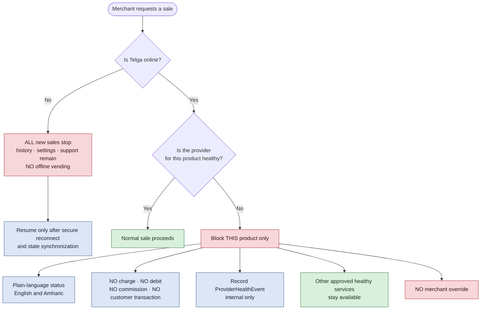
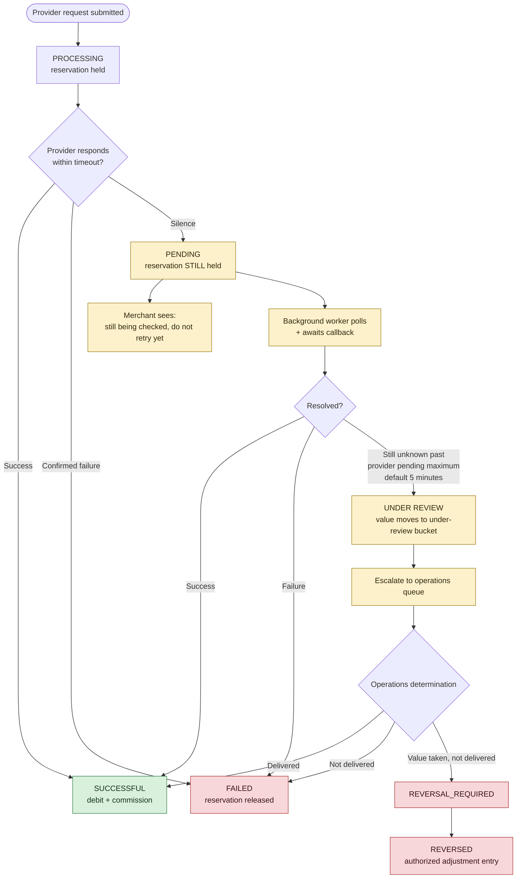

# Provider Health

## Outage isolation

When Telga is online but an airtime provider is unavailable, **only airtime is blocked**. Other
approved healthy services stay available.

> [!warning] No merchant override
> A merchant cannot force a sale through a provider Telga believes is down. An override is how a
> merchant takes a customer's cash for a product that will never be delivered.

## Telga offline

| Allowed while offline | Blocked while offline |
|---|---|
| Transaction history | All new sales |
| Settings | Funding submission |
| Support | Anything touching a provider |

**No offline vending in the pilot.** Selling resumes only after a secure reconnect and full state
synchronization — an in-flight transaction must be resolved against the server before the counter
reopens.

## Provider timeout and manual review

The path a transaction takes when a provider goes silent.

**A timeout is never a failure.** The reservation is held for the whole of this path — the
merchant's value is never released on a guess, and never debited on a guess.

## When a lookup fails rather than answers

The recovery sweep classifies a failed status lookup rather than guessing at it. The distinction
matters because only two of these categories may move a merchant's money:

| Category | Meaning | Effect on funds |
|---|---|---|
| `CONFIRMED_SUCCESS` | Delivered | Settle |
| `CONFIRMED_FAILURE` | Definitely not delivered | Release |
| `STILL_PROCESSING` | Provider is still working | **Hold** |
| `UNKNOWN` | Provider does not recognise the reference | **Hold** |
| `PROVIDER_UNAVAILABLE` | Unreachable, refused, timed out | **Hold** |
| `MALFORMED_RESPONSE` | Body could not be understood | **Hold** |
| `AUTH_OR_CONFIG_FAILURE` | **Telga is misconfigured** | **Hold** + operational alert |

`AUTH_OR_CONFIG_FAILURE` is never presented to a merchant as a failed sale. It is a platform
fault, and it pages someone. See [[Recovery Sweep]].

## Health signals

| Signal | Source |
|---|---|
| `healthCheck()` result | Provider adapter |
| Submission error rate | `TransactionAttempt` outcomes |
| Response latency p95 | [[Observability]] |
| Pending rate | Share of transactions reaching `PENDING` |
| Under-review age | Oldest unresolved transaction |

Thresholds that trip a provider into "unhealthy" are **NOT YET CONFIRMED** — they depend on the
provider's contracted SLA. See the provider agreement terms (commercial material, kept outside this repository).

## Related

- [[Transaction State Machine]]
- [[Balance Model]]
- [[Support and Disputes]]
- [[Runbooks]]

---
Back to [[00 Home]]
