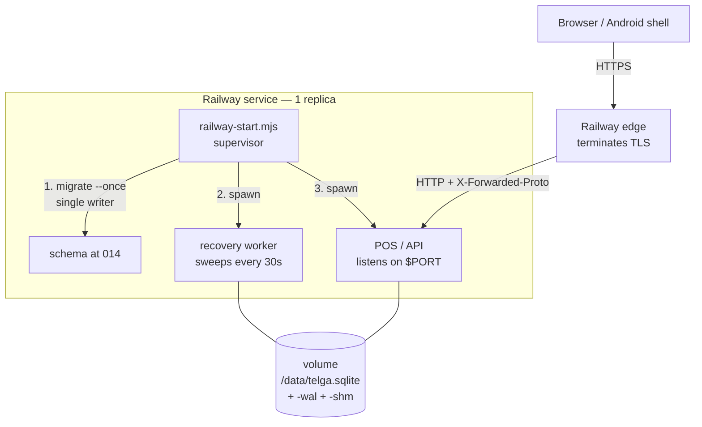

# Railway Deployment Checklist

> [!warning] Nothing here has been deployed
> No Railway account has been created, no subscription started, no payment
> details entered, no resource provisioned and no domain configured. This note
> is the **prepared** procedure, written and tested locally so that the day it
> is run there are no surprises. Running it requires the owner's explicit
> approval — see [[Decision Log]] D108.

**Operating state: TRAINING MODE — NO REAL VALUE.** The deployment described
here connects no live provider, enables no live money, and clears none of the
ten gates in [[Launch Gates]].

## The first build failure, and why its log misled

The first real Railway build failed in `npm ci`, before Telga ran at all:

```text
npm error command sh -c node-gyp rebuild
npm error gyp info using node@24.10.0 | linux | x64
npm error gyp ERR! find Python
Build Failed: npm ci did not complete successfully
```

> [!warning] Node 24 was not the cause, and pinning Node would not have fixed it
> `better-sqlite3@13.0.3` ships **N-API prebuilds** — one binary per platform,
> no ABI suffix — including `prebuilds/linux-x64.node`, exactly Railway's
> platform. `lib/binding.js` resolves `getPrebuildPath()` **before**
> `build/Release`, so that binary loads on Node 24 as readily as on Node 22.
>
> The failure came from elsewhere: the package carries a `binding.gyp` and
> **no `install` script**, which is precisely the combination that makes npm
> run an implicit `node-gyp rebuild` — whether or not prebuilds exist. The
> Nixpacks image has no Python, so that compile failed and took `npm ci` with
> it. **Node 22 with no Python fails identically.**

### The second failure — the fix was aimed at the wrong phase

Setting `railway.json`'s `buildCommand` did **not** work. The next build printed
its phase list, and that was the answer:

```text
setup    │ nodejs_24, npm-9_x
install  │ npm ci                                          ← failed here
build    │ npm ci --ignore-scripts && npm run build:clean  ← never reached
start    │ node scripts/deploy/railway-start.mjs
```

> [!danger] `buildCommand` replaces only the **build** phase
> Nixpacks generates its **own `install` phase**, and it runs first. The plain
> `npm ci` that fails was never the command D114 changed. It also selected
> `nodejs_24` despite `NIXPACKS_NODE_VERSION=22` being set, and `npm-9_x`
> against a lockfile written by npm 11.

**The fix — [[Decision Log]] D115.** A `nixpacks.toml` overrides the phase that
actually fails:

```toml
[phases.install]
cmds = ['npm ci --ignore-scripts']

[phases.build]
cmds = [
  'npm run build:clean',
  'node scripts/deploy/verify-binding.mjs',
]
```

`railway.json` keeps `builder: NIXPACKS` and **drops `buildCommand`**, so the
phases have one source of truth instead of two files that can disagree.

`scripts/deploy/verify-binding.mjs` is the check that should have existed from
the start. It opens a database, creates a STRICT table, runs a transaction and
asserts `integrity_check` **on the build host** — so a missing or unloadable
`linux-x64` binding fails the build with a named error rather than surfacing at
the first sale. It is deliberately honest about its limits: the database is
in-memory, so `journal_mode` reports `memory`, and WAL on the volume is proven
only by `[telga] migrations applied.` at runtime.

A `Dockerfile` was written first and **withdrawn at the founder's direction** in
favour of staying on Nixpacks. It would also have worked; this is the smaller
change against the same defect.

`.nvmrc` is retained for local tooling only and has no role on Railway.

### The local proof, run before this was approved

In a scratch directory outside the repository, `package.json` and
`package-lock.json` only:

| Step | Result |
|---|---|
| `npm ci --ignore-scripts` | exit **0**, 159 packages, **no `node-gyp` output** |
| `build/Release` present? | **No — nothing compiled** |
| `require('better-sqlite3')` | loaded |
| Real database opened, `journal_mode` | **wal** |
| STRICT table + transaction | 3 rows, double-entry sum **0** |
| `integrity_check` | **ok** |
| WAL and SHM files created | **yes / yes** |
| Close and cleanup | clean, exit **0** |

> [!warning] This is not yet proof that Railway works
> The proof ran on **Windows (win32-x64) under Node 25.9.0**, so it loaded
> `win32-x64.node`. **Railway is Linux.** `linux-x64.node` is present in the
> package, but **has not been proven on Railway/Nixpacks**.
>
> **Do not describe this fix as complete until a Railway build succeeds.**
> Recorded as `A103`.

### Node version — deliberately not pinned

**Node stays whatever Nixpacks selects, currently 24, and that is a decision
rather than an oversight.**

`NIXPACKS_NODE_VERSION=22` **was set and was still ignored** — the build printed
`setup │ nodejs_24, npm-9_x`. Why could not be determined from outside Railway.
Nixpacks' documented precedence is `NIXPACKS_NODE_VERSION` above
`package.json` `engines.node` (which declares `">=20"`) above `.nvmrc`, and it
did not hold here.

So the fix does not depend on it:

- **Node 24 never caused a failure.** The missing Python did, both times.
- The prebuild is **ABI-independent** and was proven loading on **Node 25**.
- Guessing at a nixpkgs attribute name to force 22 would risk a third failed
  build for no benefit.
- `.nvmrc` = `22` is kept for **local tooling only** (`nvm`, `fnm`).
- `NIXPACKS_NODE_VERSION` in Railway is **inert** — harmless to leave set.

Pinning can be revisited once a build is green, and only then.

**The cost.** `--ignore-scripts` also skips `esbuild`'s postinstall, the only
other install script in the tree. esbuild is a devDependency of vitest, and the
Railway build runs `tsc` and then the app — so the deploy path is unaffected,
but **the deployment image cannot run the test suite**. Recorded as `A104`.

### What a healthy build and start look like

| Stage | Line to look for |
|---|---|
| Install | `npm ci` completes with **no** `node-gyp` output |
| Build | `build complete: 159 .js, 159 .d.ts, 0 .ts` |
| Mode | `[telga] TRAINING MODE — NO REAL VALUE` |
| Binding | `[telga] migrations applied.` — the first line that requires a working SQLite binding (`A103`) |
| Health | `/api/health/ready` returns 200 with five checks |

If `node-gyp` appears in the install output again, the flag did not take
effect — check that Railway is building the commit that contains it.

### What this deployment still is not

Unchanged by any of the above, and true until evidence says otherwise:
**TRAINING MODE — NO REAL VALUE.** No real provider, no real airtime, no
payments, no Chapa, no wallet, no real merchant funds, no Vercel, no Supabase,
**no printing**, no self-service registration, no custom domain — `telga.pro`
is purchased and deliberately unattached. **All ten launch gates remain open.**

## The shape

One Railway **service**, one **volume**, one **replica**, running three things
in the order [[Service Startup and Shutdown]] requires:



**Why one service and not two.** The worker and the POS share one SQLite file.
Two services cannot share one volume, and a copied ledger is not a ledger —
`recovery_claims` stops two workers resolving the same transaction twice only
because both write to the same file ([[Recovery Worker]], A37/R16).

**Why one replica.** A second replica is a second writer on the same file and a
second worker sweeping the same claims. `railway.json` pins `numReplicas: 1`,
and it must stay pinned.

## Before anything is provisioned

- [ ] Owner has approved a spend. The Free plan's **$1/month** credit does not
      run a 24/7 service — see *Cost*, below.
- [ ] Owner accepts that this is training-only and no merchant will be given
      the URL.
- [ ] `telga.et` is **not** configured. It has not been purchased (A89), and
      the deployment uses the Railway-provided subdomain only.

## Cost — check the dashboard, do not trust this note

Rates published by Railway at the time of writing, which must be re-checked on
the billing page before any spend:

| | Free | Hobby |
|---|---|---|
| Subscription | $0 | $5/month |
| Included credit | **$1/month** | $5/month |
| RAM cap | 0.5 GB | 48 GB |
| Volume | 0.5 GB | 5 GB |

Usage is billed on **actual** consumption: RAM $10/GB/month, CPU
$20/vCPU/month, volume $0.15/GB/month.

**Estimate for this service running 24/7:** ~0.2 GB RAM and near-idle CPU
≈ **$2.50/month**. That exceeds the Free plan's $1 credit in roughly twelve
days, and **when credit is exhausted the workload stops**. Hobby's $5 credit
covers the estimate with no overage.

> [!danger] Volume data is deleted 30 days after credits run out
> That is the ledger. Off-platform backups are therefore mandatory, not
> advisory — see *Backups* below and [[Backup and Restore Runbook]].

## Provisioning steps

1. **Create the service** from the GitHub repository. Do not enable automatic
   deploys until the first manual deploy has been verified.
2. **Attach a volume** mounted at `/data`. One volume per service is Railway's
   limit and one is all this needs.
3. **Set environment variables** (below). Every one is required; the supervisor
   refuses to start rather than guess any of them.
4. **Deploy**, and watch the build — `better-sqlite3` is a native module and
   compiles during `npm ci`. A build that fails there fails loudly.
5. **Read the logs for `PROXY_PEER_OBSERVED`** before trusting anything. See
   *The proxy trust step*.
6. **Set `TELGA_TRUST_PROXY`** to the observed range and redeploy.
7. **Provision the first operator and device** by running the provision command
   once, against `/data/telga.sqlite`, from a Railway shell. The device key is
   printed **once** and is not recoverable.
8. **Verify** with the checks at the end of this note.

## "The variable is set, and the container says it is not"

The third deployment reached **`Starting Container`** — the build was fixed —
and then refused to start:

```text
[telga] TELGA_DB_PATH is not set. This deployment refuses to guess it
```

with the variable plainly present and correctly spelled in the dashboard. The
refusal was right; **the message was not good enough**. It named what was
missing and said nothing about what the container had actually received, so
four different causes looked identical from outside:

| Cause | Fix |
|---|---|
| Variables on a different **environment** | Switch environment, re-enter |
| Variables on the **project** as shared variables, never linked into the service | Add them on `telga-backend`, or reference the shared ones |
| Changes **staged in the editor and never applied** | Click Apply / Save |
| The **name** differs from the one the code reads | Correct the name |

Each has a different remedy, none is visible from the log, and settling it by
trial costs one deployment per guess.

**So the refusal now reports what it received.** `railway-start.mjs` prints the
**names** of every `TELGA_*` variable in the container, and a count of
`RAILWAY_*` variables:

```text
[telga] TELGA_* variables this container received (0): (none)
[telga] RAILWAY_* variables present: 12. Railway is injecting variables, so the
        TELGA_ ones are attached to a different service or environment, or were
        staged and never applied.
```

Read it like this:

| What you see | What it means |
|---|---|
| `TELGA_* (0)` and `RAILWAY_*` **> 0** | Railway's injection works. The variables are **not on this service or environment** |
| `TELGA_*` lists some names but not the one that failed | A **naming** problem on that variable alone |
| Both **0** | Nothing was applied at all |

> [!important] Names only, never values
> `Observability` requires the banner to state the posture and nothing secret. A
> variable **name** is not a secret — it is written in this note already — but a
> value may be. `TELGA_RECIPIENT_SALT` appears in that list **by name only**,
> and a test confirms its value is never printed.

**Also worth checking before blaming the variables:** that the deployment you
are reading is the one built from the commit you pushed. A service that is
restart-looping keeps an older deployment visible, and its logs look current.

## Environment variables

| Variable | Example | Why |
|---|---|---|
| `TELGA_MODE` | `TRAINING` | Anything else is refused before a database opens |
| `TELGA_DB_PATH` | `/data/telga.sqlite` | Refused if not inside the mounted volume |
| `TELGA_MERCHANT_ID` | `merchant_alpha` | The merchant this POS serves |
| `TELGA_ALLOWED_HOSTS` | `telga-xxxx.up.railway.app` | The `Host` header is client-controlled; Telga answers only for hosts it was told about |
| `TELGA_TRUST_PROXY` | *(see below)* | Addresses whose forwarding headers are believed |
| `TELGA_BACKUP_ALLOWED_ROOTS` | `/data` | The backup tool has **no** default; an unset value refuses every path |
| `PORT` | `8080` | The listener port, and the port selected when generating the domain |
| `NIXPACKS_NODE_VERSION` | `22` | Pins the runtime the native `better-sqlite3` module is built against |

### `TELGA_RECIPIENT_SALT` — the one real secret

> [!warning] Set this in Railway, and never paste its value anywhere
> The recovery worker reads `TELGA_RECIPIENT_SALT` and, when it is unset, falls
> back to the literal `cli-salt-not-a-production-secret` — a string that is
> **public in this repository**. [[Security Model]] requires the recipient salt
> to be a deployment secret precisely so that a stored digest is not a
> rainbow-table lookup, and a published constant is not one.
>
> Generate a long random value, enter it directly in Railway's variable editor,
> and do not record it in this repository, in the vault, or in a chat.

**A known asymmetry, stated rather than hidden.** The POS does *not* read this
variable: `apps/merchant-pos/src/cli.ts` uses a fresh `randomUUID()` per
process, deliberately, because the training build stores no real recipient and
"a salt that survives a restart would be a secret this file has no business
holding". So the POS and the worker use **different** salts, and the POS's
changes on every restart — which on Railway means every redeploy. In training,
with simulated recipients, this costs nothing. It must be resolved before any
real recipient is ever stored. Recorded as **A97**.

`RAILWAY_VOLUME_MOUNT_PATH` is set by Railway and is used to check
`TELGA_DB_PATH` really is on the volume.

## The proxy trust step

Railway terminates TLS at its edge and speaks plain HTTP to the container, so
the POS learns the client's real scheme from `X-Forwarded-Proto`. That header is
believed **only** from an address in `--trust-proxy`. There is deliberately no
trust-all setting ([[TLS and Proxy Configuration]], D45), and Telga ships **no
built-in range for any hosting platform**.

> [!important] Do not guess the range
> Railway's own documentation does not publish the address its edge forwards
> from. A community post reports `100.0.0.0/8`; that is **unverified**, and it
> is wider than the carrier-grade NAT block `100.64.0.0/10`, so it would include
> publicly routable space. Do not configure it on that basis.

**Observe it instead.** Deploy first with a deliberately narrow
`TELGA_TRUST_PROXY` (for example `127.0.0.1/32`), open the site once, and read
the logs:

```text
PROXY_PEER_OBSERVED peer=<address> — a forwarding header arrived from this
address and was NOT believed, because the address is not in --trust-proxy.
```

That address is the edge. Confirm it is a private/internal address, set
`TELGA_TRUST_PROXY` to it or to the narrowest range containing it, and redeploy.
The line is printed **once per address**, and observing an address never trusts
it — that stays an explicit decision.

A malformed entry, or a zero-length prefix such as `0.0.0.0/0`, is refused at
startup with `PROXY_TRUST_ENTRY_INVALID`.

## Backups

`TELGA_BACKUP_ALLOWED_ROOTS` must be set or every backup path is refused.

```bash
node services/backup/dist/cli.js backup \
  --db /data/telga.sqlite --output /data/backups/telga-$(date +%Y%m%d).sqlite
```

The manifest records the schema version, row counts, `ledgerResidualMinor` and
a SHA-256 checksum. **Copy the backup off Railway** — a backup on the volume
does not survive the volume. Restore is proven in [[Backup and Restore Runbook]].

## Verification after deploy

- [ ] `GET /api/health/live` returns `200` and `"mode":"TRAINING"`
- [ ] `GET /api/health/ready` reports `HEALTHY` for `mode`, `database`,
      `ledger_residual`, `recovery_queue` and `recovery_claims`
- [ ] The startup banner names the trusted range, and it is the observed one
- [ ] No `PROXY_PEER_OBSERVED` line appears after the range is configured
- [ ] Sign in works, and stays signed in — a `Secure` cookie that never comes
      back is the symptom of an untrusted proxy
- [ ] Redeploy, then confirm the merchant, devices and ledger rows are still
      there. The `-wal` and `-shm` files live beside the database and the
      **whole directory** must be on the volume
- [ ] A backup runs, and its `ledgerResidualMinor` is `0`

## What is deliberately not here

Custom domains, `telga.et` DNS, the operations console, live provider traffic,
live money, and any second replica. Each needs its own decision.

## Related

- [[Localhost Setup]]
- [[Service Startup and Shutdown]]
- [[Backup and Restore Runbook]]
- [[TLS and Proxy Configuration]]
- [[Deployment Target Evaluation]]

---
Back to [[00 Home]]
