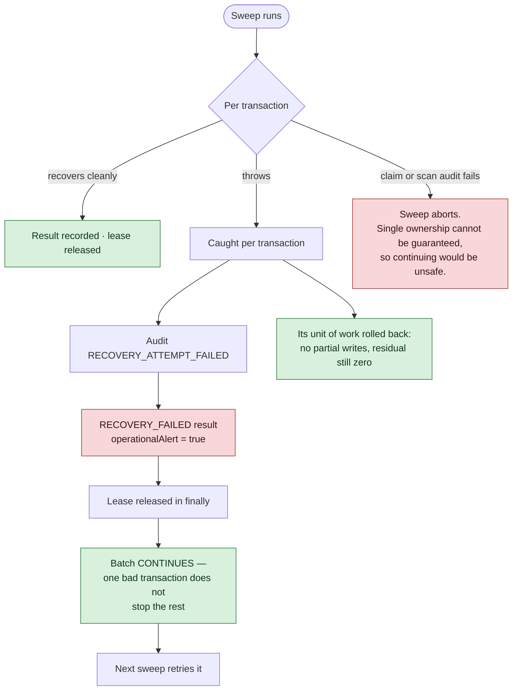

# Recovery Sweep Runbook

Owner: engineering and security — **NOT YET ASSIGNED** ([[Founders and Roles]]).

## Recovery failure and retry

A recovery failure is **never hidden**. It appears in the sweep report, in the audit log, and as an
operational alert.

## Who runs the sweep

[[Recovery Worker]] runs it on a schedule. This runbook covers the sweep's own behaviour; for
the loop around it — starting, stopping, restarting, backoff and health — see
[[Worker Operations Runbook]].

## Daily checks

1. `recoveryGauges(driver, now)` — read `processing`, `reserved`, `pending`, `underReview`, `oldestUnresolvedAgeMs`, `openManualReviews`, `ledgerResidualMinor`.
2. **`ledgerResidualMinor` must be zero.** Anything else is the highest-severity signal Telga has — go to [[Database Operations Runbook]] immediately.
3. `oldestUnresolvedAgeMs` should be well inside the configured safe period. A number that keeps climbing means the sweep is not running, or the provider is not answering.
4. `openManualReviews` should be flat or falling. See [[Manual Review Runbook]].

## Procedure — sweep reports recovery failures

1. Read the `RECOVERY_ATTEMPT_FAILED` audit events; the detail is a **safe code**, not a message.
2. Confirm the invariants still hold: residual zero, four views reconcile, database healthy.
3. The affected transactions are unchanged and still claimed-then-released, so the next sweep retries them. No manual repair is needed for a transient failure.
4. If the same transaction fails on several consecutive sweeps, treat it as a defect: write an [[Incident]] note and link it from [[Runbooks]].

## Procedure — provider lookups failing for configuration reasons

`AUTH_OR_CONFIG_FAILURE` means **the platform is misconfigured, not that the merchant's sale
failed.**

1. Do not tell merchants their sales failed. The transactions are held, not lost.
2. Check credentials and endpoint configuration for the affected provider.
3. Value stays reserved throughout; nothing is released and nothing is refunded.
4. Note that affected transactions still escalate to `UNDER_REVIEW` when their deadline passes — that is intended, and gives support a case to work while the configuration is fixed.

## Procedure — duplicate worker claims appearing

`MULTIPLE_RECOVERY_ATTEMPTS` alerts when workers are contending.

1. A small number is normal when several workers run — the claim refused the duplicate, which is the mechanism working.
2. A large number means too many workers for the batch size, or a lease shorter than a typical recovery.
3. Adjust `claimLeaseMs` or the worker count in [[Recovery Configuration]]. Do not disable the claim.

## Procedure — a worker died mid-recovery

1. Its lease expires after `claimLeaseMs`; another worker then reclaims the transaction. No action is needed beyond confirming the transaction did get picked up on a later sweep.
2. If a transaction is claimed but never progresses across several sweeps, check whether the lease is longer than the sweep interval.

## What must never be done

| Action | Why |
|---|---|
| Marking a held transaction failed to "clear the queue" | The outcome is unknown; the provider may have delivered |
| Refunding an unknown outcome | Drains the platform — see [[Support and Disputes]] |
| Disabling the claim to "speed up" recovery | Two workers would recover the same transaction |
| Shortening `pendingMaximumMs` to clear alerts | Escalates healthy transactions into the review queue |
| Editing a ledger entry | Refused by trigger. Post an `ADJUSTMENT` |

## Related

- [[Recovery Sweep]]
- [[Recovery Configuration]]
- [[Manual Review Runbook]]
- [[Transaction Failure Runbook]]
- [[Runbooks]]

---
Back to [[00 Home]]
