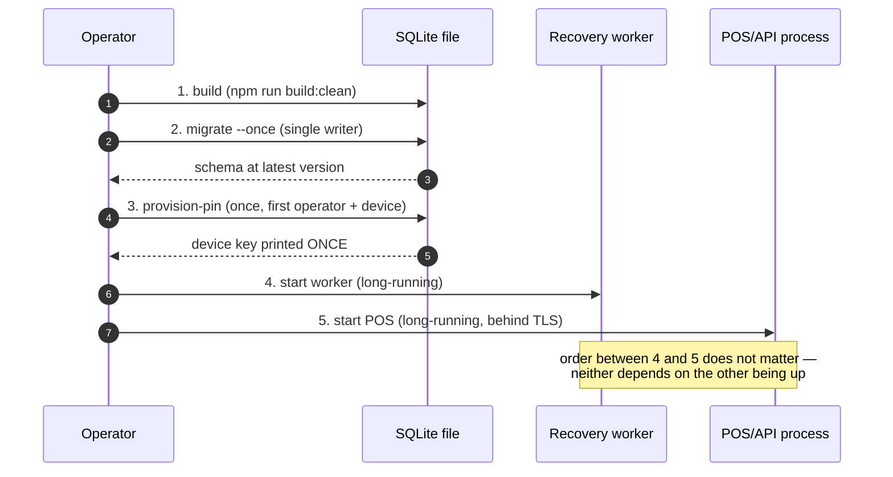

# Service Startup and Shutdown

The exact command sequence for [[Training Deployment Architecture]] on a
chosen host. Every command below already exists and is tested; this note
only orders them.

## Startup order



### 1. Build

```bash
npm install
npm run build:clean
```

Refuses to finish if TypeScript leaks into `dist/` — see [[Build Pipeline]].

### 2. Migrate — one writer, once

```bash
node services/worker/dist/cli.js --db ./telga.sqlite --migrate --once
```

Must complete before step 3 or either long-running process starts. Neither
the worker nor the POS will migrate on its own — both exit `6` against an
unmigrated database. See [[Migration Ownership]].

### 3. Provision the first operator and device

```bash
node apps/merchant-pos/dist/cli.js --db ./telga.sqlite \
  --merchant merchant_alpha --operator operator_1 --device device_1 \
  --provision-pin 481502
```

Prints the device key **once** and exits — it is not recoverable. See
[[Training Operations Runbook]] for lockouts, re-enrolment and lost devices.

### 4. Start the recovery worker (long-running)

```bash
node services/worker/dist/cli.js --db ./telga.sqlite
```

Every setting in [[Worker Configuration]] should be explicit for a real
deployment — the worker does not fall back to a development default in
production shape.

### 5. Start the POS/API process (long-running, behind TLS)

```bash
node apps/merchant-pos/dist/cli.js --db ./telga.sqlite --merchant merchant_alpha \
  --transport TRAINING_HTTPS \
  --tls-cert /path/to/cert.pem --tls-key /path/to/key.pem \
  --allowed-hosts telga-training.local
```

Or, behind a real reverse proxy terminating TLS:

```bash
node apps/merchant-pos/dist/cli.js --db ./telga.sqlite --merchant merchant_alpha \
  --tls-termination TRUSTED_PROXY --trust-proxy <proxy-address> \
  --allowed-hosts telga-training.local
```

See [[TLS and Proxy Configuration]] for the full flag reference — there is
deliberately no "trust all proxies" option.

## Health checks after startup

| Check | Command / signal | Healthy |
|---|---|---|
| Database | `driver.health()` via a manual sweep, or direct PRAGMA inspection | `integrity_check = ok`, `foreign_keys = 1`, `journal_mode = wal`, residual `0` |
| Worker | `node services/worker/dist/cli.js --db <path> --once --json` | Exit `0`, JSON line with `status: RUNNING`-equivalent health, `ledgerResidualMinor: 0` |
| POS/API | No dedicated HTTP health route exists yet — see [[Persistent Host Runbook]] | Manually confirm the sign-in screen loads over the expected transport |

## Shutdown order

Reverse of startup, and either order between worker and POS is safe:

1. Stop accepting new connections at the proxy, if a separate one is used.
2. `SIGTERM` the POS process. It stops accepting connections and closes the
   listener cleanly — tested (`tests/ui/server.test.ts`, "closes the listener
   and stops accepting connections").
3. `SIGTERM` the worker. It stops scheduling, finishes any sweep in flight up
   to `gracefulShutdownTimeoutMs`, releases **only its own** claims, and
   closes the database. See [[Worker Operations Runbook]].
4. Confirm ledger residual is still `0`.

## Restart policy

Both processes are safe to restart at any point — every recovery step is
idempotent, and the POS holds no state beyond what is in the database. What
supervises the restart (systemd, a container's own restart policy, etc.) is a
host-specific choice, not defined by this repository. Whatever is chosen must
not restart either process in a tight loop after a **fatal** failure — see
[[Worker Operations Runbook]] "Procedure — worker is FAILED": a fatal
category stopped it on purpose, so it would not retry into a broken database.

## Killing instead of draining

Safe but not clean. A killed worker's claims expire on their own lease; a
killed database recovers from its `-wal`/`-shm` files on next open. Nothing
here risks duplicate settlement — see [[Ledger Invariants]] — but prefer
`SIGTERM` and a drain whenever the situation allows it.

## What must never be done

| Action | Why |
|---|---|
| Starting the POS or worker before migrations are applied | Both refuse with exit `6`, but starting out of order wastes a deploy cycle diagnosing it |
| Starting either process with `--mode LIVE` | Refused before a database is even opened — this deployment is training-only |
| Restarting in a tight loop after a fatal worker failure | The worker stopped precisely so it would not retry into a broken database |
| Deleting a `-wal` or `-shm` file during "cleanup" | It may hold committed transactions not yet folded into the main file |

## Related

- [[Training Deployment Architecture]]
- [[Persistent Host Runbook]]
- [[Worker Operations Runbook]]
- [[Training Operations Runbook]]
- [[Migration Ownership]]

---
Back to [[00 Home]]
