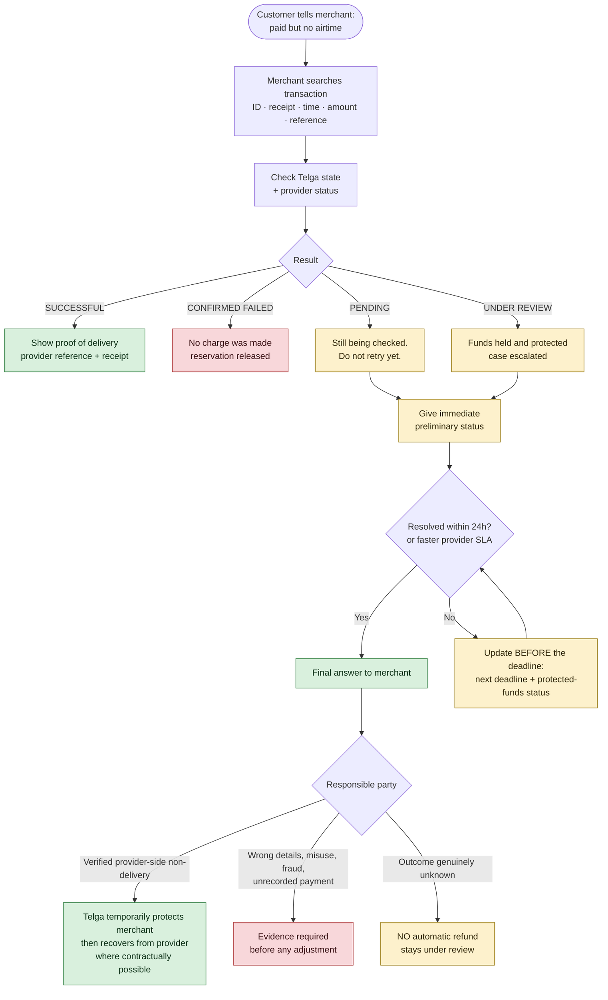

# Support and Disputes

The defining complaint is **"paid but no airtime"**. How Telga answers it is the product.

## Complaint flow

## Service commitments

| Commitment | Value |
|---|---|
| Preliminary status | Immediate |
| Final answer | Within **24 hours**, unless the provider SLA is faster |
| If unresolved | Update **before** the deadline, with the next deadline and the protected-funds status |

Missing a deadline silently is the failure that loses a merchant. An update that says "still
checking, next update by 14:00, your funds are held" keeps the relationship.

## Liability

| Cause | Telga's position |
|---|---|
| **Verified** provider-side non-delivery | Telga temporarily protects the merchant, then recovers from the responsible provider where contractually possible |
| Wrong recipient details entered | Evidence required; no automatic adjustment |
| Merchant misuse or fraud | Evidence required; case escalated to a dispute |
| Unrecorded payment (cash not entered) | Evidence required |
| Outcome genuinely unknown | **No automatic refund.** Stays `UNDER_REVIEW` |

> [!warning] Never auto-refund an unknown outcome
> Refunding on uncertainty is how a vending platform is drained. The transaction stays under
> review until the provider gives a determinate answer or the contractual reversal path resolves it.

Recovery from a provider depends on the reversal, refund and settlement terms in the provider
agreement — **NOT YET CONFIRMED**, tracked in the provider agreement terms (commercial material, kept outside this repository).

## Cases the machine opens for you

Most under-review cases are not raised by a merchant — the recovery sweep opens them
automatically when a transaction passes its pending deadline, with a reference the merchant can
quote before they have even called. Exactly one case per transaction; a repeated sweep reuses it.

How to work one is in [[Manual Review Runbook]]. The short version: age is not evidence, an
unknown outcome is never refunded, and a reversal needs a supervisor.

## Case record

Merchant · transaction · reported symptom · Telga state at report time · provider status ·
preliminary answer and time · final answer and time · responsible party · evidence ·
adjustment reference · operator.

## Escalation

Support escalation ownership is a launch gate and is **NOT YET ASSIGNED** — see
[[Founders and Roles]] and [[Launch Gates]].

## Related

- [[Transaction State Machine]]
- [[Provider Health]]
- [[Runbooks]]

---
Back to [[00 Home]]
