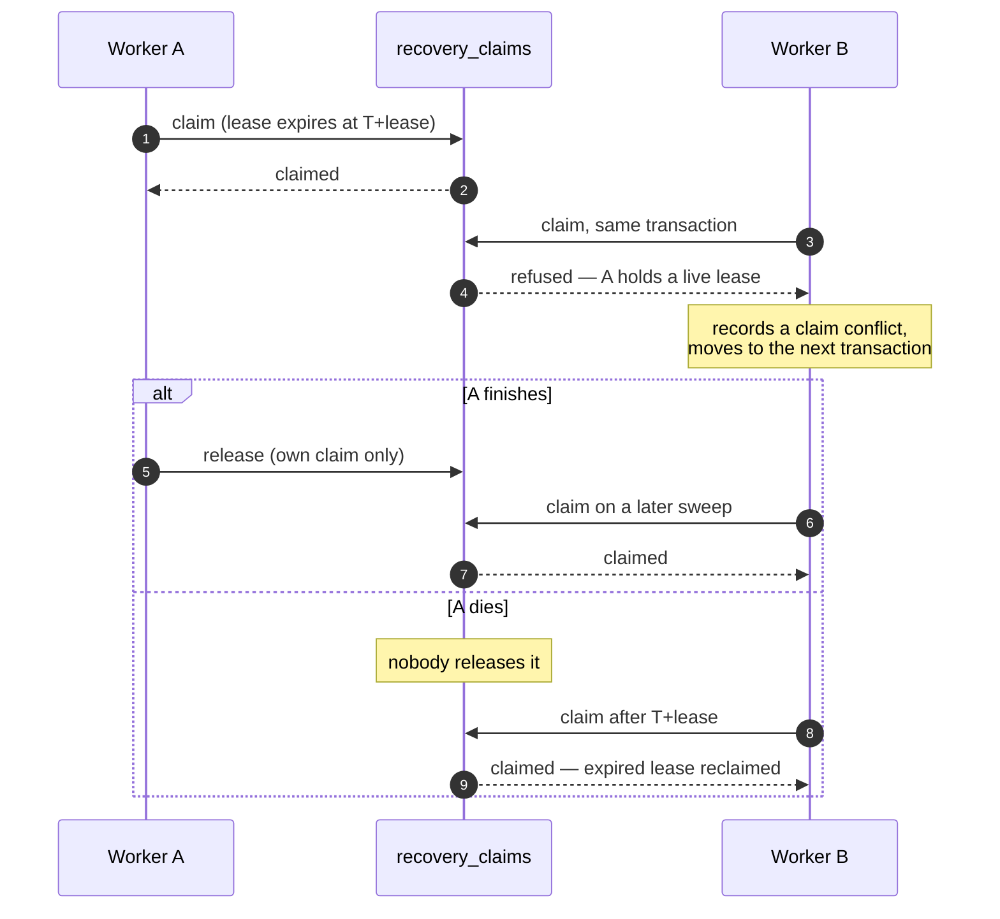

# Worker Operations Runbook

Owner: engineering and security — **NOT YET ASSIGNED** ([[Founders and Roles]]).

## Multi-worker claim lease



Two workers can run against the same database. Exactly one wins each transaction; the loser records
a conflict and continues. A dead worker's lease expires rather than stranding a merchant's money.

## Daily checks

1. `worker.health()` — confirm `level` is `HEALTHY` and `status` is `RUNNING`.
2. `lastSuccessfulSweepAt` should be recent. A stale timestamp on a `RUNNING` worker means sweeps are failing or the loop is stuck.
3. `consecutiveFailures` should be zero. Anything else means backoff is active.
4. `oldestUnresolvedAgeMs` should be inside the safe period.
5. **`ledgerResidualMinor` must be zero.** Anything else — [[Database Operations Runbook]], immediately.

## Health meanings

| Level | What to do |
|---|---|
| `HEALTHY` | Nothing |
| `DEGRADED` | Investigate today. The worker is running but failing, stale, or falling behind |
| `UNHEALTHY` | Investigate now. Either it is not running, or the ledger or database is unsound |

## Procedure — worker is BACKING_OFF

1. Read `lastFailure.category`. Provider and unexpected failures back off and retry; that is working as intended.
2. Confirm `currentBackoffMs` is growing and capped, not stuck at the maximum forever.
3. If the category is `PROVIDER_ADAPTER`, check provider health — see [[Provider Health]].
4. Backoff clears itself on the first successful sweep. No manual action is needed unless it persists.

## Procedure — worker is FAILED

A fatal category stopped it: configuration, database connection, or schema.

1. Read `lastFailure.code` — a **safe code**, never a raw message.
2. `CONFIGURATION` — a setting is missing or invalid. See [[Worker Configuration]]; fix and redeploy.
3. `DATABASE_CONNECTION` / `MIGRATION_SCHEMA` — go to [[Database Operations Runbook]]. Do not restart in a loop; the worker stopped precisely so it would not retry into a broken database.
4. Merchant value is untouched by a worker failure. Transactions stay where they were, and a healthy worker picks them up later.

## Procedure — restarting safely

1. Confirm no ledger residual before and after.
2. Stop with SIGTERM and let it drain. The worker stops scheduling, finishes the sweep in flight up to `gracefulShutdownTimeoutMs`, releases **only its own** claims, and closes the database.
3. If it must be killed, claims it held expire on their own lease — no cleanup is needed and no claim row should ever be deleted by hand.
4. Start the replacement. A restart is safe at any point: every recovery step is idempotent.

**Never delete a claim row to "unstick" a worker.** The lease expiry is the mechanism; deleting rows removes the record of who was doing what.

## Procedure — inspecting unresolved transactions

1. `recoveryGauges` gives the counts: `processing`, `reserved`, `pending`, `underReview`, `reversalRequired`.
2. `awaitingResolutions` lists pending jobs with `attempts`, `last_outcome_category`, `next_check_at` and `deadline_at`.
3. `oldestUnresolvedId` names the transaction that has held a merchant's money longest — start there.
4. For anything in `UNDER_REVIEW`, work the support case: [[Manual Review Runbook]].

## Procedure — manual recovery

Run one sweep from the compiled runtime and read the result line:

```bash
node services/worker/dist/cli.js --db <path> --once --json
```

Exit `0` with a JSON line means the sweep completed; `2`, `3`, `4` and `5` are argument, mode,
configuration and runtime failures respectively. See [[Build Pipeline]] and the README.

When the worker is down and a transaction must be resolved now:

1. Run one sweep as above, or resolve a single transaction through `resolvePending`.
2. Every guard still applies — the claim, the reservation status, the pending job. Manual running cannot double-debit.
3. Never resolve a transaction by editing rows. Editing a ledger entry is refused by trigger, and editing a transaction row bypasses the state machine.

## What must never be done

| Action | Why |
|---|---|
| Running with development configuration in production | Refused in code, and for good reason |
| Deleting a claim row | The lease is the mechanism; the row is the record |
| Restarting in a tight loop after a fatal failure | The worker stopped so it would not retry into a broken database |
| Shortening the pending maximum to clear an alert | Hides held merchant money instead of resolving it |
| Treating a stopped worker as healthy | Silence is not success |

## Related

- [[Recovery Worker]]
- [[Worker Configuration]]
- [[Recovery Sweep Runbook]]
- [[Manual Review Runbook]]
- [[Deployment Runbook]]

---
Back to [[00 Home]]
