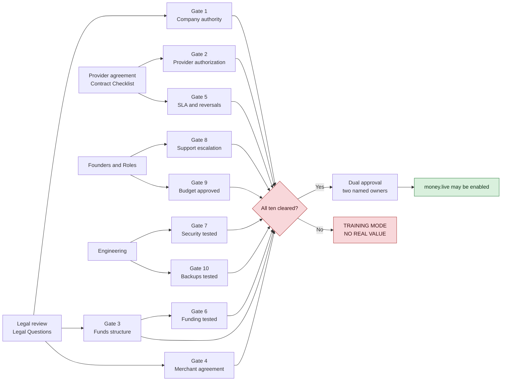

# Launch Gates

**Register K.** Ten gates. **All ten must be documented as cleared before any live-money activity.**

## Status: 0 of 10 cleared

| # | Gate | Status | Evidence required | Blocked by |
|---|---|---|---|---|
| 1 | Company authority documented | ☐ NOT CLEARED | Registration and licensing documents | [[Legal Questions]] L1, L2 |
| 2 | Airtime-provider authorization or signed reseller/integration agreement | ☐ NOT CLEARED | Signed agreement | the provider agreement terms (commercial material, kept outside this repository) |
| 3 | Approved bank / payment-partner / funds structure | ☐ NOT CLEARED | Written partner structure | [[Legal Questions]] L6, L7 |
| 4 | Merchant agreement and fee disclosure | ☐ NOT CLEARED | Both documents, reviewed | [[Legal Questions]] L10, L11 |
| 5 | Provider SLA, reversal, refund and settlement rules | ☐ NOT CLEARED | Contract terms 7–9 | the provider agreement terms (commercial material, kept outside this repository) |
| 6 | Funding and reconciliation tested | ☐ NOT CLEARED | Test results, separation of duties proven | [[Funding Verification]] |
| 7 | Security and permissions tested | ☐ NOT CLEARED | Security test results | [[Testing Strategy]] |
| 8 | Support escalation assigned | ☐ NOT CLEARED | Named owner and escalation path | [[Founders and Roles]] |
| 9 | Limits and pilot budget approved | ☐ NOT CLEARED | Approved budget and transaction limits | the pilot budget (commercial material, kept outside this repository) |
| 10 | Backups and recovery tested | ☐ NOT CLEARED | Restore test evidence | [[Runbooks]] |

## The rule while gates are open

> **If any gate is incomplete, run simulated funds and a clearly labelled
> TRAINING MODE — NO REAL VALUE.**

That is Telga's current state. See [[Balance Model]] and [[Feature Flags]].

## Two keys for live money

Clearing all ten gates is necessary but not sufficient. Enabling `money.live` additionally requires
**dual approval** recorded in [[Decision Log]]:

- **Key 1** — engineering and security owner
- **Key 2** — compliance and risk owner

Both are **NOT YET ASSIGNED** ([[Founders and Roles]]), so `money.live` cannot be enabled today
even if every other gate were cleared.

## Gate dependencies

## Clearing a gate

A gate is cleared only when: the evidence exists as a document, a named owner has reviewed it, and
the clearance is recorded in [[Decision Log]] with a date. **A gate is never cleared by assertion.**

## Related

- [[Legal Questions]]
- [[Feature Flags]]
- [[Decision Log]]

---
Back to [[00 Home]]
