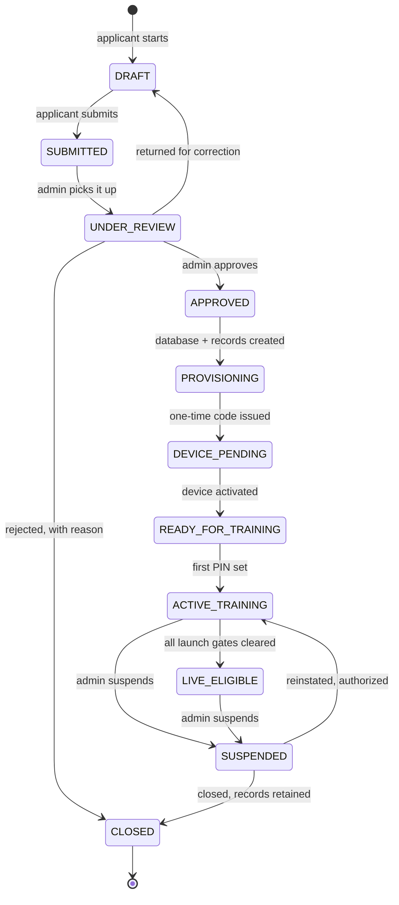

# Admin Operations Console

The Telga staff console: a **separate application** from the merchant POS and
from Telga Pay, reached by Telga employees only, never by a shop.

**Nothing here is built.** This note is the architecture proposed on
2026-08-30 and the four decisions the owner made. It exists so that the
irreversible choices are written down before any migration runs.

## What the inspection found

Four facts about the current code shaped every decision below.

| Finding | Where | Consequence |
|---|---|---|
| `merchant_users.merchant_id` is `NOT NULL` | migration 006 | **A Telga admin cannot exist.** Every user must belong to a shop, including `ADMIN` |
| `sessions.device_id` is `NOT NULL` | migration 006 | An admin would need an enrolled POS to hold a session |
| Authentication is `pin_hash` + `pin_salt` only | migration 006 | No email, no password, no MFA, no biometric anywhere |
| Provisioning is a CLI function | `cli.ts:504` | No registration exists. `provision()` creates merchant, device and owner at once and marks the merchant `ACTIVE` immediately |

Merchant isolation itself is sound: `handlers.ts` derives `merchantId` from the
session, never from the request body.

## Decision 1 — a separate admin identity

**Accepted.** A new `admin_users` table, independent of `merchants`.

Merchant identity is unchanged. `merchant_users` keeps its `NOT NULL`
merchant key — the constraint that makes cross-shop leakage structurally
impossible — and admin identity is built beside it rather than by weakening it.

An admin session carries **no device**. A console is used from a laptop, and
requiring an enrolled POS to administer the platform is the wrong shape.

Authentication is **email + password + MFA**, never a PIN. CLAUDE.md §24 and
the owner brief both forbid a merchant PIN as an administrative credential.

## Decision 2 — one database per shop

**Accepted by the owner**, with the costs stated and understood.

CLAUDE.md §9 requires this be compared rather than assumed, so the comparison
is recorded here rather than implied.

| | Shared database (today) | **Per-shop database (chosen)** |
|---|---|---|
| Isolation | Logical, from the session | Physical, plus logical |
| Backup | One file | **One per shop, plus a registry** |
| Restore | One operation | **Per shop; a partial restore is now possible** |
| Migrations | 12, run once | **12 × N, versioned per tenant** |
| Ledger residual | Provable across the platform in one query | **Per shop; the platform figure becomes a loop** |
| Cross-shop reporting | A SQL query | **A fan-out and merge** |
| Failure containment | One corrupt file affects everyone | **One corrupt file affects one shop** |

`ledgerResidualMinor()` is referenced at **128 call sites** in tests and
services. Under this model it proves double entry *within a shop*, which is
still the invariant that matters — CLAUDE.md §13.2 is about a merchant's books
balancing. The platform-wide figure becomes a sum over tenants and must be
built deliberately, not assumed.

**This is the irreversible choice.** Splitting later is a data migration;
merging later is worse. It is why it was put to the owner before any code.

What it obliges, none of which exists yet:

- a **tenant registry** — the one shared table that maps merchant to database
- **connection routing** derived from the session, never from a request
- **per-tenant migration versioning**, so a half-migrated tenant is detectable
- **N backups and N restores**, tracked
- **cross-tenant reporting** as an explicit fan-out
- a **closure policy**: a closed shop's database is retained, never deleted

## Decision 3 — public registration, no account until approved

**Accepted.** An applicant downloads the app, submits shop details, and
receives a reference number. **No account, no credentials, no device and no
database are created.** An admin reviews and approves; only then does anything
exist.

The alternative — creating a locked account immediately — would mean real
credentials for unvetted people and an approval check on every route, where a
single missed guard is a way in. Nothing to attack is better than a guard that
must never be forgotten.

The merchant lifecycle grows from four states to the owner's eleven. Today
`merchants.status` allows `ONBOARDING, ACTIVE, SUSPENDED, CLOSED`.

`LIVE_ELIGIBLE` is **eligibility, not permission**. `money.live` still needs
its ten gates and two approvers — see [[Feature Flags]]. No lifecycle state
enables a regulated feature.

**Nothing is ever deleted.** `CLOSED` retains every record and the shop's
database.

## Decision 4 — biometric via the device, never stored

**Accepted.** WebAuthn / passkey. The phone or laptop verifies the face and
releases a cryptographic key; Telga receives a signed assertion.

**Telga stores no face image and no biometric template.** Storing them would
mean holding the most sensitive category of personal data with no
data-protection review done (CLAUDE.md §8) and no retention policy — and it
would be phishable, which a passkey is not.

Password + MFA ships first; the passkey is additive. Nothing else waits on it.

## Admin roles

Individual accounts only. No shared login, no universal owner account.

| Role | May do |
|---|---|
| Platform Owner | Everything, including creating department admins |
| Operations Admin | Merchants, devices, remote stop |
| Finance / Verifier | Funding and reconciliation |
| Support Agent | Support cases; read-only merchant data |
| Auditor | Reports and audit logs; **no mutation** |
| Security Admin | Sessions, device revocation, security controls |
| Department Admin | Scoped rights within one department |

Sub-admins are created **only** by the Platform Owner. Every admin record
carries created-by, approved-by, last login, last activity, and status.

Step-up re-authentication is required for: creating or activating a merchant or
device, resetting a PIN, changing ownership or financial settings, crediting or
adjusting balances, approving funding, remote-stopping sales, changing feature
flags, exporting data, and changing admin roles.

## What is not decided

- **Device credential type.** Certificate, key pair, or server-issued refresh
  credential — see [[Device Binding]] "What would close A52". Not chosen.
- **Enrollment token lifetime.** Single-use and short-lived is decided; the
  exact expiry is not.
- **Cross-tenant reporting mechanism** under per-shop databases.
- **Data retention** for closed shops.

## Related

- [[Security Model]]
- [[Merchant Onboarding]]
- [[Founders and Roles]]
- [[Device Binding]]
- [[Feature Flags]]

---
Back to [[00 Home]]
