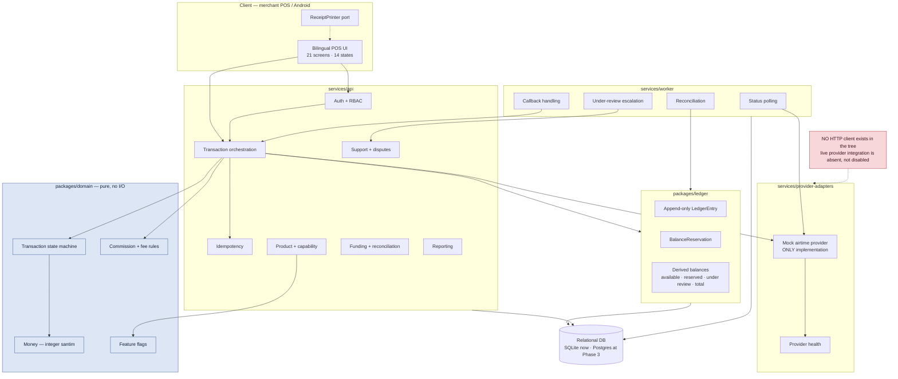

# Architecture

## System diagram



## Module boundaries

Auth/RBAC · merchant/device · product/capability · provider adapter · transaction orchestration ·
idempotency · ledger/balance · commission/fee · receipts · provider health · support/disputes ·
funding/reconciliation · reporting · notifications · audit.

## Rules

| Rule | Consequence |
|---|---|
| Provider details never reach the UI | The client knows "airtime", not which API returned what |
| **Relational database** for ledger integrity | Constraints and transactions do the enforcing |
| **Database transactions** for balance changes | A reservation and its entry commit together or not at all |
| **Append-only ledger** | No `UPDATE`, no `DELETE` on `LedgerEntry` |
| Background workers for polling, callbacks, reconciliation | A pending transaction resolves without the merchant waiting |
| **Idempotent webhooks** | A duplicate callback applies once — [[Idempotency]] |
| Client never authoritatively calculates balance or price | Both are server-derived |
| Client never stores provider secrets | Secrets live server-side only — [[Security Model]] |

## The domain package is pure

`packages/domain` has **no I/O, no database, no network, no framework**. It is types and functions:
the state machine, `Money`, the rule evaluators, the flag definitions. This is what makes the
transition table exhaustively testable and the ledger invariants provable in isolation.

## Stack

| Layer | Choice | Rationale |
|---|---|---|
| Language | TypeScript | The `AirtimeProvider` contract in the specification is TypeScript |
| Runtime | Node (v25.9.0 present) | Available; npm 11.12.1 |
| Database | **SQLite** (WAL, STRICT) behind a driver interface | [[Decision Log]] D4 — no Docker or Postgres on the build machine; Postgres at Phase 3 |
| Client | **Responsive web POS / PWA** | [[Decision Log]] D5 — no JDK/Kotlin/Gradle available; native Android at Phase 3 |
| Tests | Vitest | Fast, TypeScript-native |

## Implemented so far

As of 2026-08-20 the domain foundation and the mock adapter exist. Nothing else does — no API, no
worker, no persistence, no client. Full design in [[Domain Implementation Plan]].

```text
packages/domain/src/
├── index.ts          barrel export
├── errors.ts         16 typed domain errors with stable codes
├── ids.ts            branded identifier types — MerchantId is not a DeviceId
├── money.ts          integer santim; no float path in or out
├── mode.ts           assertSimulated — the structural refusal of live money
├── states.ts         12 states, transition map as data, VALUE_DISPOSITION
├── transaction.ts    immutable Transaction aggregate
├── idempotency.ts    key derivation, payload fingerprint, replay store
├── ledger.ts         append-only ledger, double-entry enforcement
├── balance.ts        reservations and the four derived views
├── commission.ts     rule placeholders — compute functions throw
├── provider.ts       AirtimeProvider contract
├── receipt.ts        receipts and recordReprint
└── audit.ts          append-only audit log

services/provider-adapters/mock-airtime/src/
└── index.ts          deterministic mock — 8 behaviours, virtual clock

tests/
├── helpers.ts
├── domain/{states,idempotency,ledger,balance,receipt-and-audit}.test.ts
└── provider/mock-airtime.test.ts
```

```text
packages/persistence/src/
├── index.ts
├── privacy.ts             recipient masking, salted hashing, metadata safety
├── operations.ts          atomic reserve / release / finalize / under review
├── driver/
│   ├── types.ts           the LedgerDriver contract — no update, no delete
│   └── errors.ts          persistence errors
├── schema/types.ts        row shapes and account types
├── migrations/            001 schema · 002 ledger triggers · 003 audit triggers
├── sqlite/
│   ├── connection.ts      PRAGMAs, set and read back
│   ├── migrator.ts        ordered, checksummed, transactional
│   └── driver.ts          SqliteLedgerDriver
└── repositories/          merchants · transactions · ledger · reservations · audit
```

**The domain package imports nothing.** No framework, no database driver, no HTTP client, not even
`node:crypto` — the idempotency fingerprint is a local FNV-1a. That is what lets the transition
table be tested exhaustively without standing anything up.

```text
services/api/src/
├── index.ts
└── application/
    ├── context.ts        injected clock, ids, catalog, mode
    ├── results.ts        typed results and merchant next actions
    ├── createSale.ts     the sale orchestration
    ├── resolvePending.ts status lookup and escalation
    ├── reversal.ts       requireReversal / completeReversal
    └── rehydrate.ts      row to domain Transaction
```

```text
services/api/src/application/recovery/
├── config.ts            injected thresholds, per-provider policy
├── results.ts           outcome classification and typed results
├── recoverInFlight.ts   the sweep
└── metrics.ts           gauges and alert evaluation
```

```text
services/worker/src/
├── index.ts
├── workerConfig.ts       three policies, validation, no production fallback
├── recoveryWorker.ts     composition root
├── workerLifecycle.ts    the supervised loop — the ONLY place real time is read
├── workerHealth.ts       health model and levels
├── backoff.ts            exponential backoff with jitter
├── failures.ts           failure classification, fatal vs retryable
├── shutdown.ts           cooperative cancellation and signal handling
└── observability.ts      structured logging and metrics
```

**The worker is the only long-running process in the system.** See [[Recovery Worker]].

Everything above compiles to `dist/` per package via [[Build Pipeline]]. The deployed runtime
is JavaScript — `services/worker/dist/cli.js` — and no TypeScript is needed to run it.

**The orchestration layer holds no state and owns no data.** It composes the domain's decisions,
the driver's atomicity and the provider's answers — see [[Transaction Orchestration]].

**The persistence package is the only place that knows SQLite exists.** Everything above it talks
to `LedgerDriver`, so the Postgres move at Phase 3 is a second implementation of one file. Full
detail in [[SQLite Persistence Layer]] and [[Migration Strategy]].

**There is no HTTP client anywhere in the repository.** Live provider integration is absent, not
disabled.

## Repository layout

```text
/
├── CLAUDE.md · README.md · CHANGELOG.md · ASSUMPTIONS.md · SECURITY.md
├── docs/obsidian/
├── apps/merchant-web-or-pos/
├── apps/android/                  (Phase 3)
├── apps/operations-console/
├── services/api/
├── services/worker/
├── services/provider-adapters/
├── packages/domain/
├── packages/ledger/
├── packages/design-system/
├── packages/localization/
├── infra/ · scripts/ · tests/
```

## The POS and its API surface

`apps/merchant-pos/` is a thin server-rendered client over `services/api/src/http/`. It contains
no business rule: a route either serves a screen or forwards to the router. Two packages sit
between it and the domain, both pure:

| Package | Holds |
|---|---|
| `@telga/localization` | English and draft Amharic strings, and an honest fallback |
| `@telga/pos-view-model` | The state-to-UI table, the wire DTOs, the presentation state machine, the polling loop, the display gate |

The wire contract lives in `@telga/pos-view-model` rather than in the API, because both sides need
it and neither should own it — one definition, three users, no hand-written duplicate to drift.

See [[POS API Surface]] and [[Merchant POS Screens]].

## Related

- [[API Contracts]]
- [[Ledger Invariants]]
- [[Security Model]]
- [[Testing Strategy]]

---
Back to [[00 Home]]
