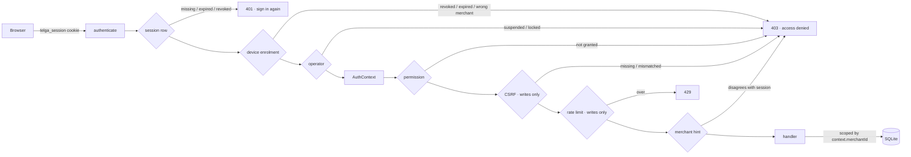
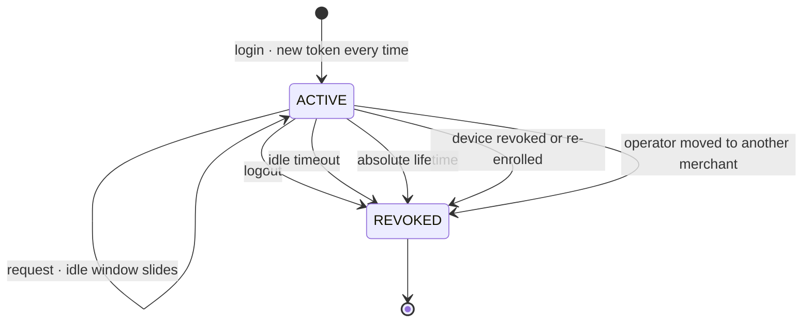

# Authentication and Sessions

Who the server thinks you are, and for how long.

> [!danger] Training-grade, and not production-ready
> This closes **A49** for *controlled internal training only*. It is not a
> production authentication system, and three limitations are load-bearing:
> plain HTTP on the training machine, no second factor, and a device binding
> that is [[Device Binding|not hardware attestation]]. None of them is an
> oversight; all three are stated here and tested where testable.

## The change this made

Before this build the merchant came from a **URL parameter**. Any operator could
edit `?merchantId=` and read another shop's transactions. That was **A49 / R22**,
and it was the reason the POS was never opened to anyone.

Now the merchant comes from a **server-side session row**, and nothing else.



A merchant id supplied by a client is compared with the session's and **refused
when they disagree**. It is a consistency check that catches a stale bookmark.
It authorises nothing, and no handler reads one.

## The pieces

| File | What it owns |
|---|---|
| `packages/domain/src/auth.ts` | Permission table, session and device *decisions*. Pure — no clock, no crypto, no database |
| `services/api/src/auth/secrets.ts` | scrypt derivation, token generation, constant-time comparison |
| `services/api/src/auth/sessions.ts` | `login`, `authenticate`, `logout`, enrolment, revocation |
| `services/api/src/auth/authorize.ts` | Role decisions and merchant scoping, as separate questions |
| `services/api/src/auth/cookies.ts` | Two cookies, hand-written, no dependency |
| `services/api/src/http/guard.ts` | The order every protected route runs in |
| `packages/persistence/src/repositories/identity.ts` | Storage. Takes hashes, never secrets |

## Secrets, and what is stored

Nothing reversible. The schema offers **no column** a raw PIN, session token or
device key could be written to.

| Secret | Stored as | Where the raw value lives |
|---|---|---|
| Operator PIN | scrypt derived key + per-user salt + recorded parameters | Nowhere. In memory during one sign-in |
| Session token | SHA-256, as the primary key of `sessions` | The `telga_session` cookie only |
| CSRF token | SHA-256, in `sessions.csrf_hash` | The `telga_csrf` cookie only |
| Device key | scrypt derived key + salt | Shown once at enrolment, then nowhere |

**scrypt, not argon2**: argon2 needs a native dependency and a build step, to
defend a six-digit training PIN that is already defended by lockout and by the
device binding. `N=16384, r=8, p=1` is real work and is in `node:crypto`.
`pin_params` records what was used, so a future rehash can detect an old one
rather than guess. Production parameters are **NOT_YET_CONFIRMED**.

**Why SHA-256 for tokens and scrypt for PINs**: a 256-bit random token has no
structure to grind, so a work factor would only slow every request down. A PIN
has a million possibilities and needs the cost.

Comparison is `timingSafeEqual`, always, on equal-length buffers — a length
mismatch is answered with a dummy comparison so the failure path costs the same.

### Never logged

Raw PIN · PIN hash · session token · CSRF token · device key · full recipient ·
provider credentials. Audit events carry **safe codes** — `PIN_MISMATCH`,
`DEVICE_REVOKED` — never values. Tests assert the absence rather than trusting
it: `authentication.test.ts` scans **every string column of every table** for
the test PIN, and `csrf-and-abuse.test.ts` scans the whole audit trail.

> [!note] The redaction gate caught a real leak during this build
> `assertSafeForDisplay` refuses any response body carrying a key that names a
> token or a secret. The first version of the sign-in handler returned the CSRF
> token in the JSON body, and the gate refused it with a 500. The fix was to
> take it out of the body — it travels in its own cookie — rather than to loosen
> the gate. Recorded as **D41**.

## The session lifecycle



**Two expiries, both checked on every request.** `idle_expires_at` moves forward
each time the session is used; `absolute_expires_at` is fixed at login and is
never extended. An operator who walks away is ended by the first; a session left
open all week is ended by the second however busy it has been.

**Session fixation is prevented by rotation.** A new token every sign-in, so an
identifier planted on the client beforehand is not the one that authenticates
anything. Tested in `rotates the session identifier on every sign-in`.

**The device outranks the session verdict.** Revoking a device also revokes its
sessions, so the next request would otherwise be refused as `SESSION_REVOKED` —
a 401 that sends the operator to a sign-in they cannot pass. `authenticate`
checks the device *first* and reports the device reason, which keeps them out of
a login loop. Found by a failing test during this build; recorded as **D42**.

## Cookies

| Cookie | HttpOnly | SameSite | Secure | Why |
|---|---|---|---|---|
| `telga_session` | **yes** | Strict | only when `--https true` | The credential. Unreadable from script, so an injected script cannot exfiltrate it — which is *why* authentication state is never trusted from client-side JavaScript |
| `telga_csrf` | no | Strict | only when `--https true` | Not a credential. On its own it authorises nothing; leaving it readable lets a page re-read it after a redirect |

There is deliberately **no `Max-Age`**. The server-side row owns both expiries; a
browser-side lifetime would be a second, weaker opinion that the client controls.

> [!warning] HTTPS
> `secureCookies` is **false** by default because the controlled training
> machine serves plain HTTP, and claiming `Secure` over HTTP makes a browser
> drop the cookie entirely. A session token is therefore exposed to anything on
> the wire. **Keep the POS on the controlled training machine.** `--https true`
> sets the flag when a real TLS terminator is in front. Recorded as **A53**.

## CSRF

Every browser write requires a token bound to the session — form field
`csrfToken`, or the `x-telga-csrf` header for an XHR. The server compares its
SHA-256 against `sessions.csrf_hash`.

`SameSite=Strict` already stops a cross-origin post from carrying the session
cookie. The token is the **second** lock, because `SameSite` is a browser
behaviour rather than a server guarantee: an old browser, a misconfigured proxy
or a same-site subdomain all weaken it, and none of those weaken a token the
server issued.

A CSRF failure **creates nothing** — the tests assert the transaction count is
unchanged and the ledger residual is still zero, because "the request was
refused" and "nothing happened" are different claims.

Idempotency survives it: a refused write followed by a retry with the same
`clientRequestId` is still exactly one sale.

## Abuse controls

All training values. Production thresholds are **NOT_YET_CONFIRMED**.

| Control | Training value | Where |
|---|---|---|
| Failed PINs before lockout | 5 | `TRAINING_LOCKOUT_POLICY` |
| Lockout duration | 5 minutes | same |
| Login attempts per window | 10 | same |
| Login rate window | 1 minute | same |
| Session idle timeout | 15 minutes | `TRAINING_SESSION_POLICY` |
| Session absolute lifetime | 12 hours | same |
| Sales per session per window | 30 | same |
| Sale rate window | 1 minute | same |
| Maximum request body | 16 KB | same |

Order matters and is deliberate: the **rate limit** is checked before the user is
looked up, the **lockout** before the PIN is verified, and the **device** before
a session is created. A locked account costs an attacker a database read rather
than a scrypt derivation, and an unenrolled device never reaches the PIN check.

Every refusal is audited: `AUTH_LOGIN_FAILED`, `AUTH_LOCKED_OUT`,
`AUTH_RATE_LIMITED`, `AUTH_ACCESS_DENIED`, `AUTH_CSRF_REJECTED`,
`DEVICE_REJECTED`. A device refusal is audited **once per session**, not on
every retry, so a stolen POS reloading in a loop cannot flood the audit table.

## Failure codes and what a merchant sees

| Code | HTTP | Screen | Why that screen |
|---|---|---|---|
| `SESSION_MISSING` / `_UNKNOWN` / `_REVOKED` / `_IDLE_EXPIRED` / `_LIFETIME_EXPIRED` | 401 | Sign in, or session-expired | Signing in again fixes it |
| `DEVICE_*` | 403 | Access denied | Signing in again will **not** fix it |
| `PERMISSION_DENIED`, `MERCHANT_SCOPE_MISMATCH` | 403 | Access denied | Same |
| `CSRF_TOKEN_MISSING` / `_INVALID` | 403 | Access denied | Same |
| `RATE_LIMITED` | 429 | Sign in, with a wait message | Temporary |
| `REQUEST_TOO_LARGE` | 413 | Safe error | Not the merchant's fault |

A refused sign-in never says **which** field was wrong. An unknown operator and
a wrong PIN return the identical code, so operator ids cannot be enumerated.

## Provisioning

```bash
# Create the operator, enrol the device, print the key once, exit.
node apps/merchant-pos/dist/cli.js --db ./telga.sqlite \
  --merchant merchant_alpha --operator operator_1 --device device_1 \
  --provision-pin 481502
```

The device key is printed **once** and is not recoverable. Losing it means
enrolling the device again — which is the property that makes the enrolment
worth checking. The PIN is never printed: whoever ran the command already knows
it.

## What this does not do

| Gap | Status |
|---|---|
| HTTPS on the training machine | **A53 OPEN** — plain HTTP, cookies not `Secure` |
| Hardware-backed device identity | **A50 OPEN** — see [[Device Binding]] |
| Second factor | Not built. Not needed for controlled training |
| Password/PIN rotation and history | Not built |
| Operator self-service (PIN change, unlock) | Not built. Unlocking is an operations action |
| Browser-level testing | **A48 OPEN** — no DOM, no CSS, no screen-reader coverage |
| Concurrent migration safety | **A30 OPEN** — unchanged by this work |

## HTTPS — 2026-08-21

`A53` is **reduced, not closed**. The controlled training deployment now serves
real TLS, so cookies are genuinely `Secure` and a passive listener no longer
reads a session token off the wire. See [[Training HTTPS Deployment]].

The cookie decision moved: `Secure` is now derived from the **client's** scheme
per request, not from a single startup flag. Behind a TLS terminator this
process speaks HTTP while the client used HTTPS, and the cookie has to follow
the client — see [[TLS and Proxy Configuration]].

Plain HTTP remains available as `TRAINING_HTTP_LOCAL`, and is **refused on any
non-loopback binding** (D46). What is still open: the certificate is self-signed,
which is not production trust.


## Related

- [[Security Model]]
- [[Device Binding]]
- [[Threat Model]]
- [[POS API Surface]]
- [[Merchant POS Screens]]
- [[Training Operations Runbook]]

---
Back to [[00 Home]]
