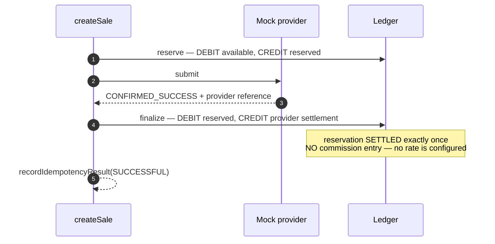
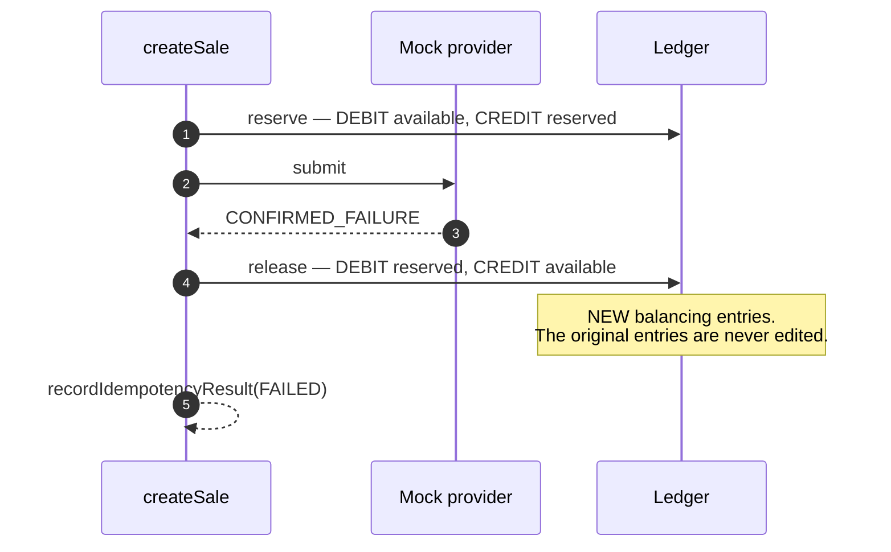
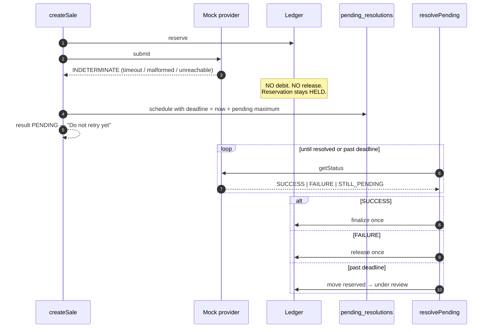
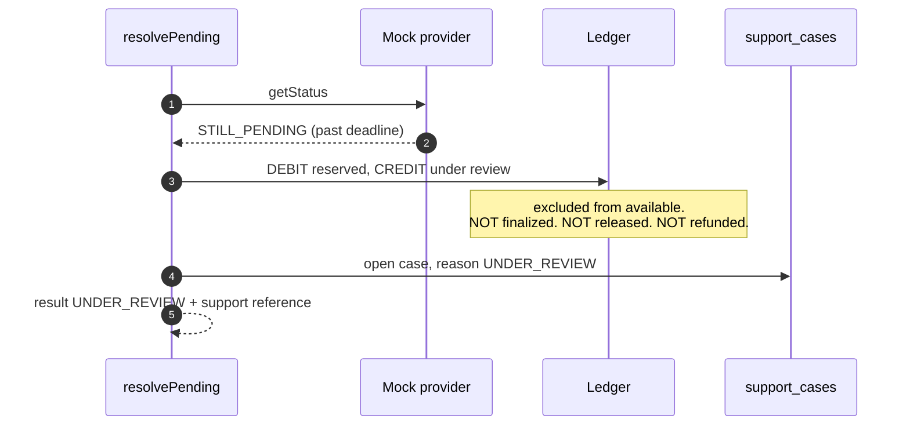

# Create Sale Service

`services/api/src/application/createSale.ts` and its companions. Every outcome below is
implemented and tested against the deterministic mock provider.

## Success

`CREATED → VALIDATED → RESERVED → PROCESSING → SUCCESSFUL`

| Effect | Value |
|---|---|
| Merchant total | reduced by the sale amount |
| Reservation | `SETTLED`, once |
| Commission | **none** — `CommissionRule` is `NOT_YET_CONFIRMED` |
| Result | `SUCCESSFUL`, `simulated: true` |
| Next action | `DISPLAY_RESULT_AND_OFFER_RECEIPT` |

## Confirmed failure

`CREATED → VALIDATED → RESERVED → PROCESSING → FAILED`

Available balance is restored **exactly**. Released once — a repeat is refused by the reservation
guard. Next action `EXPLAIN_NO_SALE_FUNDS_RELEASED`: *"This sale did not go through. No charge was
made."*

## Timeout and pending

`CREATED → VALIDATED → RESERVED → PROCESSING → PENDING`

**A timeout is never a failure.** A malformed provider response takes the same path — it tells us
nothing, so it is `PENDING`, never a false success.

Next action `DO_NOT_RETRY_YET`. A retry while pending returns `DUPLICATE_REQUEST` with the current
state; it creates no second transaction, reservation or debit.

## Under review

`PENDING → UNDER_REVIEW`, past the pending maximum (default 5 minutes).

The transaction and correlation references are preserved on every posting. Next action
`CONTACT_SUPPORT_WITH_REFERENCE`, with a reference the merchant can quote.

**Nothing is refunded on an unknown outcome.**

## Reversal

`PENDING → REVERSAL_REQUIRED` or `UNDER_REVIEW → REVERSAL_REQUIRED`, then `→ REVERSED`.

`completeReversal` calls the **mock** adapter's `reverse()` where it exists, purely to exercise the
workflow; the ledger movement does not depend on the provider's answer, because the determination
was already made. Repeat-safe: a second call returns `REVERSED` and posts nothing.

## Typed results

| Kind | Next action | Merchant message key |
|---|---|---|
| `SUCCESSFUL` | `DISPLAY_RESULT_AND_OFFER_RECEIPT` | `status.successful` |
| `FAILED` | `EXPLAIN_NO_SALE_FUNDS_RELEASED` | `status.failed.message` |
| `PENDING` | `DO_NOT_RETRY_YET` | `status.pending.message` |
| `UNDER_REVIEW` | `CONTACT_SUPPORT_WITH_REFERENCE` | `status.under_review.message` |
| `REVERSAL_REQUIRED` | `CONTACT_SUPPORT_WITH_REFERENCE` | `status.under_review.message` |
| `REVERSED` | `EXPLAIN_NO_SALE_FUNDS_RELEASED` | `status.failed.message` |
| `DUPLICATE_REQUEST` | `SHOW_EXISTING_TRANSACTION_STATE` | `error.duplicate.blocked` |
| `PAYLOAD_MISMATCH` | `SHOW_VALIDATION_ERROR` | `error.duplicate.blocked` |
| `INSUFFICIENT_BALANCE` | `SHOW_VALIDATION_ERROR` | `error.balance.insufficient` |
| `UNAUTHORIZED` | `SHOW_PERMISSION_ERROR` | `error.permission.denied` |
| `PRODUCT_UNAVAILABLE` | `SHOW_PROVIDER_UNAVAILABLE_NO_CHARGE` | `status.provider_unavailable.message` |
| `PROVIDER_UNAVAILABLE` | `SHOW_PROVIDER_UNAVAILABLE_NO_CHARGE` | `status.provider_unavailable.message` |
| `SIMULATED_ONLY` | `SHOW_SYSTEM_ERROR` | `mode.training` |
| `PERSISTENCE_FAILURE` | `SHOW_SYSTEM_ERROR` | `status.sales_unavailable` |
| `INVALID_REQUEST` | `SHOW_VALIDATION_ERROR` | `error.validation.recipient` |

The POS switches on `nextAction` and resolves `messageKey` against [[English Strings]] and
[[Amharic Strings]]. **No stack trace, no SQL text and no provider body ever reaches a merchant** —
rejections carry a stable `reasonCode` for logs instead. Tested.

## Provider outage

A blocked request creates **no transaction, no reservation and no ledger entry**. There is nothing
to charge, because nothing was attempted. See [[Provider Health]].

## Related

- [[Transaction Orchestration]]
- [[Mock Provider Behavior]]
- [[Transaction State Machine]]
- [[Balance Model]]
- [[Screen Inventory]]

---
Back to [[00 Home]]
