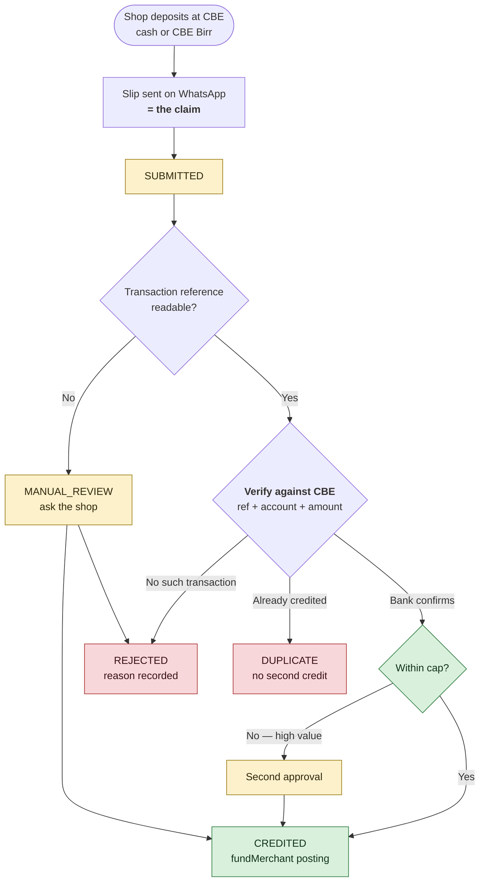

# Deposit Rail Options

How Telga could learn that a shop has paid money in. Researched 2026-09-08 in
response to the founder's question: *which Ethiopian bank can replace CBE?*

> [!important] The premise needs correcting
> **No Ethiopian bank publishes an incoming-deposit notification API.** The
> obstacle is not CBE; it is the whole category. Moving to Dashen, Awash, Bank of
> Abyssinia or Cooperative Bank of Oromia would not produce a webhook, because a
> **current account is not a notification service**.
>
> The answer is a different *kind* of counterparty, not a different bank.

## What the regulator actually licenses

The National Bank of Ethiopia recognises three categories:

| Category | Holders (per NBE) |
|---|---|
| **Payment Instrument Issuers** | Ethiotelecom **Telebirr** (Apr 2021), **Kacha** (Jun 2022), Safaricom **M-PESA** (May 2023), **Yaya** (Oct 2023); pilots Vitabirr, ToloPay |
| **National Switch Operators** | Ethswitch, Premier Switch Solution |
| **POS & Payment Gateway Operators** | ArifPay, Chapa, SantimPay, AddisPay, YagoutPay, Fenanpay, StarPay; ~11 more in pilot |

**Telga appears in none of them.** That is the licensing question in
[[Multi-Tenant Architecture Proposal]] §6, restated as a fact rather than a worry.

Using a licensed rail makes Telga a **merchant on somebody else's licence**,
which is a materially safer structure than operating an unlicensed one.

## 🔴 Most of that market is under enforcement right now

| Date | Event |
|---|---|
| **29 Dec 2025** | The Ministry of Justice ordered commercial banks to **freeze accounts** of ten payment gateways: ArifPay, AddisPay, FenanPay, LakiPay, StarPay, YagoutPay, SantimPay, **Kacha**, **Chapa**, Sinan Pay. Suspected tax evasion and money laundering |
| **2 Jan 2026** | Freeze lifted for **StarPay and YagoutPay** only |
| **29 May 2026** | **Chapa, ArifPay and SantimPay** jointly wrote to the NBE Governor over continuing Ministry of Revenue enforcement while their appeals were pending |

**As of the most recent reporting found, the three largest private gateways
remain under enforcement action.** Status after May 2026 was not established and
must be verified before any commitment.

> [!note] The founder's Chapa decision aged well
> Telga dropped Chapa in 2026-09 for unrelated reasons ([[Decision Log]] D112's
> context). Chapa's accounts were frozen four days after that decision period
> began. This is luck rather than foresight, but it is a strong argument for the
> adapter pattern below: **a rail can become unusable for reasons that have
> nothing to do with its technology.**

## The options, ranked

### 1. Telebirr — recommended primary

| | |
|---|---|
| Licence | Payment Instrument Issuer, **April 2021** |
| Ownership | Ethio Telecom — **state-owned** |
| Freeze list | **Not on it** |
| Developer access | Official portal at `developer.ethiotelecom.et`, documented C2B web payment integration |
| Integration | Merchant credentials (`FABRIC_APP_ID`, `APP_SECRET`, `MERCHANT_APP_ID`, `MERCHANT_CODE`) and **webhook endpoints for notifications** |
| Reach | The dominant wallet; most shops already have it |

**Why first:** state ownership is the strongest available answer to counterparty
risk in this market, the reach means no shop is excluded, and the webhook is the
exact primitive [[Funding Verification]] needs.

### 2. M-PESA (Safaricom Ethiopia) — recommended second

| | |
|---|---|
| Licence | Payment Instrument Issuer, **May 2023** |
| Freeze list | **Not on it** |
| Integration | The C2B pattern: register a **validation URL** and a **confirmation URL** against a shortcode; M-PESA calls validation on every payment, then confirmation once accepted |

**Why it matters:** that is precisely Telga's requirement — *"money arrived,
here is who paid, here is their reference"* — from an operator with a mature,
widely-implemented API. Two constraints are documented and worth knowing early:
provider names may not appear in the callback URL, and tunnelling services are
refused on live endpoints.

### 3. A bank corporate statement feed — keep, but not as the automatic path

Dashen Bank introduced Ethiopia's first open API platform (Amole, 2018) and is
the most likely bank to offer something. But a **statement feed is a commercial
agreement, not a public API**, and it delivers minutes-to-daily latency rather
than a push.

**Recommendation: keep CBE as the bank of record** — the corporate account,
settlement, and the audit trail — and add a wallet rail for automatic top-up.
Switching banks to solve an API problem trades a known relationship for a
capability no Ethiopian bank advertises.

### 4. Private payment gateways — not now

StarPay and YagoutPay are unfrozen and licensed. Chapa, ArifPay and SantimPay are
larger but under enforcement. **None should carry merchant float until the
enforcement position is settled and verified directly.**

### 5. Refused outright

| Approach | Why |
|---|---|
| Parsing bank SMS alerts | Unauthenticated and spoofable. Not a bank record |
| Screenshot-based verification | CLAUDE.md §8: *"Never credit a balance from a screenshot alone."* Several Ethiopian APIs offer exactly this |

## The interim rail — slip submission, while a bank API is pursued

**The founder's proposal (2026-09-08):** a shop deposits at CBE, by CBE Birr or
cash at a branch, photographs the slip, sends it on WhatsApp, and Telga credits
the float. Explicitly an interim measure until an API is available.

> [!danger] As stated, this is the one thing CLAUDE.md forbids by name
> **L128:** *"Never credit a balance from a screenshot alone."*
> **L402:** *"No overdraft. No personal account. **No screenshot-only credit.**"*
> [[Funding Verification]]: *"A photograph of a transfer is not verification."*
>
> A slip photograph proves nothing. It can be edited in a minute, sent twice,
> sent by two people, or be a genuine slip for a deposit into another account. A
> person comparing it against nothing cannot tell.

### The fix is one step, not a redesign

**Treat the slip as the claim, never as the proof.** This is exactly the state
machine [[Funding Verification]] already specifies, and the founder's flow maps
onto it without alteration:



**The decisive step is `CHK`.** The slip supplies a *transaction reference*; the
**bank record** supplies the truth. Credit follows the bank, never the image.

### Why this is achievable today, without a bank agreement

CBE and CBE Birr transactions carry a transaction / FT reference, and
**third-party services verify a CBE transaction against the bank given that
reference and an account number** — Verify.ET and ShegerPay both advertise CBE
and CBE Birr coverage, and an open-source `cbe-verifier` exists.

> [!note] The distinction that makes this lawful under §20
> Reading a reference **off** a screenshot is data entry. Verifying that
> reference **against CBE** is verification. The rule forbids the first as the
> sole basis for credit; it does not forbid using a photograph to save somebody
> typing. **The image must never be the thing that is trusted.**

Where no lookup is available, the fallback is an operator checking CBE internet
banking or the statement by hand — slower, and still verification.

### What must be built into the intake

| Requirement | Why |
|---|---|
| **Bind the WhatsApp sender to a merchant** | An unbound number means anyone can submit a claim against any shop |
| **Idempotency on the bank reference**, never the image | The same slip resent, or sent by two operators, must credit once. Re-photographing changes the file and not the deposit |
| **Amount, account and date all checked** | A genuine slip for another account, or for last month, is still not this deposit |
| **The Deposit Reference Code**, not the device key | See [[Multi-Tenant Architecture Proposal]] §6a. Unchanged by this rail |
| **Retention and minimisation** | A slip carries an account number and a name. Prefer storing the decision and the reference over the image; if the image is kept, encrypt it and set an expiry (CLAUDE.md §24) |
| **Every credit audited** | Actor, reference, amount, evidence, and the verification result |

> [!warning] WhatsApp is a third party
> Slips routed through WhatsApp are held by Meta. That is a data-protection
> decision, not only an engineering convenience, and CLAUDE.md §8 lists data
> protection among the matters requiring local advice. An in-app upload avoids
> it entirely and should be offered alongside.

### Separation of duties still applies

§20 requires the verifier and the daily reconciler to be **different people**,
with a second approval for high-value deposits. **No implementation removes
this**, and it remains the constraint that gate 6 cannot clear around.

## The architectural conclusion

CLAUDE.md §23 already requires provider adapters and keeping provider specifics
out of the UI. **The same shape applies here**, for a reason this research made
concrete rather than theoretical:

```ts
interface DepositRail {
  /** The reference a shop quotes when paying in. Never a credential. */
  referenceFor(merchantId: MerchantId): DepositReference;
  /** Verify and normalise an inbound notification. Idempotent by rail txn id. */
  confirm(notification: unknown): Promise<ConfirmedDeposit | Rejected>;
  healthCheck(): Promise<RailHealth>;
}
```

Implementations: `TelebirrRail`, `MpesaRail`, `BankStatementImportRail`, and
`SimulatedRail` for training. **The training implementation is buildable today**
against a fixture file, with no provider agreement, no credentials and no real
money — exactly as the mock airtime provider works.

> [!danger] The lesson the freeze teaches
> Ten licensed operators lost banking access in a single directive. **Telga must
> never be one integration away from being unable to take deposits.** Two rails
> configured, one adapter interface, and a manual fallback that already exists in
> [[Funding Verification]].

## What must be confirmed before building against a real rail

1. **Does the rail carry a free-text reference** through to the notification? If
   not, there is nothing to match a shop on.
2. **What does Telga PLC need to register as a merchant** — and does Telga PLC
   exist with a corporate account? **P1 is still pending.**
3. **The stored-value question** in [[Multi-Tenant Architecture Proposal]] §6.
   Holding shop float may be a regulated activity regardless of which rail
   delivers the money.
4. **Current enforcement status** of any private gateway, verified directly and
   not from reporting.

## What must not be claimed

- That any rail is integrated, agreed, or available to Telga. **None is.**
- That Telebirr or M-PESA has approved Telga as a merchant. Neither has been asked.
- That using a licensed rail resolves the licensing question. It improves the
  position; it does not answer it.
- That the enforcement position is current. It was last reported May 2026.

## Related

- [[Multi-Tenant Architecture Proposal]] — the deposit design and the legal flag
- [[Funding Verification]] — the state machine every rail feeds
- [[Balance Top-Up and Funding]] — the three tiers of top-up
- [[Architecture]] — the adapter pattern this follows
- [[Legal Questions]] — where the licensing question is tracked

---
Back to [[00 Home]]
