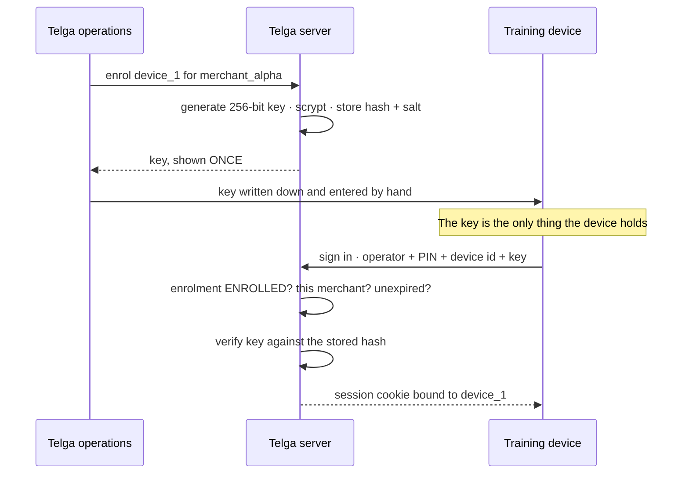
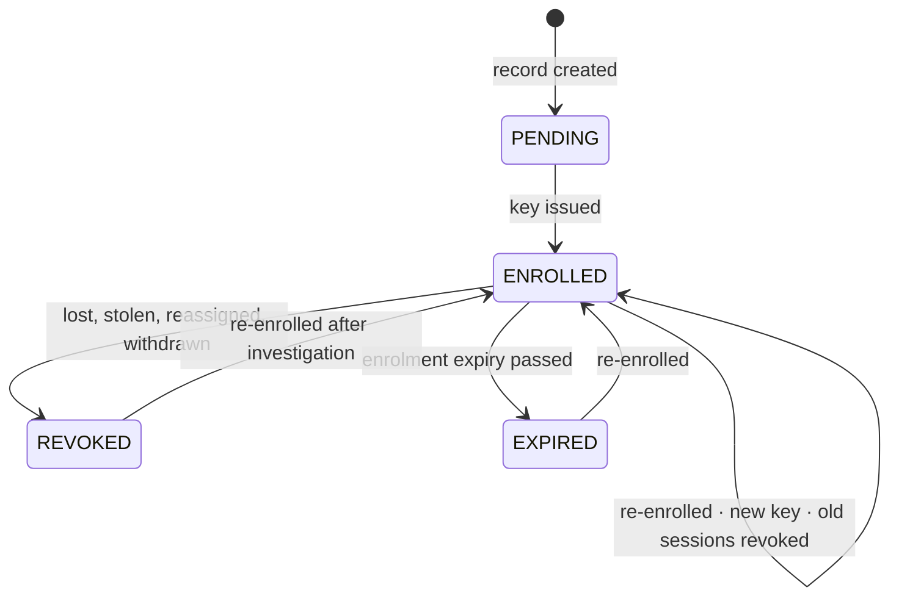

# Device Binding

Which machine a session belongs to, and how much that is worth.

> [!danger] This is training-grade, not hardware attestation
> The device identifier is **a string the client sends**. Telga pairs it with a
> server-issued key and a server-side enrolment record, which raises the cost of
> impersonation from *know the id* to *hold the key*. But a key can be copied to
> another machine, and nothing here would notice. Recorded as **A52 OPEN**.
> There is a test that demonstrates exactly this, so the limitation is visible
> in the suite and not only in a note.

## How device identity is actually established

Honestly: it is not proved. It is *asserted by the client and matched against
something the server issued*.

What that buys:

- an unenrolled machine cannot sign in, even with a correct PIN;
- a machine whose enrolment was revoked stops working **immediately**, not when
  its session happens to lapse;
- a device belongs to exactly one merchant, and a session cannot be issued
  across that boundary.

What it does **not** buy: proof that the machine at the counter is the machine
that was enrolled. Anyone who copies the identifier and the key has the device,
as far as Telga can tell.

## Enrolment states

Only **ENROLLED** carries a session. `PENDING` is refused as
`DEVICE_NOT_ENROLLED`, which is the same code an absent record gets — a device
half-way through enrolment is not usable and does not need its own message.

## The record

`device_enrollments`, one row per device, keyed by the device id.

| Column | Purpose |
|---|---|
| `device_id` | The identifier. References `devices` — enrolment is a fact about a **known** device, not a way to create one |
| `merchant_id` | The one merchant this device may act for |
| `enrollment_state` | `PENDING` · `ENROLLED` · `REVOKED` · `EXPIRED` |
| `display_name` | Optional, for an operations list |
| `secret_hash`, `secret_salt` | scrypt. The key itself is never stored |
| `enrolled_at` | When the current enrolment was issued |
| `last_seen_at` | Updated on every authenticated request |
| `expires_at` | Optional. Checked against the clock on every request |
| `revoked_at`, `revocation_reason` | Why it was withdrawn |

It is a **separate table** from `devices` on purpose: `devices` is referenced by
every transaction and must stay stable, while enrolment is an authentication
fact with its own lifecycle. Tying a security change to a table the ledger
depends on would be a poor trade.

## Checked on every request

Not only at sign-in. `authenticate` re-reads the enrolment for every single
request, because the window that matters is the one between a POS being stolen
and its session expiring.

The device check runs **before** the session verdict, so a revoked device
produces `DEVICE_REVOKED` (403, access denied) rather than `SESSION_REVOKED`
(401, sign in again) — the operator gets an answer they can act on instead of a
login loop they cannot pass. See [[Authentication and Sessions]], **D42**.

## Revocation and reassignment

**Revoking** a device marks the enrolment and revokes every session it was
carrying, in one call. A revoked device that left live sessions behind would
still be usable, which is the opposite of revoked.

**Reassignment is a revocation followed by a new enrolment**, never a quiet
change of owner. The domain refuses the quiet path: `deviceRejection` compares
the enrolment's merchant with the session's and returns
`DEVICE_NOT_ASSIGNED_TO_MERCHANT` when they differ.

**Re-enrolment issues a new key and revokes existing sessions**, because
anything still holding the old key must stop working.

`DEVICE_REVOKE` is **not** granted to any merchant role — including the owner. A
stolen device is precisely the case where the person holding it must not be able
to tidy up after themselves. Operations revokes.

`DEVICE_ENROL` is granted to `MERCHANT_OWNER` and `ADMIN`, and an owner may only
enrol for their own merchant: the handler looks the device up scoped to the
session's merchant, so another shop's device comes back as a plain 404.

## What is tested

`tests/auth/device-binding.test.ts` — 18 tests:

- the pure decision, for every state and the merchant mismatch;
- sign-in refused for unknown, revoked and wrong-merchant devices;
- a live session stopped the moment its device is revoked;
- sessions revoked alongside the device;
- enrolment expiry ending a live session;
- re-enrolment and reassignment invalidating old sessions;
- the key never stored in recoverable form, and absent from every column;
- `last_seen_at` maintained;
- **and the limitation itself**: two sign-ins with the same copied key both
  succeed, because nothing distinguishes the machines.

## What would close A52

Not planned for training. Recorded so the option is costed rather than vague:

| Approach | What it would take |
|---|---|
| Android hardware-backed keystore attestation | An Android client, key attestation, a server-side attestation verifier |
| Smart-POS secure element | Hardware selection, vendor SDK, a provisioning process |
| Client TLS certificates | A certificate authority, distribution, revocation lists, a TLS terminator that passes the client identity through |
| Bind the session to a network path | Weak — a shop's connection changes; would produce false refusals at a counter |

Each is a real project. None is justified before a provider agreement exists.

## Related

- [[Authentication and Sessions]]
- [[Security Model]]
- [[Threat Model]]
- [[Merchant Onboarding]]
- [[Training Operations Runbook]]

---
Back to [[00 Home]]
