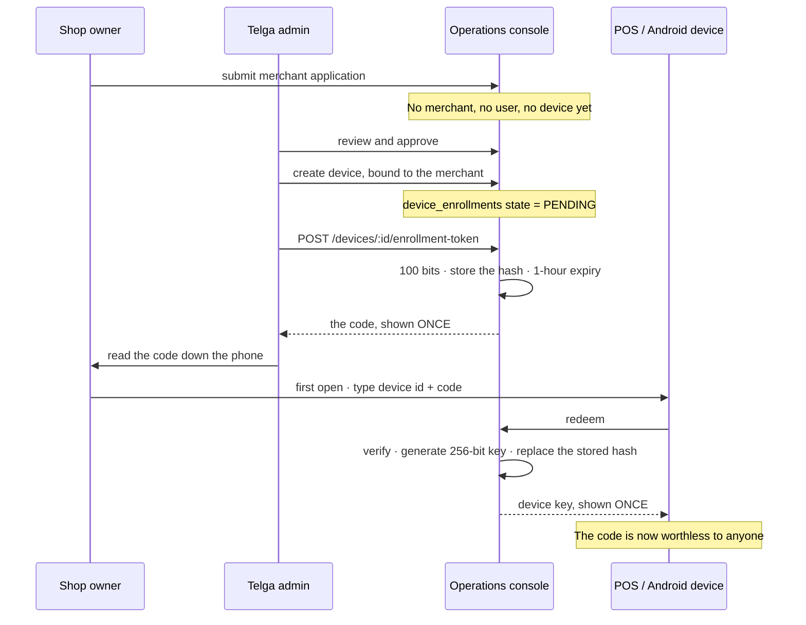

# Device Registration

> [!success] The exchange is wired as of 2026-09-09
> This note described an exchange that had **no HTTP caller**:
> `redeemEnrollmentToken` was written and tested and there was nowhere on earth
> to type a code, so device keys still came from a CLI. `GET`/`POST /activate`
> on the merchant server now serves it, linked from the sign-in screen — the
> only screen a device with no key can reach. See [[Vendor Registration]] and
> `CLAUDE.md` §18.2.

How a machine that has never spoken to Telga becomes a machine Telga will
accept. [[Device Binding]] covers what the resulting credential is worth
afterwards; this note covers how it is obtained.

> [!important] Registration is admin-initiated, not device-initiated
> A device never creates its own identity. There is no endpoint, screen, or CLI
> path anywhere in Telga that lets an unknown machine provision itself. This was
> not an oversight — see **Why not device-initiated** below.

## The gap this note closes

The founder asked, on 2026-09-09, what the documentation says about POS and
Android devices *self-registering* on first launch. The answer was: **nothing**.
`CLAUDE.md` had no description of any registration flow, and no vault note
carried one — while the mechanism had already been built in code. The flow below
is now written into `CLAUDE.md` §18.1 and recorded here.

## The two secrets

The design turns on one rule: **the thing a person reads aloud is never the
thing that signs traffic.**

| | Activation code | Device key |
|---|---|---|
| Size | 100 bits | 256 bits |
| Alphabet | Base32 without `I`, `O`, `0`, `1` | Binary, never typed |
| Who sees it | An admin, then a shop operator | Only the device |
| Lifetime | **One hour** | Until revoked |
| Uses | **Exactly one** | Every request |
| Stored as | A hash | A hash |
| Purpose | Prove this activation was authorized | Authenticate the device |

`enrollment.ts` is explicit about why: *"It activates a device once and then
dies. What the device keeps afterwards is a separate credential."* Conflating
them would mean the credential that authenticates every later request has been
spoken down a phone line, written on a note, and possibly overheard.

## The flow

## Why single use cannot be forgotten

Not a boolean somebody has to remember to set. `device_enrollments` holds **one**
secret hash per device. Issuing a code writes the *code's* hash into that column;
redeeming replaces it with the *key's* hash. After a successful redemption the
code no longer verifies against anything, **because what it was compared to no
longer exists**. A replay fails identically to a wrong code.

## What a refusal is allowed to say

| Situation | Answer |
|---|---|
| No such device | `ACTIVATION_REFUSED` |
| Wrong code | `ACTIVATION_REFUSED` — **byte-identical to the above** |
| Code issued, hour elapsed | `ACTIVATION_EXPIRED` |
| Already activated, or revoked | `ACTIVATION_NOT_PENDING` |

The first two are deliberately indistinguishable, so activation cannot be used
to enumerate which device IDs exist. Expiry **is** told apart, because an
operator whose code aged out during a phone call needs to know to ask for
another, and that fact leaks nothing an attacker did not already supply.

## Why not device-initiated

The founder's described flow — the app registering itself the first time it is
opened — is a different design, and it is currently **forbidden**:

1. **[[Decision Log]] D113(b)** defers automatic registration. No self-service
   device provisioning is exposed in any UI, API, or CLI.
2. A device that provisions itself must be trusted on the strength of something
   it carries. That something would live in the APK, and **an APK is a public
   file** — `enrollment.ts` names this in its own header.
3. Nothing would tie the new device to an approved merchant. [[Merchant Onboarding]] requires the merchant to exist and be approved *before* a device
   is bound to it, and [[Admin Operations Console]] Decision 3 says no account
   exists until an admin approves.

A safe device-initiated flow is possible — it needs an attested install, or a
merchant-authenticated enrolment session, rather than a shared APK secret. That
is **new design and needs a founder decision**; it is not a rebuild of anything
recorded here.

## Replacing a lost device

A **new** device record and a **new** activation code. Never a reissued key to
the same record: the old key must stay independently revocable, so that stopping
a stolen machine does not stop the replacement. See [[Training Operations Runbook]].

## Telling one key from another, without seeing one — D145

Telga cannot show a device key. It holds a scrypt hash and nothing else, so
there is no value to mask and nothing to decrypt. What the console offers
instead answers the question that request was really about.

**A fingerprint.** Six characters in the device list, derived from the *stored
hash* with a second one-way step on top. Safe to print, read down a phone line
and write in a case note. Two devices with different fingerprints hold different
keys; a device re-enrolled last week has a different fingerprint from the one in
last month's notes. That comparison is most of what "see the key" was ever for.

It uses the activation code's alphabet — no `I`, `O`, `0` or `1` — because a
misread fingerprint produces a confident wrong answer. A device that has never
activated shows `—`: it has no key, and printing a fingerprint for one would
invent a fact.

> [!note] A shop cannot compute their own fingerprint
> It is derived from the hash, which includes the salt — not from the key. A
> value a shop could compute from their key is a value an attacker holding one
> phished key could use to test it against other devices.

**A check.** *Check a device key* on the devices screen takes a key an operator
has been read and answers `MATCH`, `NO_MATCH` or `NOT_ENROLLED`. The key is
compared and discarded — never stored, never logged, never echoed back. The
audit event records that a check happened, by whom, against which device, and
what it said. Never the value.

> [!tip] Recommendation
> **Quote the fingerprint in support cases rather than the device id alone.** A
> device id identifies the machine; the fingerprint identifies the *credential
> it is currently holding*. A shop that has been re-enrolled since a case was
> opened is the commonest reason a "correct" key stops working, and only the
> fingerprint makes that visible.

## Related

- [[Device Binding]] — what the key proves, and what it does not
- [[Merchant Onboarding]] — the approval that must precede all of this
- [[Multi-Shop Onboarding]] — the same flow at 10,000 shops
- [[Admin Operations Console]] — where an admin does steps 2 to 4
- [[Threat Model]] — A52: a copied key is not detected

---
Back to [[00 Home]]
