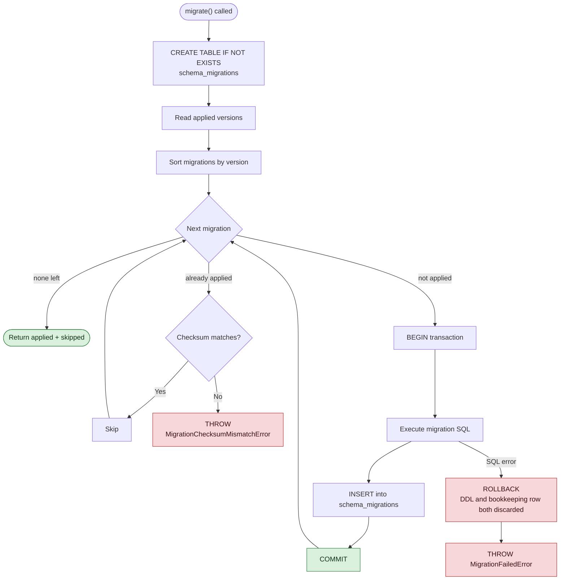

# Migration Strategy

## Applied migrations

| Version | Name | What it does |
|---|---|---|
| `001` | `initial_schema` | Seven STRICT tables, indexes, CHECK constraints, `mode = 'TRAINING'` enforcement |
| `002` | `ledger_append_only` | `BEFORE UPDATE` / `BEFORE DELETE` triggers on `ledger_entries` |
| `003` | `audit_append_only` | `BEFORE UPDATE` / `BEFORE DELETE` triggers on `audit_events` |

## Lifecycle

## Guarantees

| Property | How | Test |
|---|---|---|
| Ordered execution | Sorted by zero-padded version, regardless of array order | `applies migrations in version order regardless of array order` |
| Runs once | Applied versions are skipped | `re-running is safe and applies nothing` |
| Failure rolls back whole | Each migration is one transaction — DDL **and** its bookkeeping row | `rolls a failed migration back whole and does not record it` |
| Integrity protection | SHA-256 over version, name and SQL | `records a checksum for each migration` |
| Immutability | An applied migration whose contents changed is refused | `refuses an applied migration whose contents later changed` |

Because the DDL and the `schema_migrations` insert share one transaction, a **half-applied
migration cannot exist**: either the table is created and recorded, or neither happened.

## Rollback policy

> **Production rollback is forward-fix only.**

There is no `down` migration and there will not be one. A ledger cannot be un-migrated without
risking history: dropping a column drops entries, and `ledger_entries` is append-only precisely so
that nothing can do that.

To correct a schema mistake in production:

1. Write a **new** migration that fixes it forward.
2. Never edit an applied migration — the checksum will refuse it, deliberately.
3. If data must be corrected, post `ADJUSTMENT` entries. Never `UPDATE`.
4. If a migration cannot be fixed forward, restore from backup — see [[Database Operations Runbook]].

The per-migration transaction is the only rollback that exists, and it operates at apply time.

## Limitations

Recorded honestly rather than discovered later:

| Limitation | Consequence |
|---|---|
| No `down` migrations | A bad schema change requires a forward fix or a restore |
| SQLite `ALTER TABLE` is limited | Column changes need the create-copy-drop-rename dance, written by hand in a future migration |
| Checksums cover SQL text, not applied effect | A migration edited *and* re-checksummed by hand would pass; the protection is against accident, not a determined operator |
| Migrations are not concurrency-safe across processes | Two processes migrating the same file simultaneously is untested. Migrate on a single writer at startup |
| Restore testing is not yet automated | Launch gate 10 is **not cleared** — see [[Launch Gates]] |

## Test database policy

Every suite creates its **own database file** in its own temp directory and removes it afterwards.
`:memory:` is deliberately not the default: an in-memory database reports
`journal_mode = memory`, so it could never prove WAL is on.

**No destructive reset command exists**, and none may be added. Nothing in this repository can
drop a production database.

## Related

- [[SQLite Persistence Layer]]
- [[Database Operations Runbook]]
- [[Testing Strategy]]
- [[Launch Gates]]

---
Back to [[00 Home]]
