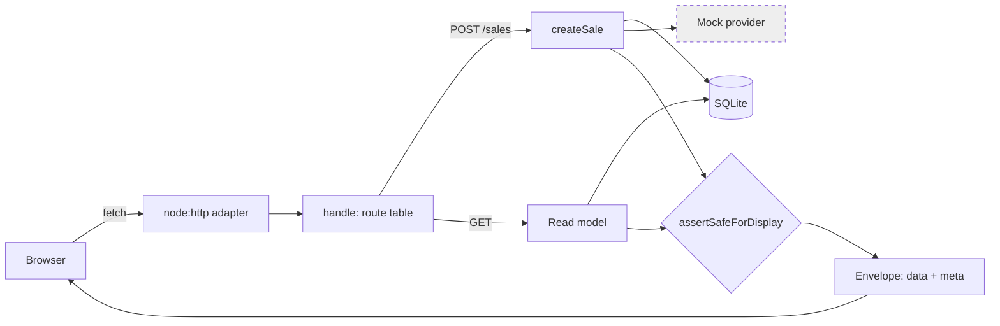

# POS API Surface

The HTTP surface the merchant POS talks to: `services/api/src/http/`. Five routes, all under
`/api/training/`, all over the **existing** application services.

> [!danger] TRAINING MODE — NO REAL VALUE
> No live money, no live provider, no wallet, no payment acceptance, no settlement.

## Four independent refusals

None of these relies on the other three, which is the point — a mistake in one is caught by the
next:

1. `assertTrainingBoundary` refuses to **start** the POS server outside `TRAINING`.
2. Every write handler refuses **before it reads the request body**.
3. `createSale` refuses a non-`TRAINING` mode at its own door ([[Transaction Orchestration]]).
4. The schema constrains `mode` to `'TRAINING'` on merchants, transactions and ledger entries, so
   a live-money row cannot be stored even by direct SQL ([[SQLite Persistence Layer]]).

A test drives a live-mode sale through the router and asserts **no transaction row, no
transaction-scoped ledger entry, and a zero ledger residual**.

## The routes

| Method | Path | Purpose |
|---|---|---|
| `GET` | `/api/training/transactions` | The merchant's transactions, newest first. Optional state filter, bounded limit |
| `GET` | `/api/training/transactions/:id` | One transaction, with recovery, support and reservation metadata |
| `GET` | `/api/training/queue` | Pending, under review and reversal required, grouped |
| `GET` | `/api/training/balance` | The four balance views |
| `POST` | `/api/training/sales` | The **only** write. Goes through `createSale` |

The route table is a list of `[method, pattern, handler]` rows matched in order — no framework,
no hand-written regular expressions, and no way to register a route twice without it being
visible in one screenful.

## What has no endpoint, on purpose

There is nothing that sets a state, posts a ledger entry, releases a reservation, approves or
completes a reversal, or credits a balance. A test asserts six such paths answer 404 or 405.

The reversal path is the interesting omission. `completeReversal` already requires a supervisor
approval; exposing it over HTTP without an authenticated supervisor session would be a way
**around** that approval rather than an implementation of it. It stays out until there is a
session to check.

## An unknown outcome is an HTTP success

`POST /sales` returns **201 with `kind: "PENDING"`** for a timed-out sale. It is tempting to make
anything non-2xx mean "broken", but that teaches a client to treat an unknown outcome as an
error, which is exactly the mistake the whole pending path exists to prevent. The request
succeeded; the outcome is unknown; the body says so.

A genuine **rejection** — insufficient balance, provider unavailable, bad input, live mode — is an
HTTP failure carrying a safe `reasonCode`.

| Result | Status |
|---|---|
| Any outcome, including `PENDING` and `UNDER_REVIEW`, and `DUPLICATE_REQUEST` | 201 |
| `INVALID_REQUEST`, `PAYLOAD_MISMATCH`, `INSUFFICIENT_BALANCE` | 400 |
| `UNAUTHORIZED`, live mode refused | 403 |
| Transaction not found for this merchant | 404 |
| `PROVIDER_UNAVAILABLE`, `PRODUCT_UNAVAILABLE` | 503 |
| `PERSISTENCE_FAILURE`, unhandled throw | 500 |

## Merchant isolation

Every read is scoped to a merchant **in SQL**, not by a caller remembering to filter. Reading
another merchant's transaction returns a plain **404**, not a 403 — a different code would confirm
the id exists.

## Redaction

Three checks, each guarding a different mistake:

1. The persistence layer refuses to **store** a full recipient; only a mask and a salted hash.
2. `assertSafeMetadata` refuses unsafe metadata keys at write time.
3. `assertSafeForDisplay` runs on **every successful response body** before it is serialised.

The third exists because a new endpoint can reintroduce a leak without touching either of the
first two. It walks the body and throws on any key naming a secret, an internal digest, or a bare
recipient — naming the JSON path so the leak can be found.

Never sent: the recipient hash, the payload fingerprint, the recipient salt, any credential, any
raw provider body. Sent, deliberately: the masked recipient, the correlation id, the provider
reference (shortened for display), the support reference. Redacting the correlation id would make
every support call longer while protecting nothing.

## Correlation

A client sends `x-telga-correlation-id`; the server honours it, echoes it on the response and
writes it into its own logs, so one merchant action is traceable across every screen it touches.

It is **length-capped and character-restricted** (`[A-Za-z0-9_-]{4,64}`) before being accepted:
it reaches log lines, and a log line is not a place to accept arbitrary input. Anything else is
replaced with a server-generated id.

## Headers

Every response: `cache-control: no-store`, `x-content-type-options: nosniff`,
`referrer-policy: no-referrer`, `x-telga-mode: TRAINING`, and the correlation id.

Every page: a Content-Security-Policy with `default-src 'none'`, `connect-src 'self'`,
`form-action 'self'`, `frame-ancestors 'none'`, `base-uri 'none'` — stated as a header and as a
`<meta>` tag so it travels with a saved page.

## Transport-agnostic

`HttpRequest` and `HttpResponse` are plain values; `node:http` is adapted to them by the POS app.
Every API test in this repository therefore runs **without opening a socket**, and the same
handler can later sit behind a different server without being rewritten.

## Known limitations

| Gap | Consequence |
|---|---|
| **No authentication** | The `merchantId` is taken from the query string. Adequate for training on a controlled machine; **not** a security boundary. Anything real needs a session and device binding — [[Security Model]] |
| No rate limiting | A training surface on a local machine; a public one would need it |
| No webhook endpoint | Provider callbacks are not received over HTTP yet |
| The simulation control | `simulatedProviderBehaviour` re-scripts the **mock**. It is validated against the mock's own list and is only ever consulted in training mode, but it is a control that must never exist against a real provider |

## Authentication — 2026-08-21

**Every route now requires a session** except `POST /api/training/auth/login`.

| Route | Method | Permission | Write |
|---|---|---|---|
| `/api/training/auth/login` | POST | *public* | issues cookies |
| `/api/training/auth/logout` | POST | `POS_LOGOUT` | yes |
| `/api/training/auth/session` | GET | `POS_LOGOUT` | no |
| `/api/training/auth/devices` | POST | `DEVICE_ENROL` | yes |
| `/api/training/transactions` | GET | `POS_VIEW_HISTORY` | no |
| `/api/training/transactions/:id` | GET | `POS_VIEW_TRANSACTION` | no |
| `/api/training/queue` | GET | `POS_VIEW_PENDING_QUEUE` | no |
| `/api/training/balance` | GET | `POS_VIEW_HOME` | no |
| `/api/training/sales` | POST | `POS_CREATE_SALE` | yes, rate limited |

The permission is a **property of the route table**, and `handle()` runs the
guard from that declaration. A new route cannot be added without stating what it
requires; the type demands one for anything not explicitly `public`.

### What changed in the request shape

- **No `merchantId` query parameter is needed anywhere.** Supplying one that
  disagrees with the session is refused with `MERCHANT_SCOPE_MISMATCH` (403).
- `POST /sales` no longer accepts `merchantId`, `deviceId` or `operatorId`. All
  three come from the session. A body carrying them is ignored for identity and
  refused if the merchant disagrees.
- Browser writes carry a CSRF token, in the `csrfToken` field or the
  `x-telga-csrf` header.

### Refusals

| Situation | Status | Reason code |
|---|---|---|
| No session | 401 | `SESSION_MISSING` |
| Expired or revoked session | 401 | `SESSION_*` |
| Revoked, unenrolled, expired or wrong-merchant device | 403 | `DEVICE_*` |
| Role lacks the permission | 403 | `PERMISSION_DENIED` |
| Supplied merchant id disagrees | 403 | `MERCHANT_SCOPE_MISMATCH` |
| Missing or wrong CSRF token | 403 | `CSRF_TOKEN_MISSING` / `_INVALID` |
| Over the rate limit | 429 | `RATE_LIMITED` |
| Body over 16 KB | 413 | `REQUEST_TOO_LARGE` |
| Another merchant's transaction, **or** one that does not exist | 404 | `TRANSACTION_NOT_FOUND` |

The last row is the important one: the two cases are **byte-identical**, so
transaction ids cannot be enumerated by reading status codes.

Full detail in [[Authentication and Sessions]].

## Transport and headers — 2026-08-21

Every API response carries the security-header set, including a CSP of
`script-src 'none'` — a JSON body runs no script and gets no nonce, which is
exactly right for something never meant to be rendered as a document.

Before any route is matched, two transport checks run:

| Check | Applies to | Refusal |
|---|---|---|
| `Host` against the allow-list | every request | 400, safe-error screen |
| `Origin` against the same-origin set | `POST`, `PUT`, `PATCH`, `DELETE` | 403, access-denied |

A **missing** `Origin` is accepted: plain form posts from older browsers omit it,
and the CSRF token is the primary control. A present-but-wrong one is refused.

Cookie `Secure` is decided **per request** from the client's scheme, not from a
startup flag — behind a terminator this process speaks HTTP while the client used
HTTPS. See [[TLS and Proxy Configuration]].

## Related

- [[Merchant POS Screens]]
- [[Transaction Orchestration]]
- [[Architecture]]
- [[API Contracts]]
- [[Security Model]]

---
Back to [[00 Home]]
