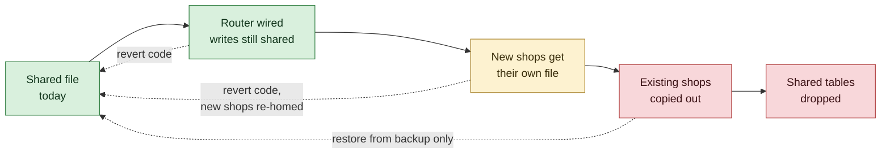

# Per-Shop Storage Migration

The execution plan for **D103** — one database file per shop — written before any
of it is done, because this is the change the vault calls
*"the irreversible choice: splitting later is a data migration and merging later
is worse."*

> [!important] This note is the work, not a description of work
> A storage change of this shape fails in one of two ways: it is done in a rush
> and loses a ledger, or it is talked about for months and never done. What
> stops the first is knowing the order of operations and the rollback point
> **before** touching anything. That is what this is.

## Where things actually stand

| | |
|---|---|
| **D103** | Chose one SQLite file per shop. **Not implemented.** |
| **D113(a)** | Deferred it for the single-shop training deployment. Named the condition that ends the deferral: *"It stops being defensible the moment a second real shop exists."* |
| **D120** | Approval provisions a merchant into **one shared database** with logical isolation, contained in a single port so the question stays open |
| `admin/tenantRouting.ts` | **Complete**, checks the registry, the derived name, the tenant status and the schema version on every open — and **has no callers** |
| `tenant_registry` | Populated on every approval, already carrying the per-tenant rows a router would read |

So the shape is there. What is missing is not code so much as a **decision plus
four pieces of operational machinery** that the shared model does not need.

## What today's isolation actually is

Worth stating plainly, because the choice is between two real options rather
than between "safe" and "unsafe":

- Every query is scoped by a **session-derived** merchant id, never one taken
  from the request
- 11 cases in `merchant-isolation.test.ts`, plus URL, body and encoded-id
  tampering in `authorization.test.ts`, against a live server
- A device belongs to one merchant and `createSale` refuses a mismatch
- Suspension is enforced at sign-in and on every authenticated request

**That is a real boundary and it is tested.** What it is not is a *physical*
one: a query written without its scope clause would cross it, and no filesystem
would stop it. Per-shop files convert a discipline into a structure.

## The five things that must move together

> [!danger] None of these is optional, and the order matters
> Doing 1 without 2 gives a fleet of databases that cannot be migrated. Doing
> 1–3 without 4 gives a system that cannot be backed up. Doing any of it without
> 5 gives a recovery worker that corrupts one file per shop instead of one file.

### 1. Routing — wire `createTenantRouter`

The smallest piece, and the only one already written. Every request that reaches
a merchant's data opens that merchant's file via the router instead of the
shared handle. The port design keeps this to one function today; it will not
stay that cheap once there are real ledgers in the shared file.

### 2. Per-tenant migrations

Today one `migrate` run at boot brings the single file to the current version,
and the supervisor refuses to start if it fails. With N files, migration becomes
a fleet operation: partial success is the normal case, a file that fails must
not take the service down for every other shop, and `tenant_registry` must carry
each file's applied version so a half-migrated fleet is visible rather than
discovered.

`tenantRouting.ts` already checks the schema version on open, which is the
enforcement half. The **application** half does not exist.

### 3. Backup and restore, N times

[[Database Operations Runbook]] and launch gate 10 assume one file. With N,
every question changes: a backup is a set, a restore is per-shop or fleet-wide,
and a partial restore leaves shops at different points in time. **Launch gate 10
("backups and recovery tested") cannot be re-proved by testing one file.**

### 4. The recovery claim lease, per file

A37/R16. The claim lease is what stops two workers resolving the same pending
sale twice, and it was proved against **one** SQLite file's locking. With N
files the worker either holds N leases or sweeps them in turn, and **the proof
does not carry over** — it has to be re-run per file, including the contention
case.

This is the piece most likely to be underestimated, because the code looks like
it would work.

### 5. Cross-tenant reads in the console

The console lists merchants, devices, applications and audit events **across all
tenants**, and today that is one query. With per-shop files it is a fan-out over
N databases, or a summary table in the shared file that must be kept true. The
second is faster and introduces a thing that can be wrong; the first is honest
and gets slow at 1000 shops.

**This is the design question inside the design question**, and it does not have
an obvious answer.

## The rollback point

**Everything up to and including step C is a code revert.** From step D the only
way back is a restore, which is why step D must not begin until step 3 of the
previous section is done and *tested*, not merely written.

## Recommendation on sequencing

> [!warning] Not during an acceptance test
> The founder's immediate plan is to approve a shop on the live deployment and
> exercise the flow end to end. Steps 1–2 change where every read and write
> goes. Landing them underneath that test would mean any failure has two
> candidate causes, and the slower one to rule out is the storage layer.
>
> **The recommended order is: finish the acceptance round on the shared file,
> fix what it finds, and start step 1 immediately afterwards** — while the
> number of real shops is still one, which is the cheapest this change will ever
> be.

The deferral's condition has not yet triggered: a second *real* shop does not
exist. But [[Vendor Registration]] means one can now arrive without anybody at
Telga typing anything, so the gap between "not yet" and "too late" is smaller
than it was.

## The open question that needs an answer either way

Item 5 above — **how the console reads across 1000 tenants** — is the one piece
that has no obviously correct answer and no existing code. It should be decided
*before* step 1 rather than discovered during step 4, because the answer changes
whether the shared file keeps a summary of every tenant, and that is a schema
decision.

## Related

- [[Platform Shape]] — what is true today, and what must not be claimed
- [[Multi-Shop Onboarding]] — where this sits in the chain
- [[Ledger Invariants]] — what must remain true through any move
- [[Database Operations Runbook]] — the backup story that has to grow
- [[Decision Log]] — D103, D113(a), D120

---
Back to [[00 Home]]
