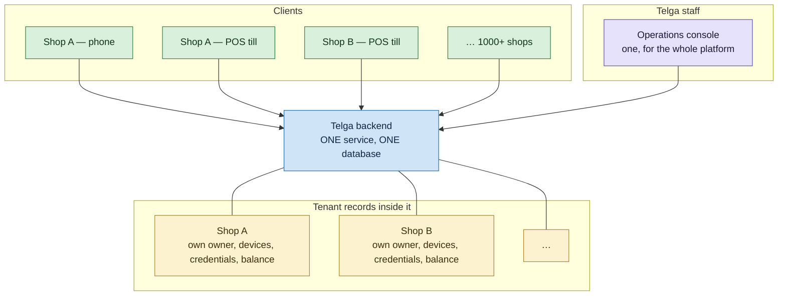

# Platform Shape

What Telga **is**, structurally, in one place — because three facts about it are repeatedly
misread, and each misreading produces a different wrong build.

> [!important] The three facts
> 1. **One app**, installed on two kinds of device. Not two apps.
> 2. **One backend**, serving every shop. Not one per shop.
> 3. **One console**, for the whole platform. Not one per tenant.

## 1. One app, two kinds of device

There is exactly one Telga Android application: `et.mulesoo.telga`, a **Capacitor shell** in
`apps/mobile/` whose whole job is to host a WebView pointed at the Telga server. It reimplements
no screens.

A smart-POS terminal runs Android. A merchant's phone runs Android. **The same APK is installed on
both.** There is no "POS app" and no separate "phone app" — the difference between a till and a
phone is hardware, not software.

> [!warning] The name that causes the confusion
> `apps/merchant-pos/` is the **server** that renders the merchant screens. It is not a client
> and it is not a POS-only component; it serves every phone and every till. The name is
> historical. `packages/pos-view-model` has the same problem. Renaming them is a wide change and
> has not been done — this note is the correction until it is.

[[Decision Log]] **D68** settled it once already: *"Telga is one application — one repository,
one login, one authenticated session"*, explicitly correcting an earlier draft that described
"two separate apps". **D106** then rejected a native reimplementation of the vending flow, and
the reason is worth repeating because it is a ledger argument rather than an effort argument:

> A second implementation of a vending flow is a **second place a duplicate sale can originate**,
> and `CLAUDE.md` §13 makes duplicate prevention an invariant, not a preference.

### What each installed instance is

| | |
|---|---|
| Belongs to | Exactly **one** shop |
| Identified by | A device id (public, guessable by design) plus a **device key** (256 bits, issued once) |
| Separate from | The console's own login, which is a Telga staff credential and has nothing to do with it |
| Obtained by | An admin-issued one-time activation code, exchanged on first open — [[Device Registration]] |

A shop may run several devices. Each has its own key and appears in the ledger on every sale it
made, so stopping one leaves the shop trading on the others.

## 2. One backend

Not separate systems per shop. Not separate sites. One deployment, one database, and each shop as
a tenant record inside it.

## 3. One console

Telga staff only. It is a separate **application** from the merchant app — different users,
different authentication, different threat model, its own MFA and step-up re-authentication — but
**not a separate system**: the same backend and the same database.

It does five things across every tenant at once:

- Review pending vendor applications (Path A of [[Vendor Registration]])
- Approve or reject **each shop individually**
- Create shops directly, where admin creation is itself the approval (Path B)
- Manage every tenant, owner and device
- See which devices belong to which shop

## What is isolated, and where the boundary actually sits

| Boundary | Owned by | Consequence |
|---|---|---|
| **Money** | The shop | `balanceFor(merchantId)`. Every till in a shop draws on one float; a deposit at one is spendable at another. **No device has a balance of its own** |
| **Authentication and audit** | The device | Each device holds its own key; the ledger records which device made each sale |
| **Credentials** | The shop | Shop A's credentials never authenticate Shop B |
| **Approval and suspension** | The shop | Per tenant, never platform-wide. One shop's suspension changes nothing for any other |

Any specification that assumes per-device balances is describing a different product.

## Scaling to 1000+ shops — the honest position

> [!danger] The one architectural decision still open
> **Per-shop SQLite files, or one shared database?**
>
> [[Decision Log]] **D103** chose one database file per shop and the vault calls it
> *"the irreversible choice — splitting later is a data migration and merging later is worse."*
> **D113(a)** deferred it for the single-shop training deployment and named the condition that
> ends the deferral:
>
> > *"It stops being defensible the moment a second real shop exists."*

### What is true today

- One shared database, with every query scoped by a **session-derived** merchant id — never one
  taken from the request
- 11 isolation cases in `merchant-isolation.test.ts`, plus URL, body and encoded-id tampering in
  `authorization.test.ts`, against a live server
- `admin/tenantRouting.ts` is complete, checks the registry, the derived name, the tenant status
  and the schema version on every open — and **has no callers**, deliberately, because under
  D120's shared model it is meant to be unused

### What must not be claimed

Per-shop database files. Per-tenant routing being active. Production readiness at 1000 shops.

### Recommendation

**Decide the storage question before the second real shop is onboarded, not after.**
The execution plan now exists: [[Per-Shop Storage Migration]] sets out the five
pieces that must move together, the rollback point beyond which only a restore
returns, and the one design question that has no obvious answer.

[[Vendor Registration]] makes reaching that second shop considerably faster — a shop can now apply
from the app without anybody at Telga typing anything. That is the point of it, and it is also
what shortens the runway on D103. The port design keeps the swap to one function today; it will
not stay that cheap once real ledgers exist in a shared file.

Three things would need to move together, and none is a patch:

1. Routing — wiring `tenantRouting.ts` to its callers
2. Per-tenant migrations, and an N-database backup and restore story
3. Re-proving the recovery claim lease **per file**

## Related

- [[Architecture]] — module boundaries and the provider adapter
- [[Vendor Registration]] — how a tenant is created
- [[Device Registration]] — how a device joins one
- [[Multi-Shop Onboarding]] — the state of the chain
- [[Multi-Tenant Architecture Proposal]] — the fuller proposal this summarises
- [[Admin Operations Console]] — the console's own design

---
Back to [[00 Home]]
