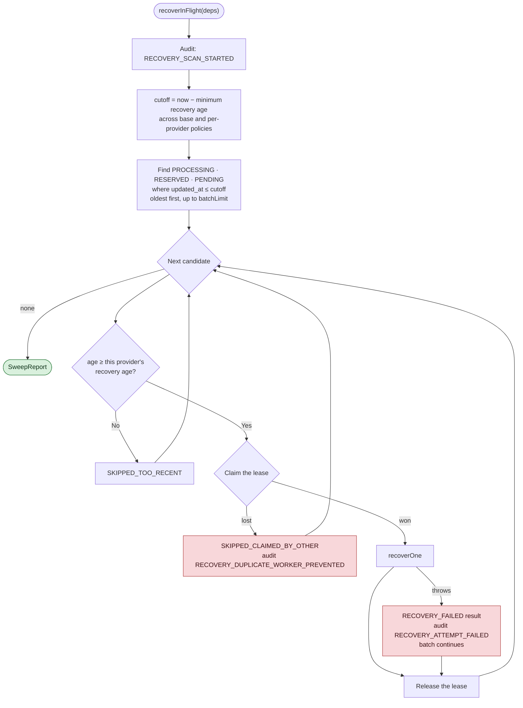
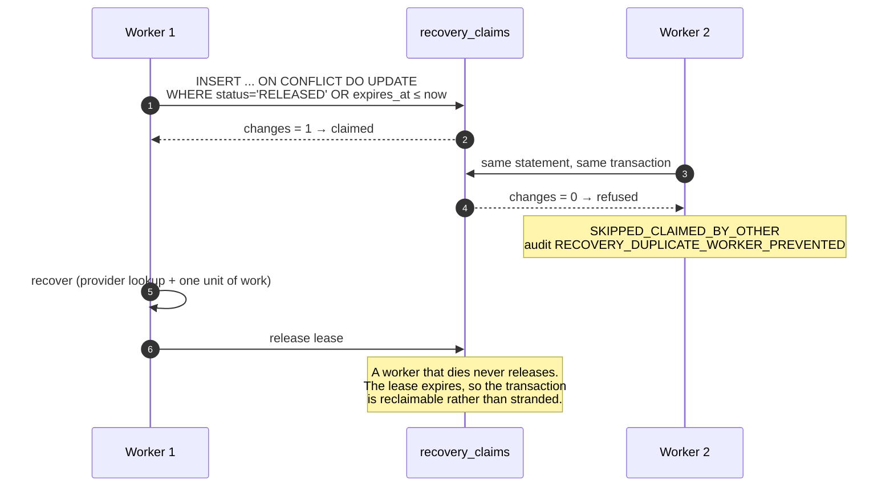
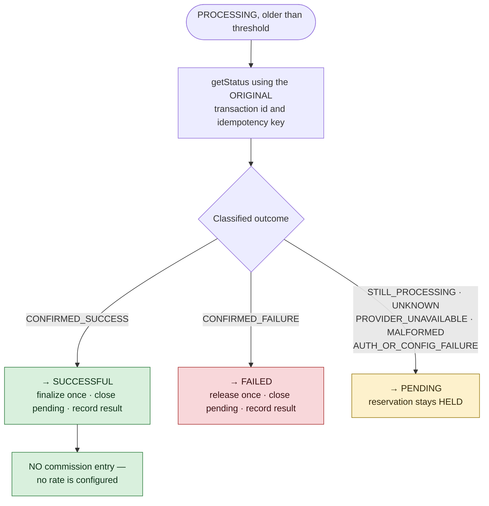
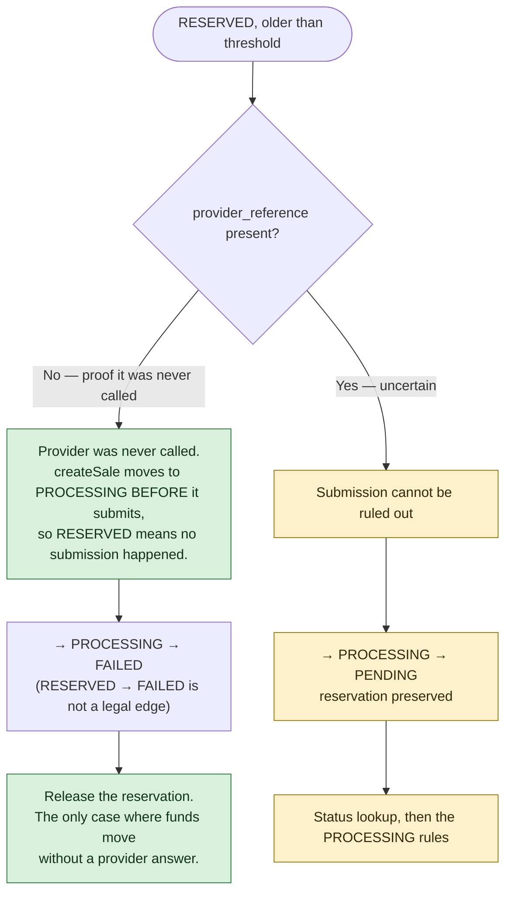
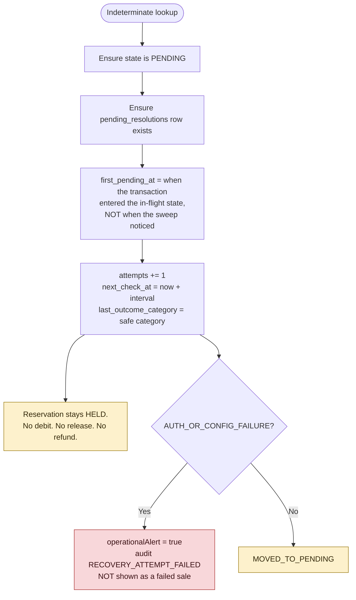
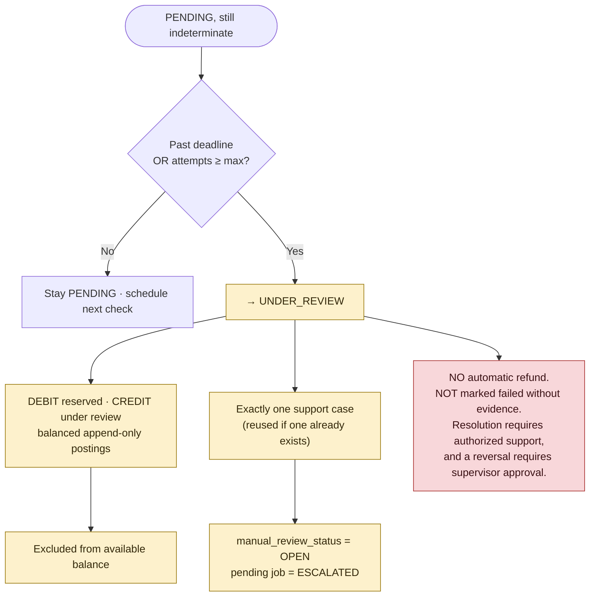

# Recovery Sweep

`services/api/src/application/recovery/` — unattended recovery for transactions left in flight.

**Implemented and tested.** 61 recovery tests. This is what closes assumption **A31**.

The sweep must be invoked. [[Recovery Worker]] is the supervised loop that invokes it unattended, with backoff, health and graceful shutdown.

## Why it exists

[[Transaction Orchestration]] puts the provider call between two units of work, which leaves a gap:
a crash in that gap leaves a transaction at `RESERVED` (provider never called) or `PROCESSING` (we
do not know). Before this service, both states held a merchant's money with nothing scheduled to
resolve them.

## The rule everything obeys

> **Only a determinate provider answer may move a merchant's money.**

Silence, an unreachable provider, a malformed body and a misconfigured credential all mean the
same thing operationally — *we do not know* — and every one of them holds the value exactly where
it is.

## Recovery scan

`PENDING` is swept too. `resolvePending` handles a pending transaction when something calls it, but
an unattended system has nothing calling it — without `PENDING` here, a transaction the sweep
itself moved to pending would sit holding money forever and the escalation deadline would never be
enforced.

## Worker claim and concurrency

One atomic statement decides ownership. The `WHERE` clause on the conflict branch is the whole
mechanism: a live lease held by someone else leaves `changes = 0`.

## PROCESSING recovery

## RESERVED recovery — evidence, not assumption

**A `RESERVED` record is never treated as successfully submitted without evidence**, and a
`RESERVED` row that somehow carries a provider reference is treated as uncertain rather than as
proof of nothing having happened.

## Unknown outcome to PENDING

A stuck transaction does not get a fresh grace period because a worker only just reached it — the
merchant's money has already been held for that time.

## PENDING to UNDER_REVIEW

## Audit trail

Nobody was watching when an unattended recovery ran, so every step is recorded:
`RECOVERY_SCAN_STARTED` · `RECOVERY_CLAIMED` · `RECOVERY_DUPLICATE_WORKER_PREVENTED` ·
`RECOVERY_STATUS_LOOKUP` · `RECOVERY_OUTCOME_RECEIVED` · `RECOVERY_RECOVERED_SUCCESSFUL` ·
`RECOVERY_RECOVERED_FAILED` · `RECOVERY_MOVED_TO_PENDING` · `RECOVERY_ESCALATED_UNDER_REVIEW` ·
`RECOVERY_ATTEMPT_FAILED` · `MANUAL_REVIEW_CREATED`

Audit details carry a **safe outcome category** only — never a provider body, never a credential.

## Idempotency

Re-running a sweep cannot duplicate a debit, a release, a reversal or a support case. Four
independent guards make that true, and each has a test:

| Guard | Mechanism |
|---|---|
| Single ownership | `recovery_claims` atomic claim |
| Single finalization | Reservation update guarded on `HELD` |
| Single escalation | Pending job guarded on `AWAITING` |
| Single case | `findSupportCaseByTransaction` before create, plus a unique reference index |

## Related

- [[Recovery Configuration]]
- [[Recovery Sweep Runbook]]
- [[Manual Review Runbook]]
- [[Transaction Orchestration]]
- [[Transaction State Machine]]
- [[Observability]]

---
Back to [[00 Home]]
