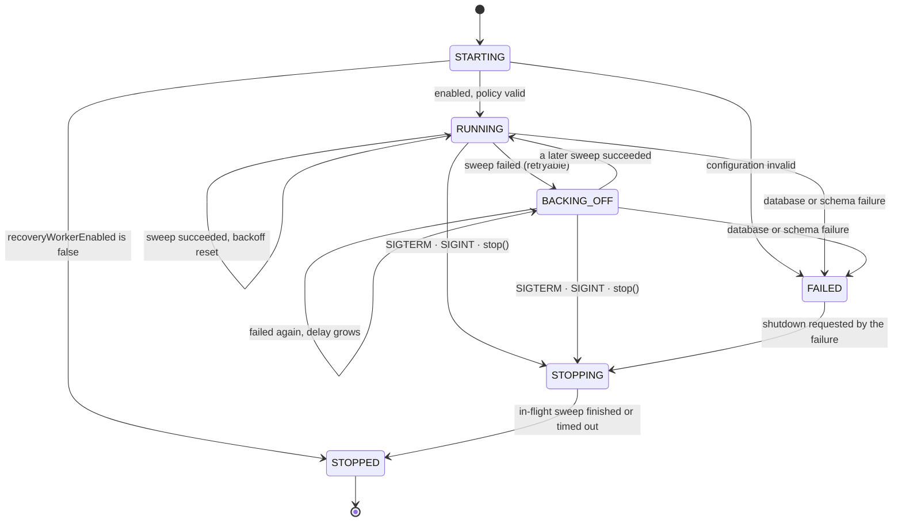
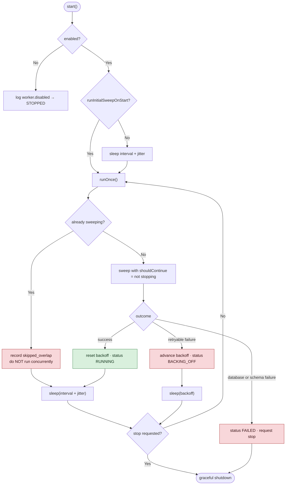
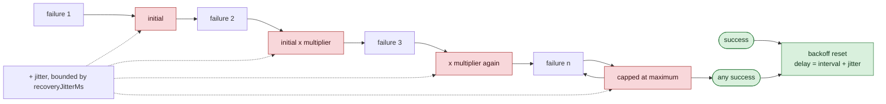
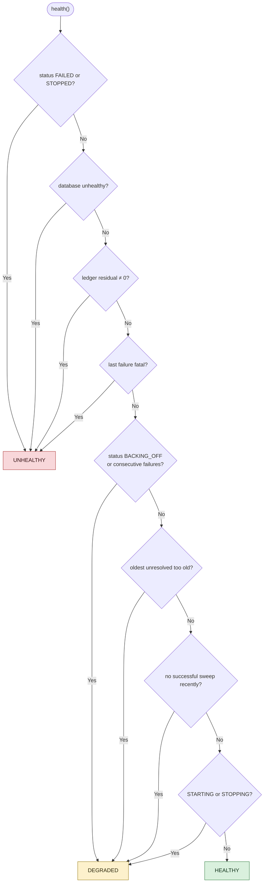

# Recovery Worker

`services/worker` — the supervised loop that actually runs [[Recovery Sweep]] unattended.

**Implemented and tested.** 82 worker tests. Until now the sweep had to be invoked by hand; this is
what makes it a background process.

## Worker lifecycle



**Disabled is a normal state, not a failure.** A worker with `recoveryWorkerEnabled: false` logs why
and stops — it does not error, and it does not sweep.

## Sweep scheduling



> [!important] Fixed delay, not fixed rate
> The next sweep is scheduled from the **end** of the previous one. Fixed-rate scheduling — "every
> N ms from a start point" — degenerates into continuous execution the moment a sweep takes longer
> than its interval: the scheduler spends the rest of its life catching up on a backlog it can
> never clear. Fixed delay cannot run away, and a test proves a sweep four times longer than its
> interval still sleeps a full interval afterwards.

## Backoff



Backoff **replaces** the interval rather than adding to it — a worker in backoff is deliberately
slower, not merely late. Jitter matters more than it looks: without it, every worker that failed
against the same outage retries at the same instant, and the recovery from an outage becomes a
second outage.

## Graceful shutdown

```mermaid
sequenceDiagram
    autonumber
    participant OS as SIGTERM / SIGINT
    participant W as Worker loop
    participant S as Sweep
    participant DB as Database

    OS->>W: signal
    W->>W: status STOPPING · stop scheduling
    Note over W: no second sweep may start

    alt a sweep is in flight
        W->>S: shouldContinue() now returns false
        S->>S: finish current transaction, release its claim
        S-->>W: stops at a safe boundary
    end

    W->>W: wait up to gracefulShutdownTimeoutMs
    W->>DB: release claims owned by THIS worker only
    Note over DB: other workers' claims untouched;<br/>abandoned leases expire on their own
    W->>DB: close connections
    W-->>OS: status STOPPED, shutdown duration logged
```

A shutdown never marks an unresolved transaction failed, never releases uncertain funds, never
deletes a pending record, never deletes a claim row, and never bypasses supervisor approval.

## Health states



| Level | Meaning |
|---|---|
| **HEALTHY** | Running, with a recent successful sweep |
| **DEGRADED** | Running, but failing, backing off, stale, or falling behind |
| **UNHEALTHY** | Not doing its job: stopped, failed, database unhealthy, or **ledger residual non-zero** |

A stopped worker is **unhealthy** even though nothing is erroring — silence is not success.

## Failure categories

| Category | Effect |
|---|---|
| `CONFIGURATION` | **Fatal** — the worker stops |
| `DATABASE_CONNECTION` | **Fatal** — retrying into a broken connection helps nobody |
| `MIGRATION_SCHEMA` | **Fatal** — needs a human |
| `PROVIDER_ADAPTER` | Backoff and retry |
| `UNEXPECTED` | Backoff and retry |
| `SHUTDOWN_CANCELLED` | Expected during shutdown |
| `PARTIAL_BATCH` | Not a sweep failure at all — the batch succeeded and the per-transaction failures are in its report |

A single transaction failing never stops the batch; the sweep records it and continues.

## Running it

The worker is started from its compiled entry point, `services/worker/dist/cli.js` — see
[[Build Pipeline]] and the README.

| Mode | Command |
|---|---|
| Supervised loop | `node services/worker/dist/cli.js --db <path>` |
| One sweep, then exit | `node services/worker/dist/cli.js --db <path> --once --json` |

`--once` exists for two reasons: an operator needs a way to run a single sweep by hand
([[Worker Operations Runbook]]), and a test needs to prove process separation without leaving a
supervised loop running forever.

**Training mode is enforced at the entry point.** `--mode LIVE` exits with code 3 before a database
is opened, and the worker, domain and schema each refuse independently beneath it.

**The worker does not migrate.** It opens the database without migrating and exits with code 6 if
any migration is missing, naming the versions. Migrations are applied once, by a single writer,
with `--migrate` — see [[Migration Ownership]].

## Where real time is read

Exactly one place: `systemWorkerClock` in `workerLifecycle.ts`. Everything below the worker takes
time as an argument, and a test asserts the recovery service contains no `Date.now(` and no
`new Date()`.

## Health reads the sweep — 2026-08-21

The worker used to report `HEALTHY` while its last sweep had claimed work and
resolved none of it. A zero ledger residual is **necessary, not sufficient**: it
says the books are consistent, not that recovery did its job.

`healthLevel` now takes a `SweepOutcome`:

| Last sweep | Level |
|---|---|
| No work found | `HEALTHY` |
| Work found and resolved | `HEALTHY` |
| Work found, only **skipped** because another worker held it | `HEALTHY` — a contested claim is normal |
| **`recoveryFailures > 0`** | `DEGRADED` |
| **Claimed something, resolved nothing** | `DEGRADED` |
| Ledger residual non-zero, database unhealthy, worker stopped or fatally failed | `UNHEALTHY` |

The sweep outcome is checked **before** the older degraded conditions, because a
failure that already happened is more specific evidence than an inference from
lag or a failure counter.

### What the JSON output carries

`skipped`, `recoveryFailures`, `stoppedEarly` and `failureReasonCodes` were added
alongside. Without them a sweep that claimed work and resolved none of it
returned a row of zeroes and explained nothing — which is exactly the state a
supervised worker most needs to account for, and exactly what made A54 take three
attempts to diagnose. Reason codes only: never a raw error, never a provider body.


## Related

- [[Recovery Sweep]]
- [[Worker Configuration]]
- [[Worker Operations Runbook]]
- [[Deployment Runbook]]
- [[Observability]]

---
Back to [[00 Home]]
