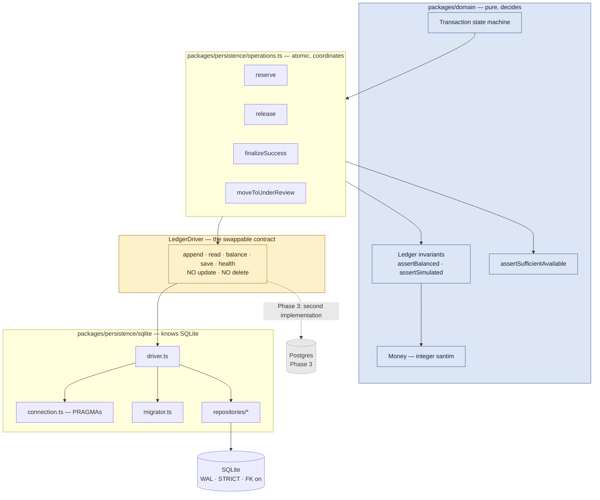
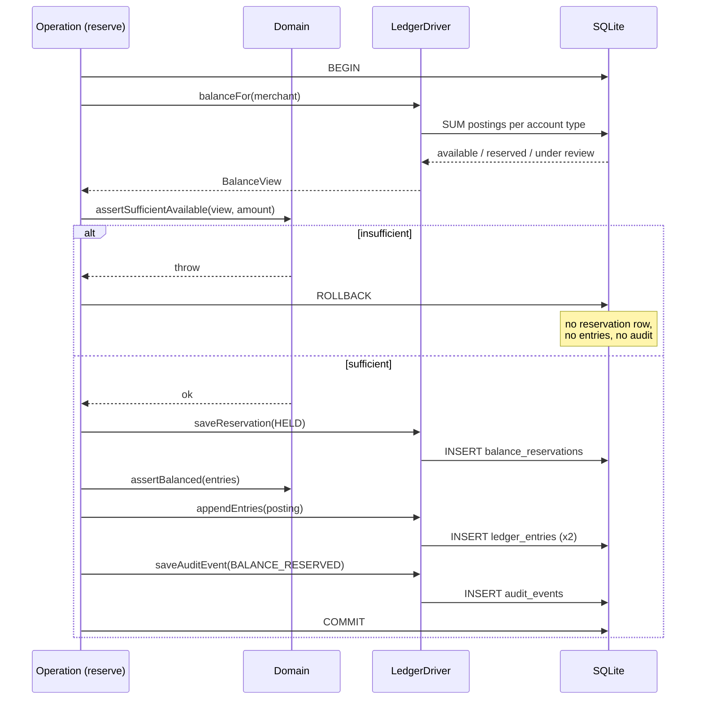

# SQLite Persistence Layer

`packages/persistence` — SQLite behind a `LedgerDriver` interface.

**Implemented and tested.** 79 persistence tests passing. Postgres at Phase 3 means writing a
second implementation of one file and changing no caller ([[Decision Log]] D4).

## Domain-to-persistence boundaries



**Decisions live in the domain. Atomicity lives in persistence.** Whether a merchant has enough
available balance is a domain question; making the check, the postings and the reservation row
commit together is a persistence one.

## PRAGMA configuration

Set at open, and **read back from the engine** — the tests assert the readback, because a PRAGMA
that silently failed to apply looks fine until a power cut.

| PRAGMA | Value | Why |
|---|---|---|
| `journal_mode` | `wal` | Concurrent readers during a write |
| `foreign_keys` | `1` | Referential integrity actually enforced |
| `busy_timeout` | `5000` ms | A blocked writer waits rather than failing instantly |
| `synchronous` | `2` (`FULL`) | See below |
| `integrity_check` | `ok` | Verified in `health()` |

> [!note] Why `FULL` and not `NORMAL`
> `NORMAL` is the usual recommendation with WAL and is measurably faster, but it can lose the most
> recent commits on power loss. This is a merchant ledger: a lost commit is a merchant's money
> unaccounted for. The write cost is worth paying.

## Schema

Seven tables, all **STRICT**. There is no `REAL` column anywhere in the schema — ledger invariant 9
enforced by the engine rather than by convention.

| Table | Holds | Notable constraints |
|---|---|---|
| `merchants` | Shops | `mode` CHECK constrained to `'TRAINING'` |
| `devices` | Registered terminals | FK to merchant |
| `transactions` | Sales | `state` CHECK against all 12 domain states; unique `(merchant_id, idempotency_key)` |
| `idempotency_records` | Replay protection | PK `(merchant_id, key)` — scoped per merchant |
| `ledger_accounts` | Accounts | `account_type` CHECK against the 9 domain kinds |
| `ledger_entries` | **Append-only** postings | Triggers abort UPDATE and DELETE |
| `balance_reservations` | Reservation lifecycle | Unique per transaction |
| `audit_events` | **Append-only** audit trail | Triggers abort UPDATE and DELETE |

`mode` is CHECK-constrained to `'TRAINING'` on merchants, transactions and ledger entries. Storing
live-money rows is not merely disabled in application code — **the database rejects them**.

## Account model

The four balance views become *postings* rather than derived figures, so every bucket movement is
auditable ([[Decision Log]] D12):

| Account type | Merchant-facing? | Purpose |
|---|---|---|
| `MERCHANT_AVAILABLE` | Yes | Spendable value |
| `MERCHANT_RESERVED` | Yes | Held against an in-flight sale |
| `MERCHANT_UNDER_REVIEW` | Yes | Held pending determination |
| `MERCHANT_FUNDS` | Yes | Undivided form used by the in-memory domain model |
| `PROVIDER_SETTLEMENT` | No | Owed to or from a provider |
| `TELGA_REVENUE` | No | Fees actually earned |
| `HARDWARE_DEPOSITS` | No | Refundable device deposits |
| `REFUND_RESERVES` | No | Held against expected reversals |
| `BANK_CLEARING` | **No** | Bookkeeping contra account only |

`BANK_CLEARING` appears in **no** merchant balance query. Asserted by
`balances the bookkeeping without appearing in a merchant balance`.

## Database write and audit flow



Everything inside the unit of work commits together or not at all. Asserted by
`a throw inside a unit of work rolls back every write in it`.

## Append-only enforcement

Two independent layers:

1. **TypeScript** — `LedgerDriver` and `AppendOnlyLedger` expose no update, delete, void or setter for entries.
2. **The database** — migration 002 installs `BEFORE UPDATE` and `BEFORE DELETE` triggers on `ledger_entries` that `RAISE(ABORT, ...)`. Migration 003 does the same for `audit_events`.

The second layer is what covers a console session, a future ORM, or a bug that reaches the
connection directly. Tests attempt raw SQL `UPDATE` and `DELETE` and assert both fail.

**A correction is a new `ADJUSTMENT` entry** — tested, and it leaves the original entry visible
beside it.

## Privacy

A full recipient number is never stored. `transactions` holds:

- `recipient_masked` — `09******00`, enough for a merchant to recognise the sale
- `recipient_hash` — salted SHA-256, for exact-match lookup without holding the number

`assertSafeMetadata` refuses any metadata key resembling a PIN, secret, token, credential, or
recipient number before it can reach a row.

## Transactions begin IMMEDIATE — 2026-08-21

```ts
transaction<T>(work: () => T): T {
  return this.handle().transaction(work).immediate();
}
```

Not the default `BEGIN`. This is the fix for **A54**, and the reasoning is worth
keeping:

A **deferred** transaction — better-sqlite3's default — starts as a *reader* and
upgrades to a writer on its first write. In WAL mode, if another connection has
committed since the read snapshot began, that upgrade fails with
**`SQLITE_BUSY_SNAPSHOT`**.

Two properties of that error matter:

1. **`busy_timeout` does not apply.** SQLite returns it immediately. Waiting is
   not offered, because the transaction's own reads may already be stale.
2. **It cannot be safely retried in place.** Re-running the same closure would
   re-read at a new snapshot, and any decision already made from the old one
   would be wrong.

Every unit of work that reaches `transaction()` writes — reserve, finalize,
release, recover. Taking the write lock at the start converts an un-waitable
failure into an ordinary wait that `busy_timeout` handles.

The cost is more serialisation between writers. For a ledger that is the correct
trade: SQLite permits one writer at a time regardless, and this only decides
whether contention is a wait or a failure.

> [!note] How it was found
> Two worker processes racing one transaction, under
> `npm run test:child-process:stress`. It reproduced on iteration 1 and reported
> `failureReasonCodes: ["SQLITE_BUSY_SNAPSHOT"]`. **200 iterations clean** after
> the change. See [[Test Stability Runbook]] and [[Decision Log]] D51.

### What this does not change

`busy_timeout` is still 5 seconds, the journal is still WAL, `synchronous` is
still `FULL`, and the append-only triggers are untouched. Concurrent *migration*
remains untested — **A30 stays open**.


## Related

- [[Architecture]]
- [[Migration Strategy]]
- [[Database Operations Runbook]]
- [[Ledger Invariants]]
- [[Balance Model]]
- [[Security Model]]

---
Back to [[00 Home]]
