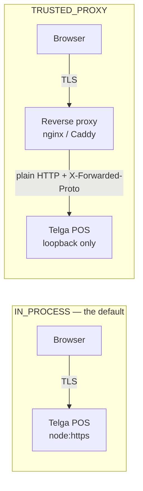

# TLS and Proxy Configuration

Where TLS ends, and what the application is allowed to believe about it.

## Two shapes



**Prefer the proxy** for anything beyond one machine: certificate renewal,
protocol tuning and OCSP stapling are all things a proxy does properly and this
application deliberately does not. `IN_PROCESS` exists because a single
controlled training machine should not need a second component.

## The rule that makes proxy termination safe

> **A forwarding header is believed only when the connection it arrived on came
> from a configured trusted address.** Anything else is treated as plain HTTP,
> whatever it claims.

There is deliberately **no "trust all proxies" setting**. It is the single
configuration that would turn this from a control into a decoration.

If `X-Forwarded-Proto: https` were believed from any client, two things follow,
and the second is worse than the first:

1. A plain HTTP request talks the server into marking a cookie `Secure`. A
   `Secure` cookie is never sent back over HTTP, so the operator signs in and is
   immediately signed out.
2. An insecure deployment **reports itself as secure**. The wrong answer arrives
   looking like the right one.

`resolveScheme` therefore decides in this order:

| Order | Source | Beaten by |
|---|---|---|
| 1 | This process's own TLS socket | nothing |
| 2 | A forwarding header **from a trusted address** | a TLS socket |
| 3 | Plaintext | anything above |

A forwarding header on a connection this process terminated itself is recorded
as `forwardingHeaderIgnored` and never consulted. From a proxy chain, the
left-most value is taken: that is the hop nearest the client.

`::ffff:127.0.0.1` is normalised to `127.0.0.1`, because Node reports the mapped
form on a dual-stack listener and a trust list configured with the plain form
would otherwise silently never match.

## Configuration that is refused

| Combination | Reason code |
|---|---|
| `TRUSTED_PROXY` with no `--trust-proxy` list | `PROXY_TRUST_REQUIRED` |
| `TRUSTED_PROXY` that also holds a certificate or key | `TLS_MATERIAL_WITH_PROXY` |
| `IN_PROCESS` with a `--trust-proxy` list | `PROXY_TRUST_WITHOUT_PROXY` |
| A loopback HTTP server with a `--trust-proxy` list | `PROXY_TRUST_ON_LOCAL_HTTP` |

The third and fourth matter: TLS ends in this process, so nothing upstream could
have set a forwarding header honestly, and believing one could only ever help an
attacker.

## Host and origin

The `Host` header is client-controlled. A server that reflects it into a
redirect, a link or a cookie domain will point an operator at somebody else's
machine. Telga answers only for `--allowed-hosts`; anything else is a **400**
with the safe-error screen.

`X-Forwarded-Host` is honoured only from a trusted proxy, for the same reason
the protocol is.

`Origin` is checked on `POST`, `PUT`, `PATCH` and `DELETE`. A **missing** origin
is accepted — plain form posts from older browsers omit it, and CSRF tokens are
the primary control; this is a second one. A *present* origin that is not
same-origin, or is on the wrong scheme, is a **403**.

## A worked nginx example

Not supplied or supported — an illustration of what the trusted-proxy boundary
assumes.

```nginx
server {
    listen 443 ssl;
    server_name telga-training.local;

    ssl_certificate     /etc/telga/tls/fullchain.pem;
    ssl_certificate_key /etc/telga/tls/key.pem;
    ssl_protocols       TLSv1.2 TLSv1.3;

    location / {
        proxy_pass http://127.0.0.1:4321;
        proxy_set_header Host              $host;
        # Set, never appended-to from the client. A proxy that forwards a
        # client-supplied value here defeats the whole boundary.
        proxy_set_header X-Forwarded-Proto $scheme;
        proxy_set_header X-Forwarded-Host  $host;
    }
}
```

```bash
npm run training:serve -- --db ./telga.sqlite --merchant merchant_alpha \
  --transport TRAINING_HTTPS --tls-termination TRUSTED_PROXY \
  --host 127.0.0.1 --port 4321 \
  --trust-proxy 127.0.0.1 \
  --allowed-hosts telga-training.local
```

Two things this depends on, and neither is verified by Telga:

1. **The proxy sets the forwarding headers rather than passing through a
   client's.** `proxy_set_header ... $scheme` does; a configuration that
   appends does not.
2. **The application is not reachable except through the proxy.** Binding to
   `127.0.0.1` is what enforces that, which is why the example does.

## What is tested

`tests/transport/proxy.test.ts` — 26 tests, all pure decisions. The one that
matters most is `does not believe a spoofed forwarding header`: if that ever
passes wrongly, everything above is decoration.

`tests/transport/https-server.test.ts` — 18 tests against a **real** `node:https`
listener on a real port, including the cookie attributes a browser actually
receives, an unrecognised `Host`, and a cross-origin post.

## What is not covered

| Gap | Consequence |
|---|---|
| No test drives a real nginx | The proxy example is illustration, not verification |
| `Forwarded` (RFC 7239) is detected but not parsed | Only `X-Forwarded-Proto` is interpreted |
| No mutual TLS | Would be one route to closing A52 — [[Device Binding]] |
| No rate limiting at the proxy | Telga's own limits are per-session, not per-address |

## Related

- [[Training HTTPS Deployment]]
- [[Local Certificate Handling]]
- [[Authentication and Sessions]]
- [[Threat Model]]

---
Back to [[00 Home]]
