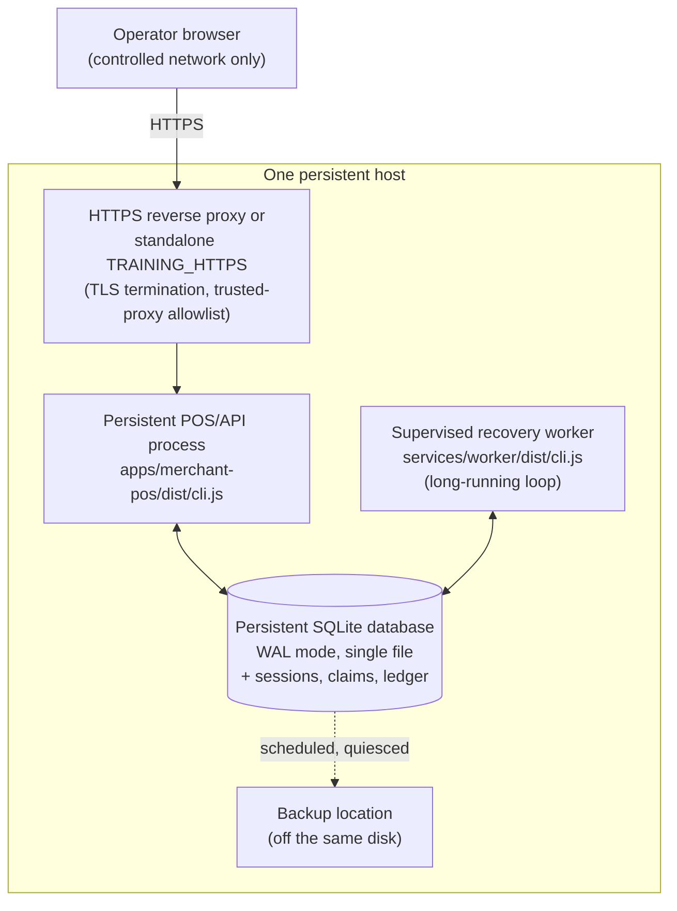

# Training Deployment Architecture

The smallest supported training deployment. Everything here already exists as
code and has been exercised locally and in CI — this note defines how the
pieces sit on **one persistent host**, not new functionality.

> [!danger] Training only
> No live provider, no live money, no wallet, no payment acceptance. The
> deployment must refuse `LIVE` mode and must not open a database before
> validating mode and configuration — enforced today: `--mode LIVE` exits `3`
> before any file is touched (worker and POS both). 0 of 10
> [[Launch Gates]] are cleared.

## Why "persistent host" is not optional

See [[Vercel Deployment Limits]] for the full reasoning. In one line: the
ledger is a local WAL-mode SQLite file, the claim lease that prevents
duplicate recovery (A37/R16) assumes every process opens the **same** file,
sessions are DB rows checked on every request, and the recovery worker is a
supervised loop with no serverless equivalent. All four require one host that
does not disappear between requests.

## Architecture

One host, four things running on it, one database file. Nothing in this
diagram is optional — remove the worker and pending transactions never
resolve; remove the persistent disk and the claim lease (A37/R16) means
nothing; remove TLS termination and A53 gets worse, not better.

## Component definitions

| Component | What it is | Process model |
|---|---|---|
| HTTPS reverse proxy | Either a real proxy (nginx, Caddy) terminating TLS and forwarding to the POS on loopback with `--tls-termination TRUSTED_PROXY --trust-proxy <proxy-addr>`, or the POS's own `--transport TRAINING_HTTPS` serving TLS directly (`--tls-termination IN_PROCESS`, the default) | Long-running, or none if the POS terminates TLS itself |
| POS/API process | `apps/merchant-pos/dist/cli.js` — training counter screens, the training HTTP surface, session issuance | Long-running, one process |
| SQLite database | One file, WAL mode, opened by the POS and the worker | Not a process — a file both processes share |
| Recovery worker | `services/worker/dist/cli.js` without `--once` — the supervised sweep loop | Long-running, one process, independent of the POS |
| Backup destination | A location *not* on the same disk/volume as the live database | Scheduled job, not a process |

## Host boundary

Everything above the `Operator` node in the diagram is **one trust boundary**:
one filesystem, one set of OS users, one network interface set. The database
file is never shared across hosts, and no component here is designed to be
split across machines without the redesign described in
[[Vercel Deployment Limits]] ("If Vercel hosting is genuinely wanted later").

## Process names and startup order

See [[Service Startup and Shutdown]] for the full command sequence, health
checks, and shutdown order. In outline:

1. Migrations (`--migrate`, one writer, once) — before anything else opens the database.
2. Provisioning (`--provision-pin`, once, to create the first operator and device) — before the POS is exposed to an operator.
3. The recovery worker (long-running).
4. The POS/API process (long-running), behind TLS.

The worker and the POS may start in either order relative to each other —
neither depends on the other being up, only on the database being migrated
first.

## Migration ownership

Exactly one process applies migrations, and both the worker and the POS
**refuse to start** (exit `6`) against an unmigrated database rather than
migrate on startup — see [[Migration Ownership]]. On a single-host deployment
this is a manual, deliberate step, not automatic. Concurrent multi-process
migration is untested (A30) and out of scope for training deployment.

## Database location

A single file outside any directory a web server would serve directly, on a
disk with room for WAL growth and backup snapshots. The `-wal` and `-shm`
files beside it are part of the database — never deleted by hand, never
excluded from a backup that must be crash-consistent.

## TLS termination

Two supported shapes, both already implemented — see
[[TLS and Proxy Configuration]] and [[Training HTTPS Deployment]]:

- **In-process** (`--tls-termination IN_PROCESS`, default): the POS serves
  real TLS itself. Simpler; no proxy to configure.
- **Trusted proxy** (`--tls-termination TRUSTED_PROXY --trust-proxy <addrs>`):
  a real reverse proxy terminates TLS and forwards to the POS over loopback.
  There is deliberately **no "trust all proxies" option** — the address list
  must be explicit ([[Decision Log]] D45).

Either way, the certificate is supplied by path and never generated — see
[[Local Certificate Handling]]. A self-signed certificate remains **not
production trust** (A53).

## Session storage

Sessions are rows in the same SQLite database — see
[[Authentication and Sessions]]. This is why a stateless/serverless POS
process cannot work: a session written by one invocation must be visible to
the next, and only a shared, persistent database provides that.

## Worker lifecycle

Long-running, supervised, restarted on failure by whatever process manager
the host uses (not defined by this repository — see
[[Persistent Host Runbook]] for the options). Stops on `SIGTERM`, drains,
releases only its own claims, closes the database — see
[[Worker Operations Runbook]].

## Log locations

Both processes currently log to stdout/stderr — see [[Observability]] for
what is and is not logged. This deployment shape assumes the host's process
supervisor captures and rotates that output; no file-logging path exists in
the code today (see [[Persistent Host Runbook]] for the gap).

## Health checks

- **Worker**: `node services/worker/dist/cli.js --db <path> --once --json`
  emits one machine-readable line — health level, status, ledger residual.
  See [[Observability]] "Reading a worker process."
- **Database**: `driver.health()` — `integrity_check`, `foreign_keys`,
  `journal_mode`, ledger residual. See [[Database Operations Runbook]].
- **POS/API HTTP surface**: `GET /api/health/live` and `GET /api/health/ready`
  — implemented and tested, see the health endpoints note (implemented separately).

## Shutdown order

1. Stop accepting new requests at the proxy (if a separate proxy exists).
2. `SIGTERM` the POS process — closes the listener, stops accepting connections (already tested).
3. `SIGTERM` the worker — drains, releases only its own claims.
4. Confirm ledger residual is still `0` before and after (see
   [[Worker Operations Runbook]] "Procedure — restarting safely").

Killing either process instead of draining it is safe but not clean: claims
expire on their own lease, and the database recovers from `-wal`/`-shm` on
next open. Nothing here risks duplicate settlement — see
[[Ledger Invariants]].

## Restart policy

Not defined by this repository — a property of whatever process supervisor
the chosen host uses (systemd, a container orchestrator's restart policy,
etc.). The worker and the POS are both safe to restart at any point: every
recovery step is idempotent, and the POS holds no state beyond what is in the
database.

## Resource limits

Not yet defined — no pilot load data exists. `test:child-process:stress` and
`test:recovery:stress` characterize behaviour on a 2-core CI runner (see
[[CI Pipeline]]), which is a reasonable floor, not a sized recommendation for
a training deployment's expected operator count.

## Training-mode enforcement

`--mode LIVE` is refused at both the worker and the POS **before a database
is opened** — this is checked in code, not by convention, and is asserted in
tests. See [[Feature Flags]] and [[Decision Log]].

## Network exposure

The controlled training deployment should be reachable only from a defined
operator network — a VPN, an office network, or an allowlisted IP range —
never the open internet without a specific decision to do so. See
[[Security Deployment Checklist]].

## Operator access

Operators sign in with an operator id, PIN, device id and device key issued
during provisioning — see [[Training Operations Runbook]]. There is no
default account and no bootstrap password.

## Device enrolment

See [[Device Binding]] and [[Training Operations Runbook]] "Provisioning an
operator and a device." Device binding remains training-grade (A52): a copied
device id and key are indistinguishable from the original.

## Rollback procedure

Application code rolls back safely on its own (the worker holds no state
beyond leases, every recovery step is idempotent). **Rolling back past a
migration is not supported** — forward-fix only ([[Decision Log]] D14). See
[[Deployment Runbook]] "Rollback."

## Restore procedure

`npm run restore -- --backup <path> --target <path>` — implemented and
tested against real synthetic data, see the backup/restore implementation note (implemented separately).
Restores only into an isolated target, never the live path. Launch gate 10
stays open regardless: implementation is not the same as having run this
against real infrastructure with a measured time-to-restore.

## What this note does not do

- Does not select a hosting provider — see [[Deployment Target Evaluation]].
- Does not claim any prerequisite below is complete — see
  [[Persistent Host Runbook]] for the audited status of each.
- Does not enable live money, a live provider, or production trust in any
  certificate.

## Related

- [[Vercel Deployment Limits]]
- [[Deployment Target Evaluation]]
- [[Persistent Host Runbook]]
- [[Service Startup and Shutdown]]
- [[Backup and Restore Runbook]]
- [[Security Deployment Checklist]]
- [[Deployment Runbook]]

---
Back to [[00 Home]]
