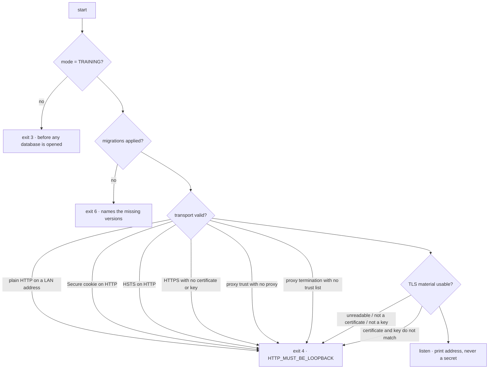

# Training HTTPS Deployment

Encrypting the wire for the controlled training machine.

> [!danger] What this does and does not close
> It reduces **A53** — a session token is no longer readable in plaintext on the
> wire when the deployment runs in `TRAINING_HTTPS`. It does **not** close it,
> because the certificate is self-signed and self-signed is not production
> trust. And it changes nothing about **A52**: the device binding is still
> training-grade. The POS remains training-only, launch gates **0 of 10**.

## Three modes

| Mode | What it is | Binding | Cookies |
|---|---|---|---|
| `TRAINING_HTTP_LOCAL` | Development fallback | **Loopback only — a LAN address is refused** | not `Secure` |
| `TRAINING_HTTPS` | The controlled training deployment | Any | `Secure` |
| `LIVE` | Rejected before a database is opened | — | — |

The plain-HTTP mode is safe only because nobody else can reach it. Binding it to
a LAN address removes the entire argument, so `validateTransport` **refuses**
rather than warning — `HTTP_MUST_BE_LOOPBACK`, exit 4.

Equally, `Secure` cookies over plain HTTP are refused. A browser never sends a
`Secure` cookie over HTTP, so the operator would sign in and immediately appear
signed out; refusing at startup beats debugging that at a counter.

## Running it

```bash
npm run build:clean

# 1. Migrations, once, by a single writer.
node services/worker/dist/cli.js --db ./telga.sqlite --migrate --once

# 2. An operator, a device, and a clearly-simulated opening balance.
npm run training:provision -- --db ./telga.sqlite \
  --merchant merchant_alpha --operator operator_1 --device device_1 \
  --provision-pin 481502 --training-float 500

# 3. Serve over TLS.
npm run training:serve -- --db ./telga.sqlite --merchant merchant_alpha \
  --transport TRAINING_HTTPS \
  --tls-cert /etc/telga/tls/cert.pem \
  --tls-key  /etc/telga/tls/key.pem \
  --allowed-hosts telga-training.local
```

`--training-float` is **explicit and off by default**. Creating a balance is a
money operation even when the money is simulated, so it is a named flag rather
than a side effect of setting up an operator — and the banner labels it
`SIMULATED — no real value`.

### Flags

| Flag | Meaning |
|---|---|
| `--transport` | `TRAINING_HTTP_LOCAL` (default) or `TRAINING_HTTPS` |
| `--host`, `--port` | Bind address. Port `0` asks the OS to choose; the banner prints what was bound |
| `--tls-cert`, `--tls-key` | Required for standalone HTTPS. Never generated |
| `--tls-termination` | `IN_PROCESS` (default) or `TRUSTED_PROXY` |
| `--trust-proxy` | Comma-separated addresses. Required for `TRUSTED_PROXY`, refused otherwise |
| `--allowed-hosts` | Hosts this deployment answers for |
| `--allowed-origins` | Extra origins accepted on a state-changing request |
| `--hsts`, `--hsts-max-age` | Off by default. Refused on plain HTTP |
| `--shutdown-timeout-ms` | Graceful shutdown budget, default 10s |
| `--provision-pin`, `--training-float` | Setup command; prints the device key once and exits |

Exit codes: `0` clean · `2` bad arguments · `3` not training mode · `4` invalid
configuration or unusable TLS material · `5` runtime failure · `6` migrations
not applied.

## What is refused, and why



The certificate/key mismatch check matters more than it looks: without it the
pair fails **per connection**, during the handshake, as something a browser
renders as an unexplained error. Checking at startup turns that into one clear
refusal before anything is served.

## Security headers

Every POS response carries them. See [[TLS and Proxy Configuration]] for the
proxy-specific parts.

| Header | Value | Why |
|---|---|---|
| `Content-Security-Policy` | `default-src 'none'` plus a **per-response nonce** | See below |
| `X-Content-Type-Options` | `nosniff` | |
| `Referrer-Policy` | `no-referrer` | A transaction id must not leak in a referrer |
| `Permissions-Policy` | camera, microphone, geolocation, payment, USB all `()` | A counter screen selling airtime has no business asking |
| `Cache-Control` | `no-store, no-cache, must-revalidate, private` | A shared counter machine whose back button re-renders the previous operator's balance is a real leak |
| `Cross-Origin-Opener-Policy` | `same-origin` | |
| `Strict-Transport-Security` | only when `--hsts true` **and** the client used HTTPS | |

### The CSP stopped saying `unsafe-inline`

The first POS shipped `script-src 'unsafe-inline'` because the page carries one
inline script and one inline stylesheet, and that was the quick way to make them
run. It is also a policy that permits **any** injected inline script — most of
what a CSP exists to stop.

The page now carries a **per-response nonce**: the script and the style declare
it, the policy allows that nonce and nothing else inline. An injected `<script>`
has no nonce and does not run, and it cannot learn one, because a fresh 128-bit
value is generated for every response. Recorded as [[Decision Log]] **D44**.

`'strict-dynamic'` is deliberately absent: nothing here loads a script that
loads another, so it would widen the policy for no gain.

> [!note] HSTS is off by default
> Turning it on tells every browser to refuse plain HTTP to that host for the
> whole max-age. On a training machine that still needs an HTTP fallback, that
> locks operators out of their own deployment. Enable it only when the HTTPS
> deployment is genuinely stable.

## The smoke test

```bash
npm run training:smoke
```

Runs the **compiled** `dist/cli.js` over real TLS against a real SQLite file,
driving it with real HTTPS requests: fifteen steps, thirty-eight checks. It
generates a temporary certificate, provisions, signs in, sells successfully,
fails, times out into `PENDING`, checks the cookie attributes, checks for a
leaked session token, revokes, logs out, and shuts down — then deletes
everything it created.

It found two real defects the unit tests could not: provisioning failed on a
fresh database because it created no merchant or device row, and `--port 0` was
rejected by the argument parser though the transport validator allowed it.

## What this does not do

| Gap | Status |
|---|---|
| A CA-signed certificate | **A53 OPEN.** Self-signed is not production trust; browsers warn, and should |
| Certificate rotation or renewal | Not built. Manual, per [[Local Certificate Handling]] |
| Client certificates | Not built — would be one route to A52 |
| Automatic HTTP→HTTPS redirect | Not built. The two modes are separate deployments, not a pair |
| A hardened reverse proxy | Documented in [[TLS and Proxy Configuration]], not supplied |

## Related

- [[TLS and Proxy Configuration]]
- [[Local Certificate Handling]]
- [[Authentication and Sessions]]
- [[Deployment Runbook]]
- [[Training Operations Runbook]]
- [[Threat Model]]

---
Back to [[00 Home]]
