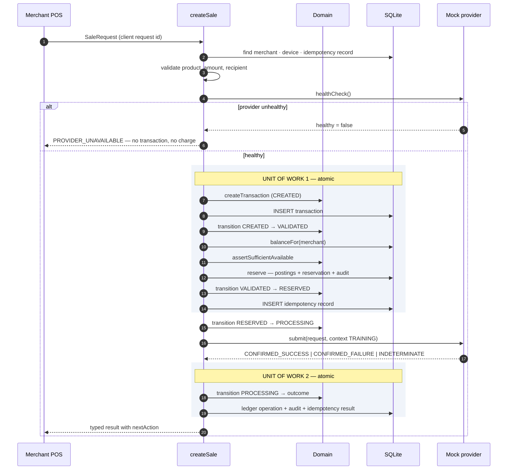
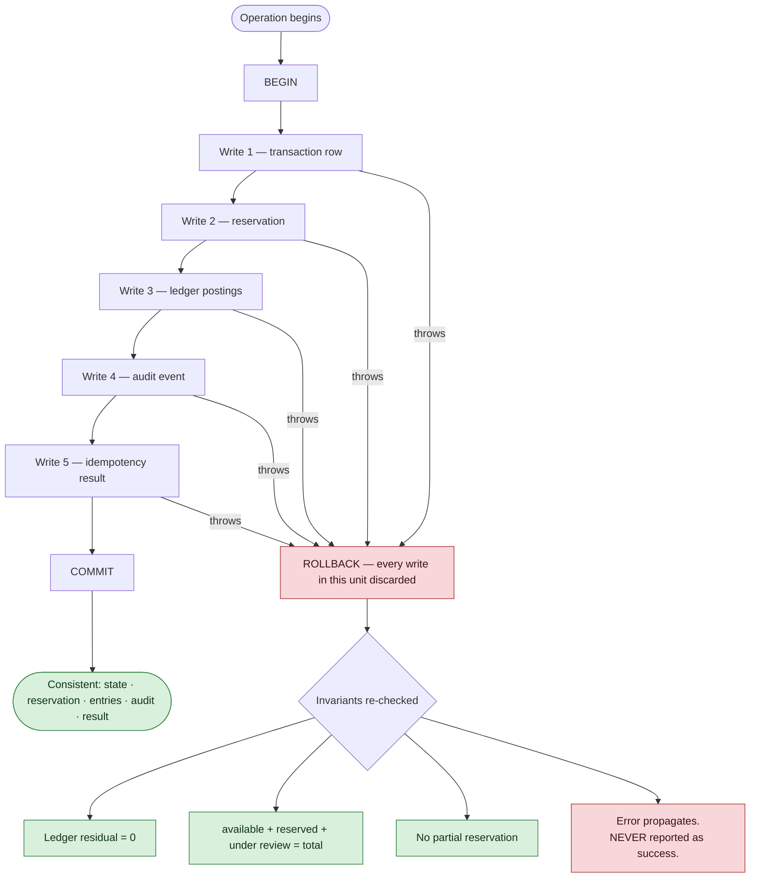
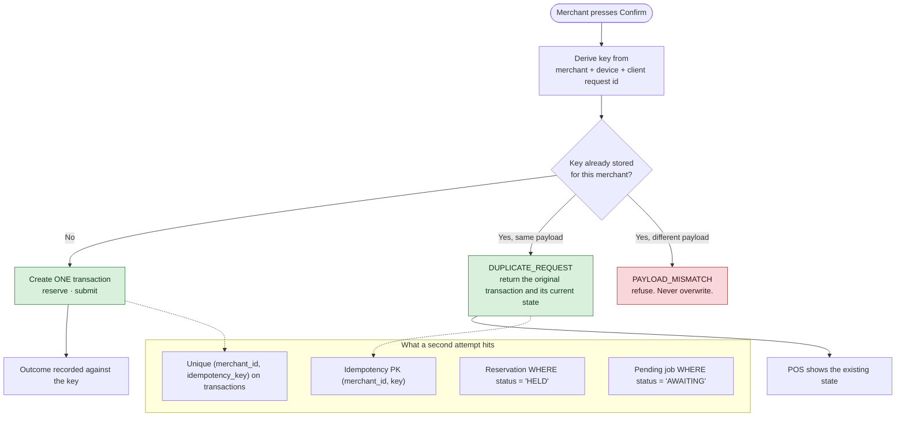

# Transaction Orchestration

`services/api/src/application` — the layer that binds the domain state machine, the persistence
driver and the mock provider into one sale.

**Implemented and tested.** 74 orchestration tests. No live provider, no live money.

## Why there are two units of work, not one

The provider call sits **between** two database transactions, and it has to. A SQLite transaction
is synchronous; holding one open across a network call would block every other writer for as long
as the provider takes to answer — and the provider is exactly the component that might not answer
at all.

The gap between the two units of work is precisely why `PENDING` exists. If the process dies
mid-flight, the merchant's value is still held by unit of work 1, and the transaction's own state
is what [[Recovery Sweep]] finds — `RESERVED` proves the provider was never called, `PROCESSING`
means the outcome is unknown. That sweep is what makes this design safe to run unattended.

## Unit-of-work rollback

Failures are injected at eight points in the tests — before reservation, after reservation before
submission, after provider success before finalization, during ledger posting, during audit
creation and during idempotency result storage. After every one, the ledger still balances and the
four views still reconcile.

**Nothing catches an error and reports success.** An unknown outcome becomes `PENDING`, which is an
honest answer, not a hopeful one.

## Idempotent retry

The key derives from **request identity**, not payload contents ([[Decision Log]] D11): if it
hashed the amount, changing the amount would change the key and a tampered request would look like
a brand new sale.

Ten rapid presses produce one transaction, one reservation and one debit. Tested.

## Services

| Service | Responsibility |
|---|---|
| `createSale` | The sale itself. See [[Create Sale Service]] |
| `resolvePending` | Status lookup for a PENDING transaction; escalation past the deadline |
| `requireReversal` | `PENDING`/`UNDER_REVIEW` → `REVERSAL_REQUIRED`, opens a support case |
| `completeReversal` | `REVERSAL_REQUIRED` → `REVERSED`, posts the returning adjustment. **Requires supervisor approval** |
| `recoverInFlight` | Unattended sweep for transactions left in flight — [[Recovery Sweep]] |

## Provider boundary

The orchestration calls only `submit`, `getStatus`, `healthCheck` and — through the mock contract
only — `reverse`. The context always carries `mode: 'TRAINING'`, and a non-TRAINING mode is refused
at the door before anything is read or written.

Preserved on every path: internal transaction id · provider reference · idempotency key ·
correlation id · simulated flag · provider outcome and a **coarse, safe** error category. Never a
raw provider body, never a credential.

## Related

- [[Create Sale Service]]
- [[Mock Provider Behavior]]
- [[Transaction Failure Runbook]]
- [[Transaction State Machine]]
- [[Idempotency]]
- [[SQLite Persistence Layer]]

---
Back to [[00 Home]]
